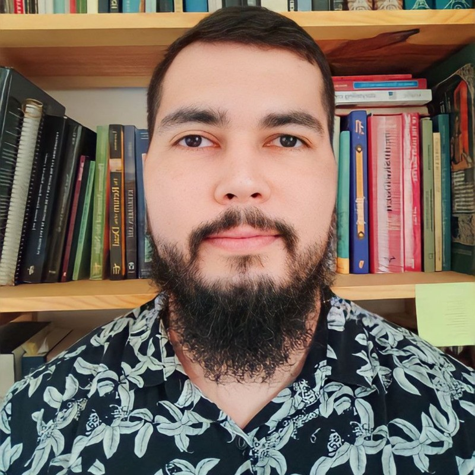

    

<h1 align="center">Apresentação</h1>

Saudações. Me chamo **Pablo Gomes de Miranda** e esse é o meu repositório com as informações de toda a minha trajetória no **programa de bolsas da Compass UOL, trilha de Engenharia de Dados** contendo exercícios, desafios e informações das sprints. 

Mais informações sobre mim:
- Resido em **João Pessoa, Paraíba**;
- Possuo experiência profissional como: 
    - **Cientista de Dados** na FUNETEC-PB, uma instituição de apoio à pesquisa e ensino dos institutos federais da Paraíba. Meu cotidiano de trabalho envolveu a coleta e realização da limpeza periódica de dados, montagem de painéis analíticos, preparação de relatórios semanais para diferentes equipes, construção e manutenção de modelos de Machine Learning pertinentes ao projeto em que participei;
    - Fui **Professor de História** no ensino fundamental e superior (ensinei História Antiga como prof. substituto na UFRN), então considero que tenho boas *soft skills* e mantenho bons relacionamentos interpessoais com o resto da equipe. Além disso, minha experiência de pesquisa e os hábitos criados com essa experiência, fortaleceram rotinas de trabalho baseadas nas leituras de artigos científicos, documentação das ferramentas utilizadas, etc;

- Meus hobbies incluem me exercitar, jogos de tabuleiro, literatura antiga e medieval.

## Sprints 
1. [Sprint 1](/Sprint%201/README.md)
2. [Sprint 2](/Sprint%202/README.md)
3. [Sprint 3](/Sprint%203/README.md)
4. [Sprint 4](/Sprint%204/README.md)
5. [Sprint 5](/Sprint%205/README.md)