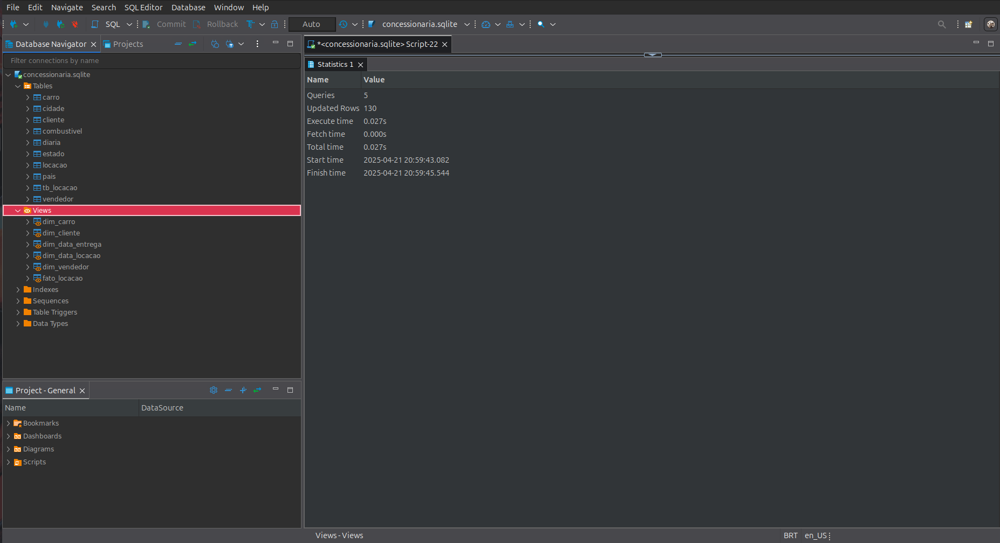

# Desafio da Sprint 1 - Modelagem de Dados Relacional e Dimensional com SQL

## Entregáveis:
- [x] Explicação breve dos passos seguidos para a normalização;
    - No próprio `README.md`

- [x] Arquivos `.sql`;
    - [modelo relacional](./etapa-1/modelo_relacional.sql)
    - [modelo dimensional](./etapa-2/modelo_dimensional.sql)

- [x] Desenho da Modelagem Relacional após a normalização (modelo lógico);
    - [modelo lógico da modelagem relacional](./etapa-1/modelo_relacional.png)

- [x] Desenho da Modelagem Dimensional (modelo lógico).
    - [modelo lógico da modelagem dimensional](./etapa-2/modelo_dimensional.png)

## Sumário
- [Desafio](#desafio)
- [Etapa 1 - Normalizar Base de Dados](#etapa-1---normalização-da-base-de-dados)
    - [Primeira Forma Normal (1FN)](#primeira-forma-normal-1fn)
    - [Segunda Forma Normal (2FN)](#segunda-forma-normal-2fn)
    - [Terceira Forma Normal (3FN)](#terceira-forma-normal-3fn)
    - [Conclusão Modelagem Relacional](#conclusão-modelagem-relacional)
- [Etapa 2 - Modelagem Dimensional](#etapa-2---modelagem-dimensional)
    - [Conclusão Modelagem Dimensional](#conclusão-modelagem-dimensional)

## Desafio:
Normalizar a [base de dados concessionaria](./concessionaria.sqlite), aplicando as formas normais e depois utilizar o modelo relacional normatizado para criar views de dimensões e fato, o modelo dimensional. Documentar e explicar as etapas. Os entregáveis se encontram nas subpastas etapa-1 e etapa-2, e as evidências na pasta Evidência.

**Etapa1 - Normalizar Base de Dados**: aplicar as formas Normais nas tabelas, criar arquivo .sql com a criação das estruturas e elaborar um desenho explicativo do relacionamento;

**Etapa 2 - Modelo Dimensional baseado no Modelo Relacional**: praticar conceitos de Modelagem Dimensional estudado anteriormente. Considerar a base de dados [Concessionária](./concessionaria.sqlite), cujo modelo será criado na seção anterior de Modelagem Relacional. O desafio é montar o Modelo Dimensional com base no Modelo Relacional normalizado na seção anterior.

**Dicas**:
- Aplicar as técnicas aprendidas sob o modelo relacional, criar arquivos .sql com a criação das estruturas e elaborar um desenho explicativo do relacionamento
- Criar views para as tabelas dimensão e fato com a nomenclatura dim_ e fato_
- Tabela de dimensão tempo criar ano, mês, semana e dia baseado em cada data
- Tabela fato é com valores inteiros (códigos), quantidades e datas

Esperamos que haja, minimamente:

- Passo a passo para obter o resultado entregue do desafio.
- Trechos de códigos e suas explicações.
- Relacionamento com a pasta de evidências (imagens).


# [Etapa 1 - Normalização da Base de Dados](./etapa-1/)

Originalmente o banco de dados fornecido se encontra dessa maneira:


Cada linha traz informações sobre a locação dos seus veículos e a única informação que não se repete é a chave primária `idLocacao`. Apesar disso, já existem identificadores diversos, registros de data e hora que podem ser tratados, entre outras informações.


## Primeira Forma Normal (1FN)
O material apresentado na trilha define como objetivo da primeira forma normal ser **retirar os atributos ou trupos repetitivos** e complementa representação de informações que se repetem para a mesma unidade, retratando ocorrências de um mesmo fato dentro de uma única entidade, vinculado a sua chave, onde para cada chave há a ocorrência de uma e comente uma informação de cada atributo. Desta forma, cada campo de uma tabel precisa conter somente um único tipo de dado, e cada parcela de dado deve ser armazenada em somente um lugar. Essa exigência é conhecida como **atomicidade de dados**.

A atomicidade de Dados foi obtida criando uma tabela `cliente` para os clientes, outra `combustivel` para combustível, uma `carro` para carro, outra `vendedor` para vendedor e uma `locacao` para locação. Para realizar isso foi criada uma chave primária para cada tabela aproveitando que já havia identificadores. Na tabela carro, a coluna classiCarro é única e representa o Chassi de cada veículo, dois veículos do mesmo ano, modelo e marca vão possuir chassis diferentes, de modo que foi assegurado que esses valores também devem ser únicos, mas ainda foi necessária uma coluna idCarro ao invés de usar classiCarro como chave primária por uma questão de performance (é mais interessante realizar joins entre tabelas utilizando números inteiros do que strings). ainda mais: foi adicionada uma chave estrangeira dos combustíveis, pois há uma dependência entre essas tabelas. Na tabela locacao foi adicionada as chaves estrangeiras das outras tabelas, exceto da tabela combustível, que já constava na tabela carro. Rodando o seguindo código, é possível obter a primeira normalização formal:

```sql
-- cliente
create table if not exists cliente (
	idCliente int primary key,
	nomeCliente varchar (100) not null,
	cidadeCliente varchar (100) not null,
	estadoCliente varchar (50) not null,
	paisCliente varchar (50) not null
);
-- combustível
create table if not exists combustivel (
	idCombustivel int primary key,
	tipoCombustivel varchar (50) not null
);
-- carro
create table if not exists carro (
    idCarro int primary key,
    kmCarro int not null,
    classiCarro varchar(20) not null unique,
    marcaCarro varchar(50) not null,
    modeloCarro varchar(50) not null,
    anoCarro int not null,
    idCombustivel int not null,
    foreign key (idCombustivel) references combustivel(idCombustivel)
);
-- vendedor
create table if not exists vendedor (
    idVendedor int primary key,
    nomeVendedor varchar(100) not null,
    sexoVendedor char(1) not null,
    estadoVendedor varchar(50) not null
);
-- locação
create table if not exists locacao(
    idLocacao int primary key,
    idCliente int not null,
    idCarro int not null,
    dataLocacao date not null,
    horaLocacao time not null,
    qtdDiaria int not null,
    vlrDiaria decimal(10,2) not null,
    dataEntrega date not null,
    horaEntrega time not null,
    idVendedor int not null,
    foreign key (idCliente) references cliente(idCliente),
    foreign key (idCarro) references carro(idCarro),
    foreign key (idVendedor) references vendedor(idVendedor)
);
```

O resultado obtido com o código indica que todas as tabelas foram criadas com sucesso, como observado na amostra abaixo:


## Segunda Forma Normal (2FN)
O objetivo é separar as **dependências parciais**. É preciso que as tabelas estejam na primeira forma normal e que cada uma contenha dados sobre uma e somente uma entidade, onde as colunas que dependem parcialmente da PK, devem formar uma nova tabela, algumas entidades, para serem identificadas e individualizadas, necessitam conter em sua chave mais de um atributo, formado, portanto, uma chave concatenada, verificar se a mesma possui chave concatenada e, se for o caso, constatar se todos os tributos não chaves não apresentam dependência parcial com areferida chave. Isto é, quando os atributos não-chaves dependem parcialmente de chave concatenada.

A resolução das dependências parciais foi resolvida assegurando que estava realizada a primeira normalização formal 1FN, e criando uma nova tabela `diaria`, que depende de cada carro. Com o seguinte código se obtém a segunda normalização formal:

```sql
-- cliente
create table if not exists cliente (
	idCliente int primary key,
	nomeCliente varchar (100) not null,
	cidadeCliente varchar (100) not null,
	estadoCliente varchar (50) not null,
	paisCliente varchar (50) not null
);
-- combustível
create table if not exists combustivel (
	idCombustivel int primary key,
	tipoCombustivel varchar (50) not null
);
-- carro
create table if not exists carro (
    idCarro int primary key,
    classiCarro varchar(20) not null unique,
    marcaCarro varchar(50) not null,
    modeloCarro varchar(50) not null,
    anoCarro int not null,
    idCombustivel int not null,
    foreign key (idCombustivel) references combustivel(idCombustivel)
);
-- diaria
create table if not exists diaria (
    idDiaria int primary key,
    idCarro int not null,
    vlrDiaria decimal(10,2) not null,
    foreign key (idCarro) references carro(idCarro)
);
-- vendedor
create table if not exists vendedor (
    idVendedor int primary key,
    nomeVendedor varchar(100) not null,
    sexoVendedor char(1) not null,
    estadoVendedor varchar(50) not null
);
-- locação
create table if not exists locacao(
    idLocacao int primary key,
    idCliente int not null,
    idCarro int not null,
    idDiaria int not null,
    dataLocacao date not null,
    horaLocacao time not null,
    qtdDiaria int not null,
    dataEntrega date not null,
    horaEntrega time not null,
    kmCarro int not null,
    idVendedor int not null,
    foreign key (idCliente) references cliente(idCliente),
    foreign key (idCarro) references carro(idCarro),
    foreign key (idDiaria) references diaria(idDiaria),
    foreign key (idVendedor) references vendedor(idVendedor)
);
```

O resultado obtido com o código indica que todas as tabelas foram criadas com sucesso, como observado na amostra abaixo:


## Terceira Forma Normal (3FN)
Segundo o material da trilha, o objetivo é eliminar **dependências transitivas**.Quando alguns atributos não são dependentes diretos da chave da entidade, mas sim por transitividade, através de outros residentes na mesma entidade referenciada. Isto é dependência indireta de um atributo com a chave da entidade, através de outro atributo não-chave, do qual é diretamente dependente.

A resolução das dependências transitivas foi resolvida assegurando que estava feita a segunda normalização formal 2FN, e criando as tabelas `pais`, `estado` e `cidade`, evitando assim a dependência transitiva nas tabelas `cliente`, `vendedor` e `locacao`.

```sql
-- pais
create table if not exists pais (
    idPais integer primary key,
    nomePais varchar(50) not null
);
-- estado
create table if not exists estado (
    idEstado integer primary key,
    nomeEstado varchar(50) not null,
    idPais integer not null,
    foreign key (idPais) references pais(idPais)
);
-- cidade
create table if not exists cidade (
    idCidade integer primary key,
    nomeCidade varchar(100) not null,
    idEstado integer not null,
    foreign key (idEstado) references estado(idEstado)
);
-- cliente
create table if not exists cliente (
    idCliente integer primary key,
    nomeCliente varchar(100) not null,
    idCidade integer not null,
    foreign key (idCidade) references cidade(idCidade)
);
-- combustivel
create table if not exists combustivel (
    idCombustivel integer primary key,
    tipoCombustivel varchar(50) not null
);
-- carro
create table if not exists carro (
    idCarro integer primary key,
    classiCarro varchar(20) not null unique,
    marcaCarro varchar(50) not null,
    modeloCarro varchar(50) not null,
    anoCarro integer not null,
    idCombustivel integer not null,
    foreign key (idCombustivel) references combustivel(idCombustivel)
);
-- diaria
create table if not exists diaria (
    idDiaria integer primary key,
    idCarro integer not null,
    vlrDiaria decimal(10, 2) not null,
    foreign key (idCarro) references carro(idCarro)
);
-- vendedor
create table if not exists vendedor (
    idVendedor integer primary key,
    nomeVendedor varchar(100) not null,
    sexoVendedor char(1) not null,
    idEstado integer not null,
    foreign key (idEstado) references estado(idEstado)
);
-- locacao
create table if not exists locacao (
    idLocacao integer primary key,
    idCliente integer not null,
    idCarro integer not null,
    idDiaria integer not null,
    dataLocacao date not null,
    horaLocacao time not null,
    qtdDiaria integer not null,
    dataEntrega date not null,
    horaEntrega time not null,
    kmCarro integer not null,
    idVendedor integer not null,
    foreign key (idCliente) references cliente(idCliente),
    foreign key (idCarro) references carro(idCarro),
    foreign key (idDiaria) references diaria(idDiaria),
    foreign key (idVendedor) references vendedor(idVendedor)
);
```

O resultado obtido com o código indica que todas as tabelas foram criadas com sucesso, como observado na amostra abaixo:


## Conclusão Modelagem Relacional
O modelo relacional na 3fn está disponível dentro da pasta etapa-1 como [modelo_relacional.sql](./etapa-1/modelo_relacional.sql)

Abaixo está o modelo lógico após a normalização das tabelas gerada com a ajuda do editor DBeaver. O modelo lógico aponta as relações entre as tabelas obedecendo a normalização aplicada obedecendo o princípio da atomicidade bem como o afastamento das dependências parciais e transitivas. A tabela `pais` está relacionada a tabela `estado`, que está relacionada a tabela `cidade` e a tabela `vendedor`; A tabela `cidade` por sua vez se relaciona tanto a tabela `cliente` e `vendedor`. A tabela `combustivel` se relacionada somente com a tabela `carro`. Por sua vez a tabela `locacao` se relaciona com as tabelas `cliente`, `vendedor`, `carro` e `diaria`.


A inserção de dados, **apesar de não ter sido requisitada**, foi conseguida realizando uma série de consultas utilizando subqueries e diferentes joins para garantir que não estaríamos importando dados com duplicatas e pode ser feita da seguinte maneira:

```sql
-- pais
insert into pais (nomePais)
select distinct paisCLiente 
from tb_locacao 
where paisCLiente is not null;

-- estado
insert into estado (idEstado, nomeEstado, idPais)
select 
    row_number() over (order by tl.estadoCliente, p.idPais) as id,
    tl.estadoCliente,
    p.idPais
from (select distinct estadoCliente, paisCliente from tb_locacao where estadoCliente is not null) tl
inner join pais p ON tl.paisCliente = p.nomePais;

-- cidade
insert into cidade (idCidade, nomeCidade, idEstado)
select
	row_number() over (order by c.cidade, e.idEstado) as id,
	c.cidade,
	e.idEstado
from (select distinct l.cidadeCliente as cidade, l.estadoCliente as estado from tb_locacao l where l.cidadeCliente is not null) c
inner join estado e on c.estado = e.nomeEstado;

-- cliente
insert into cliente (idCliente, nomeCliente, idCidade)
select
    row_number() over (order by c.nome) as id,
    c.nome,
    c.idCidade
from (
    select distinct
        tl.nomeCliente as nome,
        ci.idCidade
    from tb_locacao tl
    join cidade ci on tl.cidadeCliente = ci.nomeCidade
    where tl.nomeCliente is not null
) c;

-- combustivel
insert into combustivel (idCombustivel, tipoCombustivel)
select
    row_number() over (order by tipoCombustivel) as id,
    tipoCombustivel
from (
    select distinct tipoCombustivel 
    from tb_locacao 
    where tipoCombustivel is not null
);

-- carro
insert into carro (idCarro, classiCarro, marcaCarro, modeloCarro, anoCarro, idCombustivel)
select 
    row_number() over (order by t.modeloCarro, t.anoCarro) as id,
    t.classiCarro,
    t.marcaCarro,
    t.modeloCarro,
    t.anoCarro,
    c.idCombustivel
from (
    select distinct
        classiCarro,
        marcaCarro,
        modeloCarro,
        anoCarro,
        tipoCombustivel
    from tb_locacao
    where classiCarro is not null
    and marcaCarro is not null
    and modeloCarro is not null
    and anoCarro is not null
    and tipoCombustivel is not null
) t
inner join combustivel c on t.tipoCombustivel = c.tipoCombustivel;

-- diaria 
insert into diaria (idDiaria, idCarro, vlrDiaria)
select
    row_number() over (order by idCarro, vlrDiaria) as id,
    idCarro,
    vlrDiaria
from (
    select distinct
        c.idCarro,
        t.vlrDiaria
    from tb_locacao t
    inner join carro c on t.modeloCarro = c.modeloCarro 
                      and t.marcaCarro = c.marcaCarro
                      and t.anoCarro = c.anoCarro
    where t.vlrDiaria is not null
) dados_unicos;

-- vendedor
insert into vendedor (idVendedor, nomeVendedor, sexoVendedor, idEstado)
select
    row_number() over (order by nomeVendedor) as id,
    nomeVendedor,
    sexoVendedor,
    e.idEstado
from (
    select distinct
        t.nomeVendedor,
        t.sexoVendedor,
        t.estadoVendedor
    from tb_locacao t
    where t.nomeVendedor is not null
      and t.sexoVendedor is not null
      and t.estadoVendedor is not null
) dados_vendedor
inner join estado e on dados_vendedor.estadoVendedor = e.nomeEstado;

-- locacao
insert into locacao (idLocacao, idCliente, idCarro, idDiaria, dataLocacao, horaLocacao, qtdDiaria, dataEntrega, horaEntrega, kmCarro, idVendedor)
select
    tl.idLocacao,
    cli.idCliente,
    car.idCarro,
    dia.idDiaria,
    tl.dataLocacao,
    tl.horaLocacao,
    tl.qtdDiaria,
    tl.dataEntrega,
    tl.horaEntrega,
    tl.kmCarro,
    ven.idVendedor
from tb_locacao tl
inner join cliente cli on tl.nomeCliente = cli.nomeCliente
inner join cidade c_cli on cli.idCidade = c_cli.idCidade and c_cli.nomeCidade = tl.cidadeCliente
inner join carro car on tl.modeloCarro = car.modeloCarro 
                     and tl.marcaCarro = car.marcaCarro 
                     and tl.anoCarro = car.anoCarro
inner join diaria dia on dia.idCarro = car.idCarro and dia.vlrDiaria = tl.vlrDiaria
inner join vendedor ven on tl.nomeVendedor = ven.nomeVendedor
inner join estado e_ven on ven.idEstado = e_ven.idEstado and e_ven.nomeEstado = tl.estadoVendedor
where tl.idLocacao is not null
group by tl.idLocacao;
```

Abaixo uma amostra para visualizarmos os dados na tabela normalizada `locacao`:


# [Etapa 2 - Modelagem Dimensional](./etapa-2/)
O modelo dimensional está disponível dentro da pasta etapa-2 como [modelo_dimensional.sql](./etapa-2/modelo_dimensional.sql)

A modelagem dimensional foi realizada em cima da modelagem relacional, de forma que quando os dados foram inseridos da tabela original, a modelagem dimensional importou esses dados diretamente como **views**. No futuro, caso esse fosse um case real e o time de negócio precisasse, poderíamos materializar as views dimensão e fato como tabelas. As tabelas dimensão construídas foram `dim_data_locacao`, `dim_data_entrega`, `dim_cliente`, `dim_carro` e `dim_vendedor`, e a tabela fato `fato_locacao`.

As views `dim_data_locacao` e `dim_data_entrega` foram particularmente difíceis de realizar, porque o formato das colunas dataLocacao e dataEntrega já se encontravam em formato `date`, mas não obedeciam nenhum comando de formatação ou extração. Em menor grau, as colunas horaLocacao e horaEntrega também se encontravam em formato `time` mas foi impossível realizar ações de concatenação para formar um `datetime`. Foi necessário um tempo considerável na documentação do SQLite para entender o problema. O problema foi resolvido realizando subqueries para limpar os dados no formato de string com a função `susbstr()` que funciona da maneira `substr( string, start, length )` e foi concatenada com hífens para enfim ficar no formato YYYY-MM-DD. No campo horas poderia haver uma incrongruência onde horas abaixo de 10:00 poderia ser registrado sem o primeiro dígito, exemplo: "08:00" e "8:00". O resto das views foram criadas com simples consultas e ocasionais `inner joins`.

O código seguinte cria todas as views em conformidade com a modelagem relacional:
```sql
-- view dimensão data de locação
create view dim_data_locacao as
with datas_das_locacoes as (
    select
    	dataLocacao,
    	horaLocacao,
        substr(dataLocacao, 1, 4) || '-' || 
        substr(dataLocacao, 5, 2) || '-' || 
        substr(dataLocacao, 7, 2) AS data_formatada,
        case when instr(horaLocacao, ':') = 2 
             then '0' || horaLocacao 
             else horaLocacao end as hora_formatada
    from 
        locacao
)
select 
	dataLocacao,
	horaLocacao,
    data_formatada,
    hora_formatada,
    data_formatada || ' ' || hora_formatada || ':00' as data_hora_locacao,
    strftime('%Y', data_formatada) as ano,
    strftime('%m', data_formatada) as mes,
    strftime('%d', data_formatada) as dia,
    cast(strftime('%w', data_formatada) as integer) as dia_semana
from 
    datas_das_locacoes;

-- view dimensão data de entrega
create view dim_data_entrega as
with datas_das_entregas as (
    select
    	dataEntrega,
		horaEntrega,
        dataEntrega,
        horaEntrega,
        substr(dataEntrega, 1, 4) || '-' || 
        substr(dataEntrega, 5, 2) || '-' || 
        substr(dataEntrega, 7, 2) as data_formatada,   
        case 
            when length(trim(horaEntrega)) = 4 then '0' || horaEntrega
            else horaEntrega 
        end as hora_formatada
    from 
        locacao
)
select
	dataEntrega,
	horaEntrega,
    data_formatada,
    hora_formatada,
    data_formatada || ' ' || hora_formatada || ':00' as data_hora_entrega,
    strftime('%Y', data_formatada) as ano,
    strftime('%m', data_formatada) as mes,
    strftime('%d', data_formatada) as dia,
    cast(strftime('%w', data_formatada) as integer) as dia_semana
from 
    datas_das_entregas;

-- view dimensão cliente
create view dim_cliente as
select 
    c.idCliente as id_cliente,
    c.nomeCliente as nome_cliente,
    ci.nomeCidade as cidade_cliente,
    e.nomeEstado as estado_cliente,
    p.nomePais as pais_cliente
from cliente c
inner join cidade ci on c.idCidade = ci.idCidade
inner join estado e on ci.idEstado = e.idEstado
inner join pais p on e.idPais = p.idPais;

-- view dimensão vendedor
create view dim_vendedor as
select 
    v.idVendedor as id_vendedor,
    v.nomeVendedor as nome_vendedor,
    v.sexoVendedor as sexo_vendedor,
    e.nomeEstado as estado_vendedor
from vendedor v
inner join estado e on v.idEstado = e.idEstado;

-- view dimensão carro
create view dim_carro as
select 
    car.idCarro as id_carro,
    car.classiCarro as classi_carro,
    car.marcaCarro as marca_carro,
    car.modeloCarro as modelo_carro,
    car.anoCarro as ano_carro,
    comb.tipoCombustivel as tipo_combustivel,
    d.vlrDiaria as valor_diaria
from carro car
inner join combustivel comb on car.idCombustivel = comb.idCombustivel
inner join diaria d on car.idCarro = d.idCarro;

-- view fato locacao
create view fato_locacao as
select 
    l.idLocacao as id_locacao,
    dc.id_cliente,
    dca.id_carro,
    dv.id_vendedor,
    dca.valor_diaria,
    l.qtdDiaria as qtd_diaria,
    l.kmCarro as km_carro,
    (l.qtdDiaria * dca.valor_diaria) as valor_total,
    dl.data_hora_locacao,
    de.data_hora_entrega,
    dl.ano as ano_locacao,
    dl.mes as mes_locacao,
    dl.dia as dia_locacao,
    dl.dia_semana as dia_semana_locacao,
    de.data_hora_entrega - dl.data_hora_locacao as duracao_locacao_dias
from locacao l
inner join dim_data_locacao dl on l.dataLocacao = dl.dataLocacao and l.horaLocacao  = dl.horaLocacao
inner join dim_data_entrega de on l.dataEntrega = de.dataEntrega and l.horaEntrega = de.horaEntrega
inner join dim_cliente dc on l.idCliente = dc.id_cliente 
inner join dim_carro dca on l.idCarro = dca.id_carro
inner join dim_vendedor dv on l.idVendedor = dv.id_vendedor;
```

O resultado obtido com o código indica que todas as views foram criadas com sucesso, como observado na amostra abaixo:


Abaixo uma amostra demonstrando a inserção dos dados na view fato_locacao:


## Conclusão Modelagem Dimensional
O modelo dimensional está disponível dentro da pasta etapa-2 como [modelo_dimensional.sql](./etapa-2/modelo_dimensional.sql)

Abaixo está o modelo lógico gerado com a ajuda do editor DBeaver. O modelo lógico não aponta as relações entre as views, mas caso fossem materializadas as relações seriam também mostradas pelo editor.


