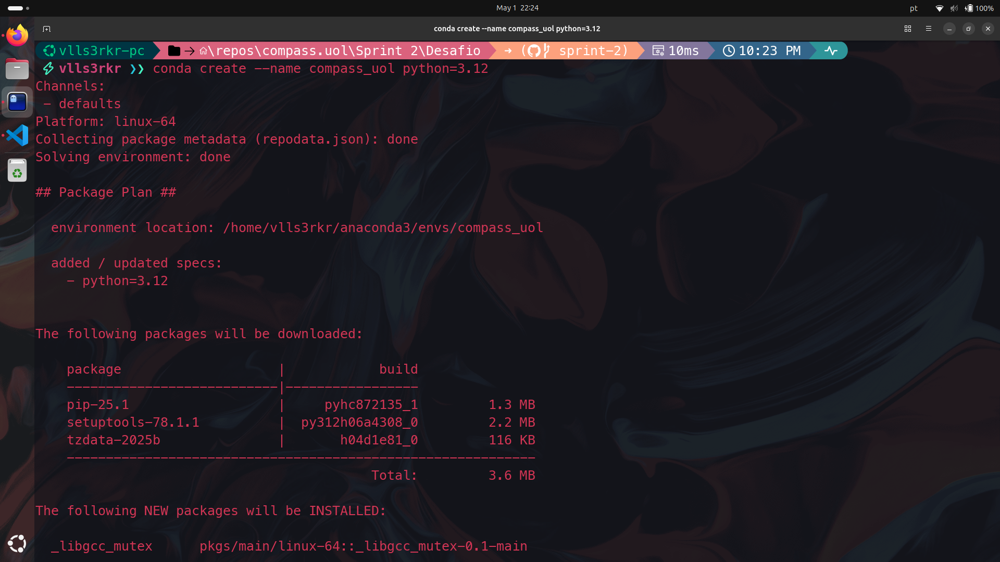
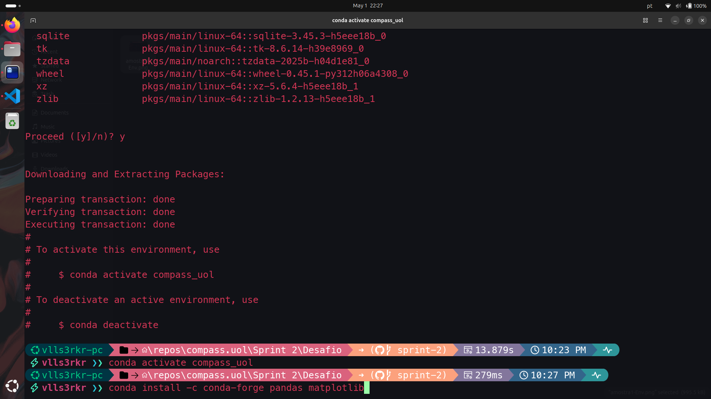
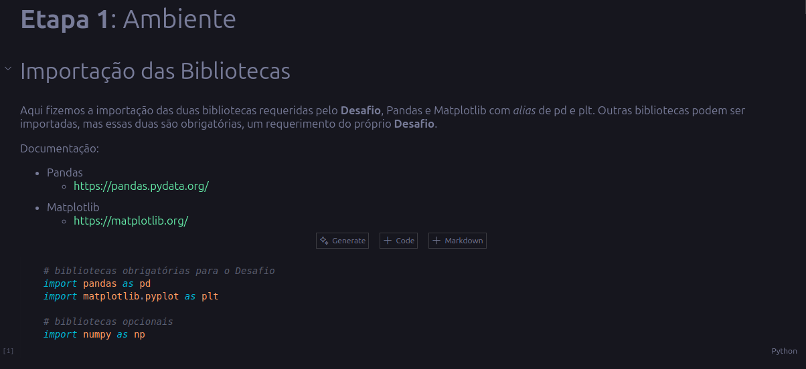
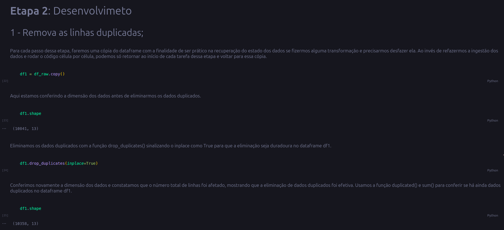

# Desafio da Sprint 2 - Análise de Dados

## Entregáveis
- [] Arquivo no formato `.ipynb` contendo o código no modelo de Notebook, por exemplo Jupyter, com a **execução realizada**.

- [] Incluir células em **Markdown** (explicativas) com documentação de cada célula de código criado.

## Sumário

## Desafio
O objetivo para essa sprint é ler o arquivo de estatísticas da Loja do Google, processar e gerar gráficos de análise. Essencialmente o desafio foi separado em duas etapas: 

Na **primeira etapa** deve ser criado o ambiente, com a instalação das bibliotecas **Pandas** e **Matplotlib** seguindo os passo:
1. Fazer o download do arquivo googleplaystore.csv;
2. Construa ambiente com Jupyter.

Na **segunda etapa** a solução foi desenvolvida seguindo uma série de etapas:
1. Remova as linhas duplicadas;
2. Faça um gráfico de barras contendo os top 5 apps por número de instalação;
3. Faça um gráfico de pizza (pie chart) mostrando as categorias de apps existentes no dataset de acordo com a frequência em que elas aparecem;
4. Mostre qual o app mais caro existente no dataset;
5. Mostre quantos apps são classificados como **'Mature 17+'**;
6. Mostre o top 10 apps por número de reviews bem como o respectivo número de reviews. Ordene a lista de forma decrescente por número de reviews;
7. Crie pelo menos mais 2 cálculos sobre o dataset e apresente um em formato de lista e outro em formato de valor. Por exemplo: "top 10 apps por número de reviews" e "o app mais caro existente no dataset";
8. Crie pelo menos outras 2 formas gráficas de exibição dos indicadores acima utilizando a biblioteca **Matplotlib**.

# [Etapa 1 - Ambiente]
1. Foi feito o download do arquivo csv e armazenado dentro da pasta do Desafio como [googleplaystore.csv](googleplaystore.csv).

2. Foi criado um novo ambiente Python chamado compass_uol utilizando o terminal como mostra a evidência abaixo:

3. O ambiente foi ativado e as bibliotecas Pandas e Matplotlib instaladas, como mostra a evidência à seguir: 

4. Um novo arquivo .ipynb foi criado e armazenado dentro da pasta do Desafio como [desafio.ipynb](./desafio.ipynb). As bibliotecas foram importadas, o arquivo lido e fizemos uma rápida exploração da situação dos dados contidos no dataset. **Essa exploração não é requerida pelo Desafio, mas foi realizada e documentada em Markdown no arquivo do desafio**. Descobrimos que o dataset possui: 10841 linhas e 13 colunas, 1487 dados faltantes, 483 linhas duplicadas e que praticamente todas as colunas estão no formato de *string*, sendo apenas a coluna 'Rating' no formato de float, o que pode trazer um desafio extra na próxima etapa. A amostra seguinte traz as bibliotecas Pandas e Matplotlib sendo importadas, bem como a ingestão do dataset googleplaystore.csv:

# [Etapa 2 - Desenvolvimento]
1. **Remova as linhas duplicadas**: os dados duplicados foram removidos com a ajuda da função drop_duplicates() sinalizando o inplace como True para que as mudanças sejam duradouras. O efeito dessa remoção foi acompanhada com a ajuda da função shape antes e depois do uso de drop_duplicates(), retornando uma tupla com as linhas e colunas do dataframe que contém os dados, e que a diferença nas linhas mostrou que a remoção foi realizada.

Abaixo uma amostra com o retorno do código de cada célula, observar que antes do uso de drop_duplicates(), tínhamos 10841 linhas e depois ficamos com 10358 linhas:

2. **Faça um gráfico de barras contendo os top 5 apps por número de instalação**: