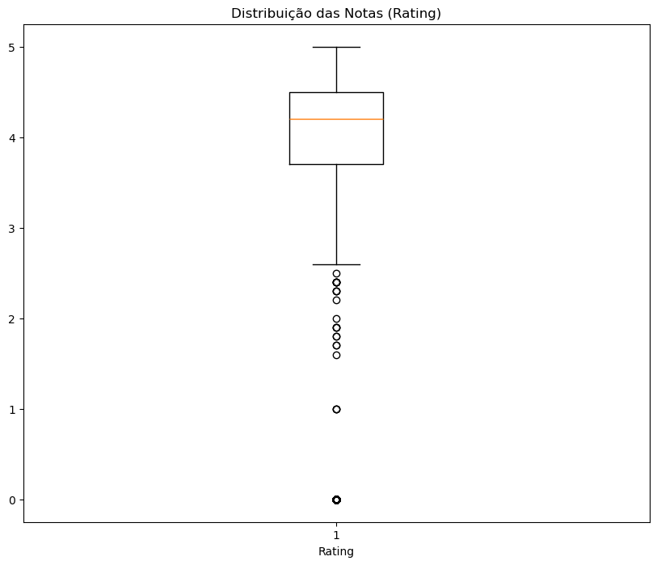

# Desafio da Sprint 2 - Análise de Dados

## Entregáveis
- [x] Arquivo no formato `.ipynb` contendo o código no modelo de Notebook, por exemplo Jupyter, com a **execução realizada**.
    - arquivo [desafio.ipynb](./desafio.ipynb) neste diretório Desafio.

- [x] Incluir células em **Markdown** (explicativas) com documentação de cada célula de código criado.
    - Células em **Markdown** incluídas no notebook do desafio.
    - Sempre que uma nova função surge no código, **providenciamos a documentação consultada**.

## Sumário
- [Desafio](#desafio)
- [Etapa 1 - Ambiente](#etapa-1---ambiente)
- [Etapa 2 - Desenvolvimento](#etapa-2---desenvolvimento)

## Desafio
O objetivo para essa sprint é ler o arquivo de estatísticas da Loja do Google, processar e gerar gráficos de análise. Essencialmente o desafio foi separado em duas etapas: 

Na **primeira etapa** deve ser criado o ambiente, com a instalação das bibliotecas **Pandas** e **Matplotlib** seguindo os passo:
1. Fazer o download do arquivo googleplaystore.csv;
2. Construa ambiente com Jupyter.

Na **segunda etapa** a solução foi desenvolvida seguindo uma série de etapas:
1. Remova as linhas duplicadas;
2. Faça um gráfico de barras contendo os top 5 apps por número de instalação;
3. Faça um gráfico de pizza (pie chart) mostrando as categorias de apps existentes no dataset de acordo com a frequência em que elas aparecem;
4. Mostre qual o app mais caro existente no dataset;
5. Mostre quantos apps são classificados como **'Mature 17+'**;
6. Mostre o top 10 apps por número de reviews bem como o respectivo número de reviews. Ordene a lista de forma decrescente por número de reviews;
7. Crie pelo menos mais 2 cálculos sobre o dataset e apresente um em formato de lista e outro em formato de valor. Por exemplo: "top 10 apps por número de reviews" e "o app mais caro existente no dataset";
8. Crie pelo menos outras 2 formas gráficas de exibição dos indicadores acima utilizando a biblioteca **Matplotlib**.

# [Etapa 1 - Ambiente]
- Foi feito o download do arquivo csv e armazenado dentro da pasta do Desafio como [googleplaystore.csv](googleplaystore.csv).

- Foi criado um novo ambiente Python chamado compass_uol utilizando o terminal como mostra a evidência abaixo:

- O ambiente foi ativado e as bibliotecas Pandas e Matplotlib instaladas, como mostra a evidência à seguir. Durante o desenvolvimento do projeto, adicionamos também a biblioteca NumPy para realizar algumas tarefas, a documentação foi fornecida no momento em que ela se fez necessária: 

- Um novo arquivo .ipynb foi criado e armazenado dentro da pasta do Desafio como [desafio.ipynb](./desafio.ipynb). As bibliotecas foram importadas, o arquivo lido e fizemos uma rápida exploração da situação dos dados contidos no dataset. **Essa exploração não é requerida pelo Desafio, mas foi realizada e documentada em Markdown no arquivo do desafio**. Descobrimos que o dataset possui: 10841 linhas e 13 colunas, 1487 dados faltantes, 483 linhas duplicadas e que praticamente todas as colunas estão no formato de *string*, sendo apenas a coluna 'Rating' no formato de float, o que pode trazer um desafio extra na próxima etapa. A amostra seguinte traz as bibliotecas Pandas e Matplotlib sendo importadas, bem como a ingestão do dataset googleplaystore.csv. A amostra abaixo traz o import das bibliotecas. A segunda amostra traz a importação do dataset.

# [Etapa 2 - Desenvolvimento]

> Antes de mais nada, em conversa com o monitor da sprint, combinamos uma regra de negócio: "Ao lidar com os aplicativos com o mesmo nome, devemos priorizar aquele que tiver um maior número de instalações".

1. **Remova as linhas duplicadas**: os dados duplicados foram removidos com a ajuda da função drop_duplicates sinalizando o inplace como True para que as mudanças sejam duradouras. O efeito dessa remoção foi acompanhada com a ajuda da função shape antes e depois do uso de drop_duplicates, retornando uma tupla com as linhas e colunas do dataframe que contém os dados, e que a diferença nas linhas mostrou que a remoção foi realizada.

Abaixo uma amostra com o retorno do código de cada célula, observar que antes do uso de drop_duplicates:

Contudo, foi combinado com o monitor uma regra de negócios, trazemos abaixo as nossas observações presentes no notebook:

> Pela regra de negócios, ficou combinado que apenas retirar as duplicatas não bastava, no caso de aplicativos com o mesmo nome, devemos manter os aplicativos com um maior número de instalação. Portanto, além de retirar os aplicativos cujo os valores estão inteiramente duplicados, vamos consultar quais aplicativos possuem o mesmo nome, mas números de instalações diferentes e manter aqueles que tiverem o maior número de instalação.
>
> **Isso não vai eliminar inteiramente o problema de duplicatas** mas o time de negócios pode querer manter esses registros, onde apps com o mesmo nome possuem registro diferentes por várias razões: os aplicativos podem ter passado por mudanças significativas, e apesar da natureza deles não ter sido modificada, agora eles podem estar em uma nova categoria, ou pode ter sido adicionado um método de pagamento para aplicativos que antes eram gratuitos (e o time de negócios quer acompanhar a mudança de padrões de reviews e instalações desse aplicativo).

Existe um problema na coluna 'Installs' que é Oo item 10472 que deveria ter recebido um valor faltante na coluna de categoria, então a solução é jogar todos os dados para a próxima categoria com a ajuda da biblioteca NumPy. Por um lado **a nossas regra de negócio não nos informa se esse problema é prioritário**, de modo que poderíamos só apagar esse registro, por outro lado, como é apenas uma única linha, isso não representa um grande gasto de tempo ou energia, de modo que optamos por formatar a linha do registro. Em seguida limpamos a coluna dos sinais gráficos de "+" e "," com a ajuda da função replace e convertemos a coluna para inteiros. **Como mostram as 3 amostras abaixo** esse foi todo o nosso processo para acabar com as duplicatas e nos ater à regra de negócio combinado:

No final, restaram-nos 9660 linhas e 0 duplicatas.

2. **Faça um gráfico de barras contendo os top 5 apps por número de instalação**: a limpeza da coluna e a conversão dos dados foi realizada na tarefa anterior, então nos restou fazer a seleção dos top 5 apps e plotar o gráfico em barras com a função bar do Matplotlib. Em tempo, fiz uma breve anotação sobre a natureza dessa seleção e gráfico no notebook que trago para cá:

> Vamos criar um dataframe auxiliar que vai conter uma lista ordenada com a função sort_values e que vai ser limitada a um top 5, selecionada com a função head, para daí e plotar o gráfico com a biblioteca Matplotlib. Em tempo, **essa seleção infelizmente não reflete o top 5 aplicativos por número de instalação**. E a razão é que a coluna 'Installs', apesar de ter sido limpa e tratada, ainda possui uma natureza categórica. Ela não traz informações detalhadas pelo número de Instalações e esse top 5 que trouxemos abaixo nada mais é que os **5 primeiros aplicativos em ordem alfabética** com o valor máximo na coluna Installs (a categoria de 1000000000 installs possui 20 apps contando com esses 5 abaixo). Esse é um problema que em uma situação real deve ser trazida e discutida com o time técnico e com o time de negócios.

O gráfico foi plotado utilizando várias funções da biblioteca Matplotlib, bar é a função que seleciona as informações para o gráfico em barras, mas ajustamos o tamanho da imagem com figure, demos um título com title, nomeamos os eixos x e y com xlabel e ylabel, e plotamos ao fim com show, o resultado é o gráfico da amostra abaixo:

3. **Faça um gráfico de pizza (pie chart) mostrando as categorias de apps existentes no dataset de acordo com a frequência em que elas aparecem**: para obter os valores de cada categoria, utilizamos a função value_counts e plotamos o gráfico com a ajuda da função pie do Matplotlib, passando o argumento 'autopct' para que a contagem fosse feita como porcentagem. Utilizamos ainda as funções figure e title para ajustar a imagem, o resultado é o da amostra abaixo:

**Porém, o gráfico se encontra muito poluído e ele não faz uma boa tarefa em nos informar sobre a frequência dessas categorias**. Ao examinar a contagem dos valores, notamos que há uma diferença muito significativa entre as três categorias de topo e as outras categorias, de modo que nós juntamos todas essas categorias com menos frequência em uma categoria chamada 'OUTROS' e plotamos novamente o gráfico. Essa seleção foi feita com a ajuda de uma função lambda que separou as categorias com uma contagem de valores maior ou igual a 800 (limite entre as top 3 categorias e o restante) e o resultado pode ser conferido na amostra abaixo:

4. **Mostre qual o app mais caro existente no dataset**: a solução aqui foi bem simples: realizamos a limpeza da coluna 'Price', retirando o cifrão "$" com a função replace, e convertemos a coluna para float. Fizemos um dataframe auxiliar localizando o maior valor da coluna com a ajuda da função loc e max e daí já tinhamos uma única linha com o preço máximo nesse dataframe auxiliar. Passamos a resposta com um print no formato de f-string utilizando a função iloc para extrairmos o nome e o preço do app. Na amostra abaixo consta o print com a informação final de que **o app mais caro é "I'm Rich - Trump Edition" que custa 400 dólares**:

5. Mostre quantos apps são classificados como **'Mature 17+'**: realizamos uma consulta simples com um operador de igualdade e com a função sum. A ideia foi saber quais registros tinham na coluna 'Content Rating' o valor Mature 17+ e somar esse resultado. Passamos a consulta em uma f-string como pode ser visto na amostra abaixo que **393 apps estão classificados como Mature 17+ pela coluna 'Content Rating'**:

6. Mostre o top 10 apps por número de reviews bem como o respectivo número de reviews. Ordene a lista de forma decrescente por número de reviews: o resultado foi obtido com a conversão da coluna 'Reviews' para inteiros, e depois o ordenamento com a função sort_values e a seleção dos top10 com a função head (passando o 10 como argumento). O resultado pode ser observado na amostra à seguir:

7. Crie pelo menos mais 2 cálculos sobre o dataset e apresente um em formato de lista e outro em formato de valor. Por exemplo: "top 10 apps por número de reviews" e "o app mais caro existente no dataset":
    
    7.1 Formato de Lista: quais apps foram atualizados na última data registrada no dataset, e qual o tipo ('Type') de cobrança realizam?

    - Fizemos a conversão da coluna 'Last Updated' para datetime e passamos o formato desejado com a função strftime (normalmente a função to_datetime já converte para o formato que desejamos: YYYY-MM-DD, mas passar o formato com a função strftime é a maneira de nos assegurarmos que esse formato vai ser forçado em todas as linhas da coluna). Para um dataframe auxiliar, localizamos todas as linhas que possuíam o último dia registrado na coluna 'Last Updated' e a função max, em seguida selecionamos as colunas desejadas, incluindo a coluna 'Type'. A listagem final pode ser examinada na amostra seguinte:

    

    7.2 Formato de Valor: qual a mediana das avaliações ('Rating') dos apps da categoria mais volumosa do dataset?

    - Convertemos a coluna 'Rating' para float com a função astype e preenchemos os valores faltantes com 0 usando a função fillna. Em seguida selecionamos apenas as linhas com a categoria com maior contagem de valores selecionando a coluna 'Category' com a função value_counts e a função idxmax (que isolou a categoria 'FAMILY'). Em seguida, passamos essa categoria em uma f-string e calculamos a mediana com a função median diretamente no print, informando que a mediana das avaliações da categoria 'FAMILY' é 4.2, como é possível observar na amostra à seguir:

    

8. Crie pelo menos outras 2 formas gráficas de exibição dos indicadores acima utilizando a biblioteca **Matplotlib**:

    8.1 Semelhante ao que fizemos no exercício 2, plotamos um gráfico em barras para entender a distribuição dos apps que receberam atualização no último dia de registro por tipo ('Type'). Para isso, utilizamos o dataframe auxiliar que havia sido criado na tarefa anterior e contamos os valores da coluna 'Type' com value_counts. Utilizando as funções index e values para os eixos x e y. O resultado, como pode ser observado na amostra, é um gráfico em barras que mostra a distribuição desses aplicativos atualizados no último dia registrado no dataset por tipo, se são grátis (Free) ou pagos (Paid):

    

    8.2 Preparamos um boxplot, onde o 2o quartil (linha em destaque) é a mediana dos valores da coluna 'Rating', **e que está em 4.2**, como declarado na questão anterior. Essa visualização mostra a distribuição dos valores da coluna selecionada: onde 50% dos dados estão condensados no que chamamos de Intervalo Interquartil, entre o 1o e o 3o quartil (o primeiro e o terceiro traço da "caixa"); os valores máximos e mínimos (excluindo os valores extremos) estão entre 5 e 3.6, são indicados pelos "fios de bigodes" (ou *whiskers*), e os valores abaixo de 3.6 são considerados extremos, discrepantes, mostrando que não são muitos apps que possuem esses valores. O gráfico pode ser conferido à seguir:

    

