# Resumo da Sprint 2

A Sprint 2 foi dividida em duas semanas. A primeira semana esteve relacionado a um conteúdo extenso de Python; a segunda semana esteve relacionado essencialmente a realização dos exercícios e do desafio envolvendo análise de dados.

- **Python**:

- **Ciência de Dados**:

# Sumário

# Desafio

# Exercícios
Foram realizadas quatro bateria de exercícios e para cada uma delas estão disponibilizados os arquivos com a resolução dos arquivos no formato **.py**, além das evidências em formato **.png**. Excepcionalmente para a bateria de "ETL com Python" a resolução dos arquivos foi disponibilizada em um Jupyter Notebook no formato **.ipynb** e o output das questões armazenadas em arquivos **.txt** conforme requisitado.

- [Pasta para os exercícios de Python Básico](./Exercícios/basico/)

- [Pasta para os exercícios de Python Avançado I](./Exercícios/avancado_I/)

- [Pasta para os exercícios de Python Avançado II](./Exercícios/avancado_II/)

- [Pasta para os exercícios de ETL com Python](./Exercícios/etl/)

## Exercícios Python Básico
1. Resposta do exercício 1:
- [Exercício 1](./Exercícios/basico/ex1.py)

2. Resposta do exercício 2:
- [Exercício 2](./Exercícios/basico/ex2.py)

3. Resposta do exercício 3:
- [Exercício 3](./Exercícios/basico/ex3.py)

4. Resposta do exercício 4:
- [Exercício 4](./Exercícios/basico/ex4.py)

5. Resposta do exercício 5:
- [Exercício 5](./Exercícios/basico/ex5.py)

6. Resposta do exercício 6:
- [Exercício 6](./Exercícios/basico/ex6.py)

7. Resposta do exercício 7:
- [Exercício 7](./Exercícios/basico/ex7.py)

8. Resposta do exercício 8:
- [Exercício 8](./Exercícios/basico/ex8.py)

9. Resposta do exercício 9:
- [Exercício 9](./Exercícios/basico/ex9.py)

10. Resposta do exercício 10:
- [Exercício 10](./Exercícios/basico/ex10.py)

11. Resposta do exercício 11:
- [Exercício 11](./Exercícios/basico/ex11.py)

12. Resposta do exercício 12:
- [Exercício 12](./Exercícios/basico/ex12.py)

13. Resposta do exercício 13:
- [Exercício 13](./Exercícios/basico/ex13.py)

14. Resposta do exercício 14:
- [Exercício 14](./Exercícios/basico/ex14.py)

## Exercícios Python Avançado I
15. Resposta do exercício 15:
- [Exercício 15](./Exercícios/avancado_I/ex15.py)

16. Resposta do exercício 16:
- [Exercício 16](./Exercícios/avancado_I/ex16.py)

17. Resposta do exercício 17:
- [Exercício 17](./Exercícios/avancado_I/ex17.py)

18. Resposta do exercício 18:
- [Exercício 18](./Exercícios/avancado_I/ex18.py)

19. Resposta do exercício 19:
- [Exercício 19](./Exercícios/avancado_I/ex19.py)

## Exercícios Python Avançado II
20. Resposta do exercício 20:
- [Exercício 20](./Exercícios/avancado_II/ex20.py)

21. Resposta do exercício 21:
- [Exercício 21](./Exercícios/avancado_II/ex21.py)

22. Resposta do exercício 22:
- [Exercício 22](./Exercícios/avancado_II/ex22.py)

23. Resposta do exercício 23:
- [Exercício 23](./Exercícios/avancado_II/ex23.py)

24. Resposta do exercício 24:
- [Exercício 24](./Exercícios/avancado_II/ex24.py)

25. Resposta do exercício 25:
- [Exercício 25](./Exercícios/avancado_II/ex25.py)

26. Resposta do exercício 26:
- [Exercício 26](./Exercícios/avancado_II/ex26.py)

## Exercícios Python ETL
Jupyter notebook com as respostas das questões de ETL
- [ETL com Python](./Exercícios/etl/etl.ipynb)

1. Etapa-1:
[txt etapa-1](./Exercícios/etl/etapa-1.txt)

2. Etapa-2:
[txt etapa-2](./Exercícios/etl/etapa-2.txt)

3. Etapa-3:
[txt etapa-3](./Exercícios/etl/etapa-3.txt)

4. Etapa-4:
[txt etapa-4](./Exercícios/etl/etapa-4.txt)

5. Etapa-5:
[txt etapa-5](./Exercícios/etl/etapa-5.txt)

# Evidências
## Exercícios Python Básico
1.

2.

3.

4.

5.

6.

7.

8.

9.

10.

11.

12.

13.

14.


## Exercícios Python Avançado I
15. As classes `Pato()` e `Pardal()` herdam da classe `Passaro` dois métodos, `voar()` e `emitir_som()`, e sobreescrevem o método `emitir_som()`. No final, a questão espera uma saída que instancia as duas classes Pato e Pardal, imprime no output uma sequência que inclui a saída da sobrescrição do método `emitir_som()`. A amostra abaixo mostra que o códgo passou em todos os testes:

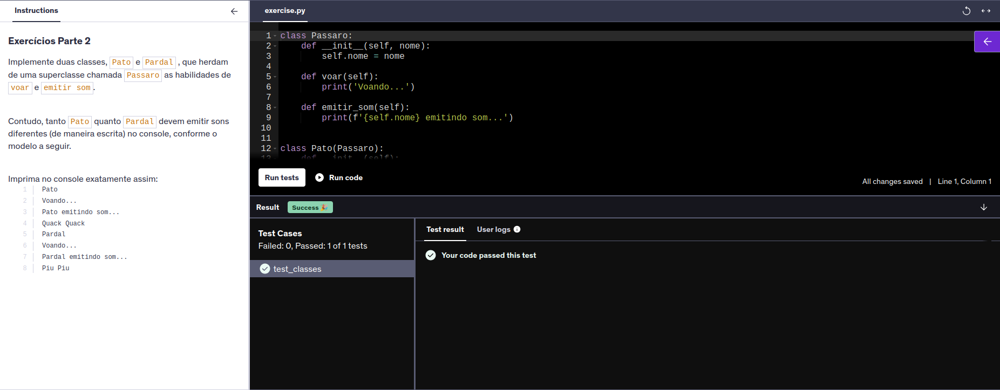

16. O código utiliza properties para criar um getter e um setter para o controle da classe Pessoa, protegendo o acesso ao atributo __nome, realizando validações mas sem alterar publicamente a interface. O código foi testado usando  o exemplo:

```
pessoa = Pessoa(0) 
pessoa.nome = 'Fulano De Tal'
print(pessoa.nome)
```

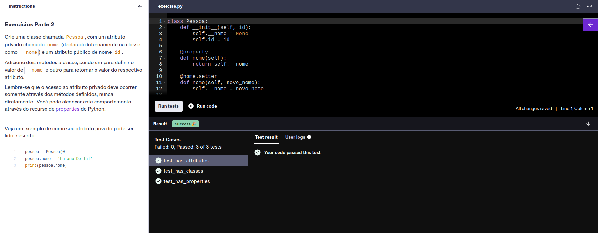

17. O código implementa uma classe `Cálculo` com dois métodos básicos simples de `adicao()` e de `subtracao()` imprimindo os resultados formatados. O output mostra que o código passou nos testes e rodou com as variáveis x e y fornecidas na questão:

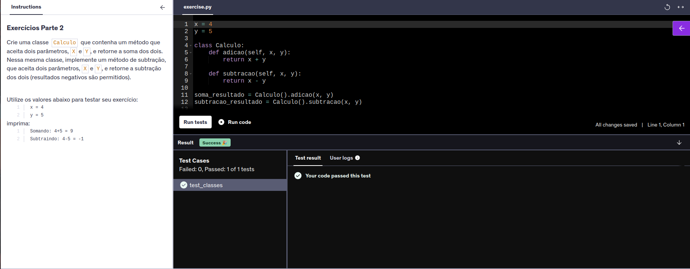

18. O código abaixo implementa uma classe chamada `Ordenadora` e que pode ser instanciada para ordenar uma lista de forma `crescente` através do método `ordenacaoCrescente` ou de forma `decrescente` através do método `ordenacaoDecrescente`. Abaixo uma amostra do código rodando com a testagem em positivo:      

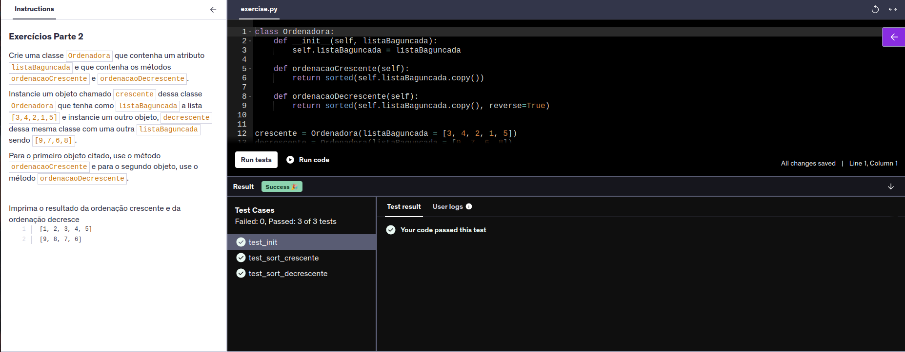

19. O código implementa uma classe `Aviao` que recebe os atributos  `modelo`, `velocidade_maxima` e `capacidade`, no qual o atributo cor seja sempre Azul. Ao receber uma lista de atributos, o código imprime no output os atributos em uma ordem requisitada na questão. Abaixo uma amostra do código rodando e passando pelo teste:

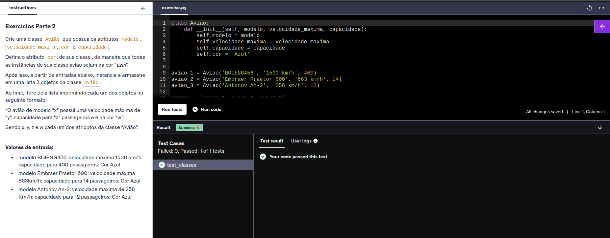

## Exercícios Python Avançado II
20. O código abaixo lê um arquivo e armazena o conteúdo na variável linhas, o converte para inteiros e filtra apenas os números pares com a ajuda das funções `map()` e `filter()`. Em seguida, os números são colocados em ordem decrescente e apenas o top 5 é selecionado. No final, é disponibilizazdo a soma dos 5 maiores números pares e a somaa deles. A priori a grande dificuldade de fazer esse código passar pelos testes foi saber que o nome do arquivo é **number.txt**, o que só foi conseguido lendo o retorno no cconsole de testes, mas abaixo é possível examinar que o código volta com todos os testes funcionando:

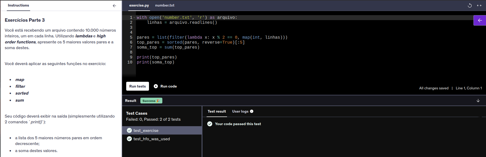

21. A função `conta_vogais()` filtra dentro de uma string quais letras são vogais: com a ajuda de uma função lambda e `filter()` e depois retorna essa seleção como lista usando a função `list()`, para daí retornar a quantidade de elementos dentro dessa lista com a função `len()`. A amostra abaixo mostra o código rodando e passando em todos os testes: 

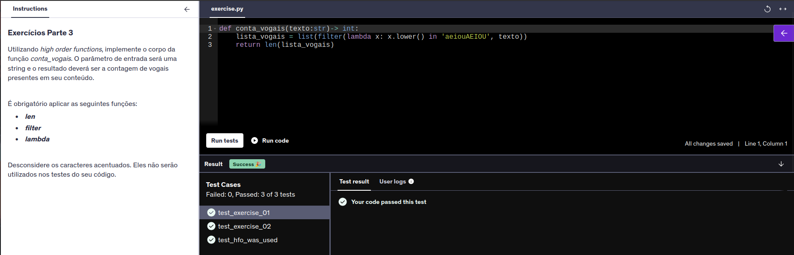

22. A função `calcula_saldo()` reduz cada produto ao seu preço utilizando a função `map()` e armazenando na variável valores e depois itera cada item somando os valores armazenados na variável valores com o próximo item com a ajuda da função importada `reduce()`, e o código é aprovado nos testes como pode ser observado abaixo:

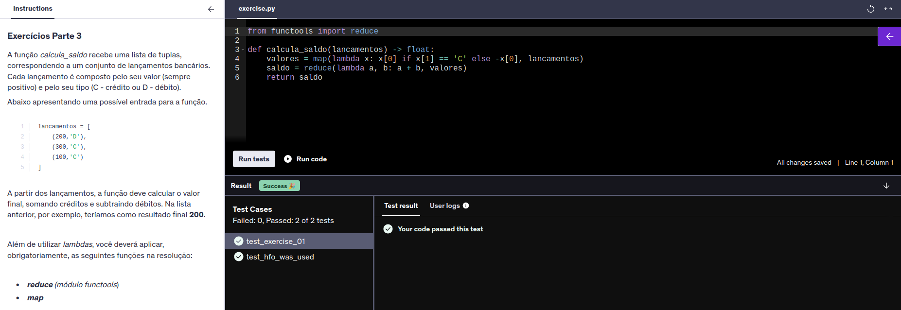

23. O código realiza diferentes operações com funções lambda e retorna o valor máximo dentre elas. As funções `map()` e `zip()` são usadas para aplicar as operações a cada par e combinar os operadores com seus pares de operandos, respectivamente. Por fim a função `max()` retorna o valor máximo. Abaixo nosso código roda passando por todos os testes:

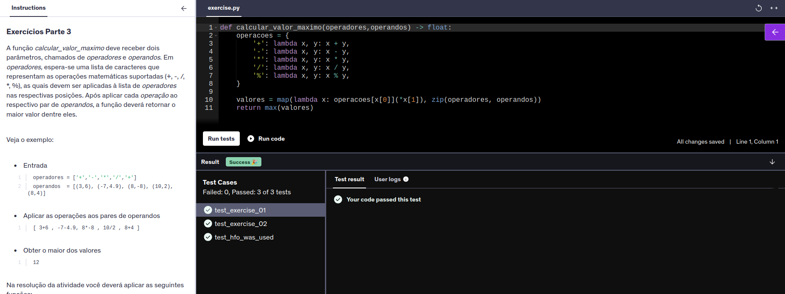

24. Esse foi um exercício difícil não pelo enunciado, mas pelos ajustes necessários para rodar nos testes. Foi requisitado uma listagem ordenada com o nome dos alunos, as três maiores notas listadas de maneira decrescente e a média dessas notas disponibilizada em até a segunda casa decimal. O resultado obtido era válido conforme os requisitos do enunciado da questão (ao utilizar todas as funções pedidas `round()`, `map()` e `sorted()`). Foi criada uma variável `notas_mod` e utilizando uma list comprehesion iteramos em cima da listagem das notas top 3 de cada aluno e convertemos para int todos os valores filtrados com a função `is_integer()` e arredondamos para uma casa decimal quem não fosse. A amostra abaixo mostra o código rodando e passando por todos os testes: 

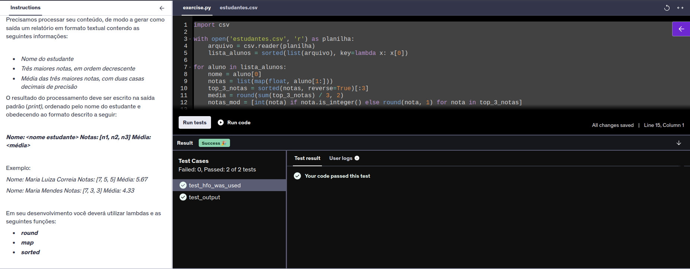

25. Para esse exercício, a função `maiores_que_media()` filtra e ordena produtos com preço acima da média de um dicionário chamado `conteudo`. Abaixo a amostra evidenciando os testes retornando como positivo para o código:

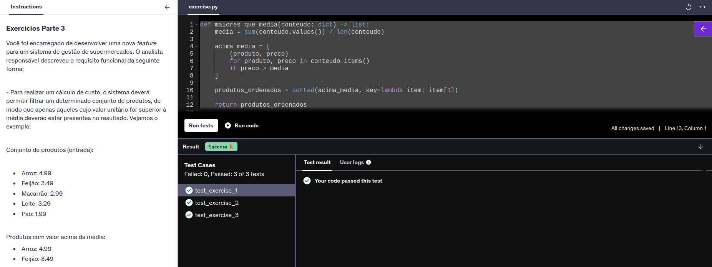

26. Para o exercício a função `pares_ate(n:int)` gera números pares, iniciando do 2 até um número n (incluindo ele, daí o n + 1). Abaixo a amostra do exercício aprovado pelo teste:

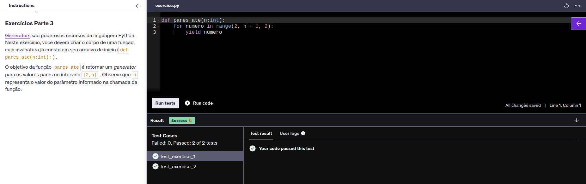

## Exercícios Python ETL
1. O enunciado da etapa 1 diz: "Apresente o ator/atriz com maior número de filmes e a respectiva quantidade. A quantidade de filmes encontra-se na coluna Number of movies do arquivo". O código desenvolvido abre e lê o arquivo **.csv** como uma lista de dicionário (gerando assim uma relação chave-valor), usa a função `max()` para retornar o valor máximo percorrido com uma função lambda na coluna 'Number of Movies'.

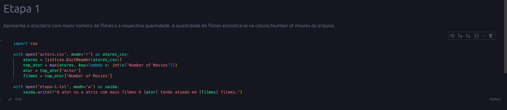

O resultado é gravado no arquivo **etapa-1.txt** com a informação desejada das colunas 'Actor' e 'Number of Movies':

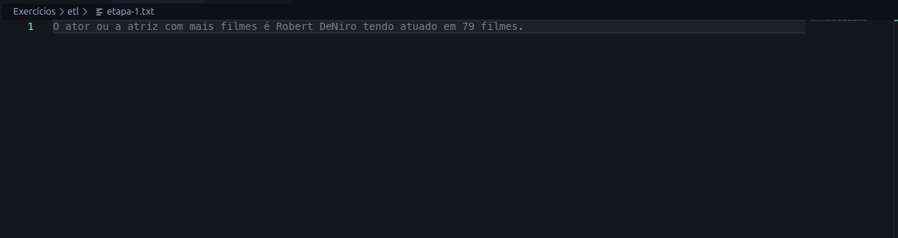

2. O enunciado da etapa 2 pede: "Apresente a média de receita de bilheteria bruta dos principais filmes, considerando todos os atores. Estamos falando aqui da média da coluna Gross". O código abaixo abre o arquivo, converte os dados em uma lista de dicionário, calcula-se a média dividindo a soma dos valores da coluna 'Gross' pelo número de elementos da lista.

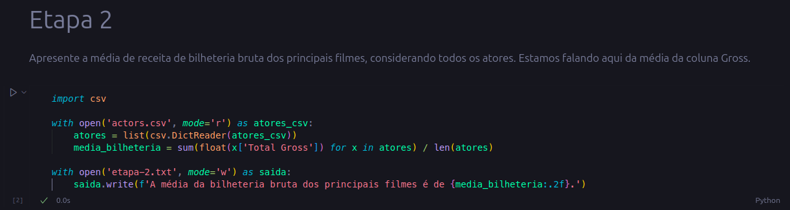

O resultado foi então registrado no arquivo **etapa-2.txt** com a média bruta das bilheterias e formatado para apresentar o resultado com duas casas decimais:

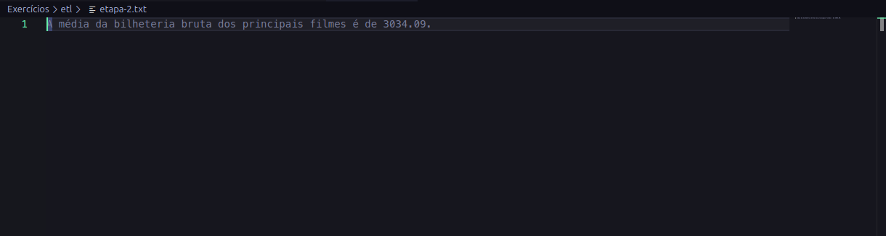

3. O enunciado da etapa 3 é a seguinte: "Apresenta o ator/atriz com a maior média de receita de bilheteria bruta por filme do conjunto de dados. Considere a coluna Average per Movie para fins de cálculo". O código lê o arquivo e o converte em uma lista de dicionário e com a ajuda de uma função lambda e da função `max()`, retorna o valor máximo da coluna 'Average per Movie'.

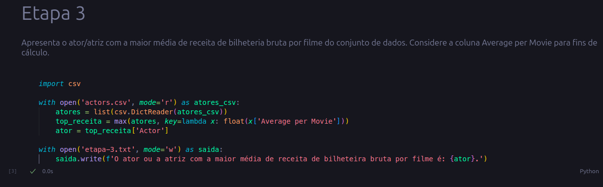

O resultado foi registrado no arquivo **etapa-3.txt** trazendo o nome do ator com o maior valor médio por filme:


4. Para a etapa 4 é requisitado: "A coluna #1 Movie contém o filme de maior bilheteriea em que o autor atuou. Realize a contagem de aparições destes filmes no dataset, listando-os ordenados pela quantidade de vezes em que estão presentes. Considere a ordem decrescente e, em segundo nível, o nome do filme. 

Ao escrever no arquivo, considere o padrão de saída (sequencia) - O filme (nome filme) aparece (quantidade) vez(es) no dataset, adicionando um resultado a cada linha". O código escrito é um pouco mais complexo: ele começa com um dicionário vazio, percorre a lista de filmes adicionando os filmes a essa lista, e se o filme já está lá, o contador é incrementado em um para cada vez que ele aparece de novo na iteração.

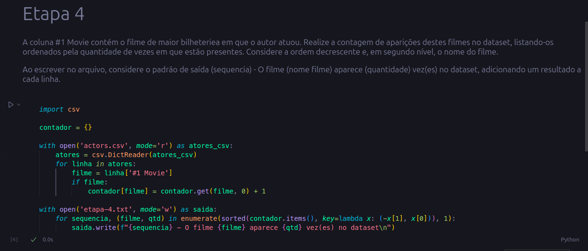

O resultado é registrado com a ajuda da função `enumerate()` que recupera o índice da lista, além do nome dos filmes e de quantas vezes foram registradas após a iteração. A função lambda é responsável ainda por ordenar a lista de forma decrescente à partir da quantidade de registros de cada filme. Os registros foram realizados conforme a formatação requisitada:

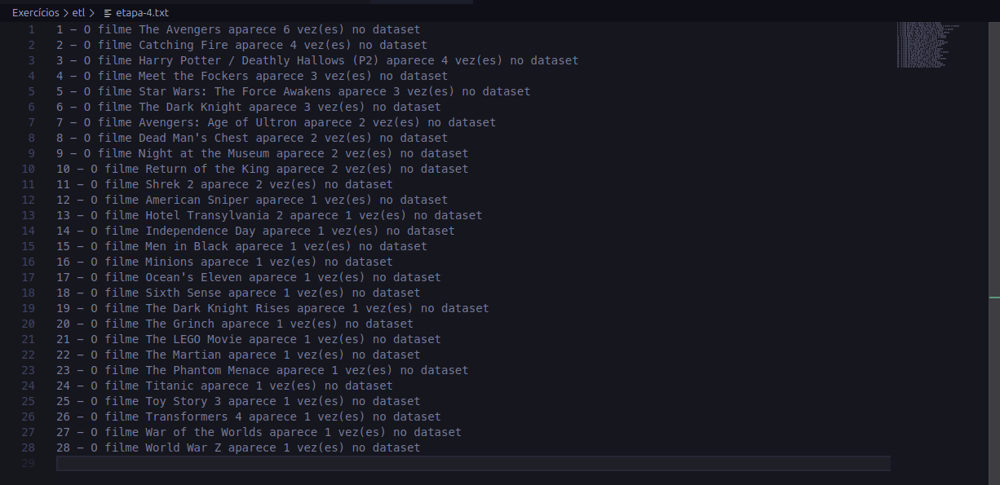

5. Por fim, para a etapa 5 o enunciado pede: "Apresente a lista dos atores ordenada pela receita bruta de bilheteria de seus filmes (coluna Total Gross), em ordem decrescente. Ao escrever no arquivo, considere o padrão de saída (nome do ator) - (receita total bruta), adicionando um resultado a cada linha". O código lê os dados, ordena a lista de maneira decrescente pela coluna 'Total Gross' com a ajuda de uma função lambda, mantendo os valores como float para que isso não atrapalhe a ordenação.

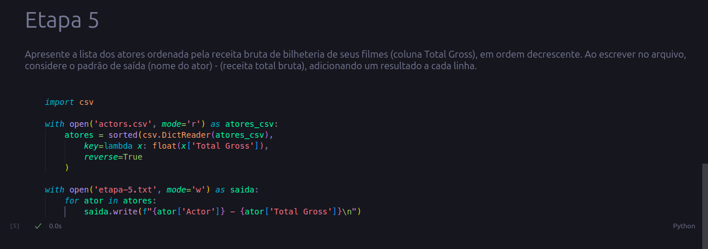

Os registros são salvos contendo ordenadamente o nome de cada ator e atriz, e o valor total da receita bruta:

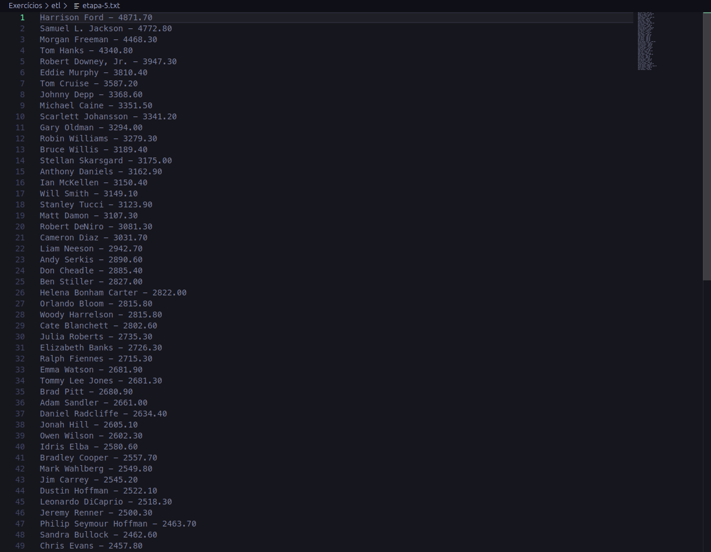

# Certificados
Não foi realizado nenhum curso fora da plataforma Udemy, portanto não foi necessário apresentar nenhum certificado.