# Desafio da Sprint 3 - Docker e Python

## Entregáveis

- [x] dois arquivos no formato **.py** contendo o código usado para a execução de cada etapa correspondente do problema;

    - [etl.py](./etapa-1/etl.py)

    - [job.py](./etapa-2/job.py)

- [x] dois arquivos **Dockerfile** contendo as resoluções de cada etapa correspondendo do problema;

    - [Dockerfile de ETL da Etapa 3](./etapa-3/Dockerfile)

    - [Dockerfile de Job da Etapa 4](./etapa-4/Dockerfile)

- [x] um arquivo **docker-compose.yaml** contendo a resolução do problema proposto;

    - [docker-compose da Etapa 5](./etapa-5/docker-compose.yml)

- [x] um arquivo **.csv** após o processo de limpeza;

    - [csv_limpo.csv da Etapa 1](./etapa-1/csv_limpo.csv)

- [x] um arquivo **.txt** com as respostas dos questionamentos da etapa 5;

    - [respostas.txt da Etapa 5](./etapa-5/volume/respostas.txt)

- [x] duas imagens de gráficos geradas no formato png.

    - [Q4.png](./etapa-2/Q4.png)

    - [Q5.png](./etapa-2/Q5.png)

## Sumário
1. [Desafio](#desafio)

2. [Etapa 1](#etapa-1)

3. [Etapa 2](#etapa-2)

4. [Etapa 3](#etapa-3)

5. [Etapa 4](#etapa-4)

6. [Etapa 5](#etapa-5)

## Desafio 

O objetivo do desafio dessa sprint é a prática de Docker e Python combinando os conhecimentos que foram adquiridos no PB.

A preparação para o desafio envolveu o download do arquivo [concert_tours_by_women.csv](./etapa-1/concert_tours_by_women.csv) e a disponibilidade dos recursos envolvendo a containerização das soluções requisitadas. O desafio foi realizado em 5 etapas distintas:

Na **primeira etapa** foi requisitada a entrega de um script chamado **etl.py** que fará a limpeza dos dados do arquivo csv disponibilizado, resultando em um arquivo nomeado como **csv_limpo.csv** exatamente como na imagem abaixo:

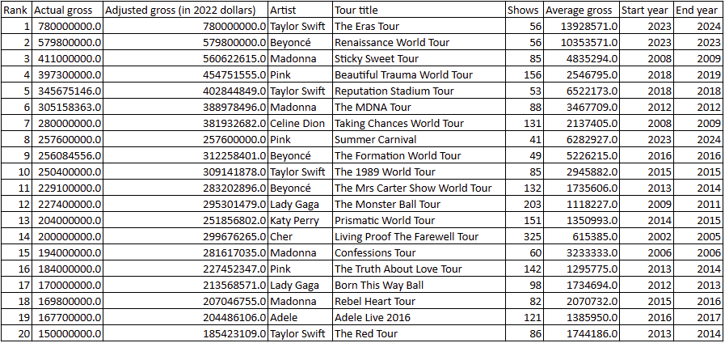

Para a **segunda etapa** o script **job.py** deverá realizar o processamento dos dados e realizar uma série de perguntas:

1. Qual é a artista que mais aparece nessa lista e possui a maior média de seu faturamento bruto (Actual gross)?

2. Das turnês que aconteceram dentro de um ano, qual a turnê com a maior média de faturamento bruto (Average gross)

3. Quais são as 3 turnês que possuem o show (unitário) mais lucrativo? Cite também o nome de cada artista e o valor por show. Utilize a coluna "Adjusted gross (in 2022 dollars)". Caso necessário, crie uma coluna nova para essa conta.

4. Para a artista que mais aparece nessa lista, e que tenha o maior somatório de faturamento bruto, crie um gráfico de linhas que mostra o faturamento por ano da turnê (use a coluna Start Year). Apenas os anos com turnês.

5. Faça um gráfico de colunas demonstrando as 5 artistas com mais shows na lista.

Na **terceira etapa** vamos criar um arquivo **Dockerfile** para executar o script criado na etapa 1.

Para a **quarta etapa** vamos criar um arquivo **Dockerfile** para executar o script criado na etapa 2.

Finalmente, na **quinta etapa** vamos criar um arquivo **docker-compose** para conectar os dois contêineres e rodar a aplicação completa utilizando um volume em uma pasta local criada especificamente para isso, o nome do diretório deve ser **/volume**. A execução do desafio deve ser somente pelo **docker-compose**.

### **ATENÇÂO**: 

- a solução para as primeira e segunda etapas foram prototipadas em um **jupyter notebook** para cada etapa, que, apesar de não ser um entregável, também se encontra em suas respectivas pastas.

- a etapa 5 pode ser resolvida de mais de uma maneira, apresentamos uma de uma maneira 

## Etapa 1

Após examinar a imagem fornecida para o desafio, seguimos uma série de passos para a resolução da etapa:

1. Ajuste do título da coluna "Adjustedgross (in 2022 dollars)"

2. Criação das colunas "Start year" e "End year"

3. Limpeza e Transformação das colunas "Actual gross", "Adjusted gross (in 2022 dollars)" e "Average gross"

4. Limpeza da coluna "Tour title"

5. Exportar o Dataframe tratado como "csv_limpo.csv"

O código final do script [etl.py](./etapa-1/etl.py) ficou da seguinte maneira:

```Python
import pandas as pd

df = pd.read_csv(
    './concert_tours_by_women.csv',
    usecols=[
        'Rank',
        'Actual gross',
        'Adjustedgross (in 2022 dollars)',
        'Artist',
        'Tour title',
        'Shows',
        'Average gross',
        'Year(s)',
    ],
)

df = df.rename(
    columns={'Adjustedgross (in 2022 dollars)': 'Adjusted gross (in 2022 dollars)'}
)

df[['Start year', 'End year']] = df['Year(s)'].str.split('-', expand=True)
df['End year'] = df['End year'].fillna(df['Start year'])
df = df.drop('Year(s)', axis=1)

aux = ['Actual gross', 'Adjusted gross (in 2022 dollars)', 'Average gross']
df[aux] = df[aux].replace(r'[^\d]', '', regex=True).astype(float)

df['Tour title'] = (
    df['Tour title']
    .str.replace(r'\[.*?\]|[^\w\s]', '', regex=True)
    .str.replace(r'\s+', ' ', regex=True)
    .str.strip()
)

df.to_csv('csv_limpo.csv', index=False)

```

1. A biblioteca Pandas foi importada para a manipulação dos dados da tabela fornecida, sendo importado como *dataset* apenas as colunas necessárias. Com a função `rename` ajustamos o nome da coluna **Adjustedgross (in 2022 dollars)** para **Adjusted gross (in 2022 dollars)**.

2. As colunas **Start year** e **End year** foram criadads à partir da coluna **Year(s)** utilizando a função `split` da biblioteca Pandas, que dividiu os valores no "-". Não sabíamos antes, mas foi possível criar uma nova coluna com o argumento **expand**, já que selecionamos os nomes das colunas antes como uma lista. Contudo a coluna **End year** ficou com valores faltantes, justamente porque os valores registrados na coluna **Year(s)** se encaixavam em duas categorias, ou eram registradas como um único ano quando o tour aconteceu, ou como a série de anos (quando o tour aconteceu), de maneira que utilizamos a função `fillna` para preencher os valores faltantes de **End year** com os valores de **Start year**. Como a coluna **Year(s)** já não era mais necessária, excluímos ela com a função `drop`.

Documentação e Links consultados para a solução usando `split`:

- https://pandas.pydata.org/pandas-docs/stable/reference/api/pandas.Series.str.split.html

- https://www.geeksforgeeks.org/python-pandas-split-strings-into-two-list-columns-using-str-split/

- https://stackoverflow.com/questions/63796316/string-split-with-expand-true-can-anyone-explain-what-is-the-meaning

3. As colunas **Actual gross**, **Adjusted gross (in 2022 dollars)** e **Average gross** precisaram ser limpas (utilizamos expressões regulares) e convertidas para "float". Para isso, criamos um Dataframe com essas colunas, e utilizando o método `replace`, filtramos todos os caractéres que não fossem dígitos com a expressão regular `r'[^\d]'`, para só então converter os dados para "float" com a função `astype`. 

4. A limpeza da coluna **Tour title** foi a mais trabalhosa e precisamos realizar uma série de limpezas com expressões regulares utilizando a função `replace` e a função `strip` para remover possíveis espaços em branco antes ou após as *strings* registradas na coluna. Para a primeira expressão regular `r'\[.*?\]|[^\w\s]'` a ideia foi filtrar com a ajuda de um operador *pipe* os caractéres entre colchetes (incluindo os próprios colchetes), e os caractéres que não fossem alfanuméricos. Como os dados foram obtidos por webscraping, notamos a presença de valores entre colchetes, que podem ter sido provenientes de notas ou observações no local onde foram adquiridos os dados, problemas como esse podem voltar a acontecer e a ideia foi prover uma solução duradoura. Para o caso de algum espaço estar duplicado onde filtramos os valores, usamos a expressão regular `r'\s+'` para normalizar esse espaço.

5. O Dataframe foi exportado como um arquivo csv e se encontra na pasta desta etapa como [csv_limpo.csv](./etapa-1/csv_limpo.csv).

Na amostra à seguir ativamos o ambiente virtual com o uso do gerenciador de ambientes e bibliotecas **conda**, examinamos a pasta da etapa e conferimos que o arquivo final não está presente. Rodamos o script **etl.py**, que realiza os tratamentos necessários e exporta o arquivo em csv, que no final se encontra no nosso diretório.:

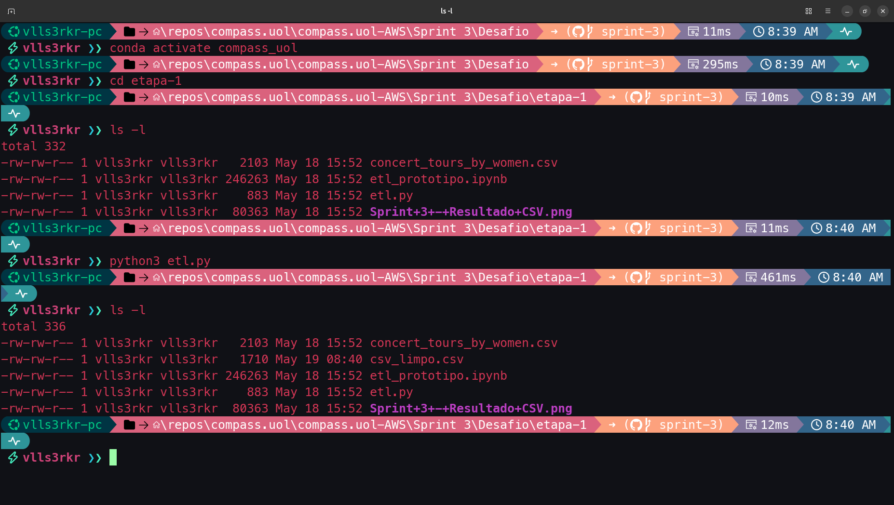

Abaixo o arquivo csv_limpo.csv aberto com o **software** Libre Calc:

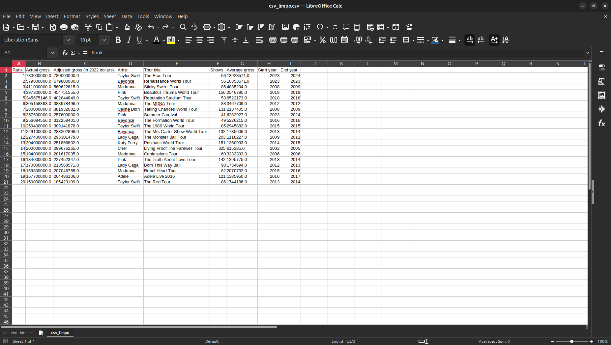

## Etapa 2

O processamento de dados foi realizado observando as questões propostas para essa etapa do desafio. O código final do script [job.py](./etapa-2/job.py) ficou da seguinte maneira:

```Python
import pandas as pd
import matplotlib.pyplot as plt
import seaborn as sns

df = pd.read_csv("../etapa-1/csv_limpo.csv")

q1 = (
    df.groupby('Artist')
    .filter(lambda x: len(x) == df['Artist'].value_counts().max())
    .groupby('Artist')['Actual gross']
    .mean()
    .reset_index()
    .sort_values('Actual gross', ascending=False)
    .head(1)
    .iloc[0]['Artist']
)

q2 = (
    df[df['Start year'] == df['End year']]
    .nlargest(1, 'Average gross')
    .iloc[0]['Tour title']
)

q3 = (
    df.assign(show_unitario = df['Adjusted gross (in 2022 dollars)'] / df['Shows'])
    .sort_values('show_unitario', ascending=False)
    .head(3)
    [['Artist', 'Tour title', 'show_unitario']]
    .rename(columns={'show_unitario': 'Show unitario'})
    .reset_index(drop=True)
)

with open('respostas.txt', mode='w') as saida:
    saida.write(f'Q1: \n\n--- A artista que mais aparece nessa lista e possui a maior média de seu faturamento bruto é {q1}\n\n')
    saida.write(f'Q2: \n\n--- Das turnês que aconteceram dentro de um ano, qual a turnê com a maior média de faturamento bruto é {q2}\n\n')
    saida.write(f'Q3: \n\n--- As três turnês que tiveram os shows mais lucrativos foram: {q3["Tour title"].iloc[0]} de {q3['Artist'].iloc[0]}, com o show unitário avaliado em US${q3["Show unitario"].iloc[0]:.2f}, {q3["Tour title"].iloc[1]} de {q3['Artist'].iloc[1]}, com o show unitário avaliado em US${q3["Show unitario"].iloc[1]:.2f}, e {q3["Tour title"].iloc[2]} de {q3['Artist'].iloc[2]}, com show unitário avaliado em US${q3["Show unitario"].iloc[2]:.2f}.\n\n')

q4 = (
    df
    .groupby('Artist')
    .filter(lambda x: len(x) == df['Artist'].value_counts().max())
    .groupby('Artist')['Actual gross']
    .sum()
    .pipe(lambda x: df[df['Artist'] == x.idxmax()])
)

plt.figure(figsize=(14, 8))

sns.lineplot(data=q4, x='Start year', y='Actual gross', marker='o')
plt.title(f'Faturamento Bruto por Início de Tour da artista "{q4["Artist"].iloc[0]}"')
plt.xlabel('Ano de Início da Tour')
plt.ylabel('Faturamento Bruto em Dólares')
plt.gca().yaxis.set_major_formatter('${x:,.0f}')
plt.savefig('Q4.png', dpi=300, bbox_inches='tight')
plt.close()

q5 = (
    df
    .groupby('Artist')['Shows']
    .sum()
    .sort_values(ascending=False)
    .head(5)
    .reset_index()
)

plt.figure(figsize=(14, 8))

sns.barplot(data=q5, x='Shows', y='Artist', hue='Artist')
plt.title('Top 5 Artistas por Número de Shows')
plt.xlabel('Número de Shows')
plt.ylabel('Artistas')
plt.savefig('Q5.png', dpi=300, bbox_inches='tight')
plt.close()
```

Para toda a resolução do script, importamos as bibliotecas Pandas, Matplotlib e Seaborn.

### Questões 1, 2 e 3:

1. Questão 1: a resolução foi feita pegando o valor máximo de aparições das artistas na coluna **'Artist'**, somando os valores brutos adquiridos em cada turnê, que foram registrados na coluna **'Actual gross'**, e dividido pelo número de turnês de cada artista (que é essencialmente o que a função `mean` está fazendo junto a função `groupby`.).

2. Questão 2: Separamos as turnês que aconteceram dentro de um ano igualando as colunas de **'Start year'** e **'End year'** e usamos a função `nlargest` para pegar o maior valor da coluna **'Average gross'**, e por último selecionamos o valor da coluna **'Tour title'**.

3. Questão 3: Foi criada uma nova coluna chamada **'show_unitario"** calculada à partir da divisão da coluna **'Adjusted gross (in 2022 dollars)'** pela coluna **'Shows'**, em seguida os valores resultantes foram organizados em ordem decrescente e foram separados os top 3 casos. renomeamos a coluna **'show_unitario'** para **'Show unitario'** (não conseguimos fazer direto porque a função `assign` não havia aceitado esse nome separado ou entre aspas). Resetamos o index apenas para a criação do novo dataframe.

As três questões foram exportadas em um arquivo **respostas.txt** e organizadas conforme os requerimentos do desafio.

### Questões 4 e 5:

4. Questão 4: Caso a nossa tabela seja atualizada e outra artista venha a ser aquela que mais aparece na lista e que tenha o maior somatório de faturamento bruto, nosso código **PRECISA** capturar essa mudança. Para isso filtramos com uma função lambda e as funções `value_counts` e `max` (que pegou o valor máximo da contagem de valores filtrados na coluna **'Artist'**) os artistas que mais aparecem na lista. O gráfico requisitado para a questão foi um gráfico de linha plotado com a função `lineplot` da biblioteca seaborn e as funções de matplotlib para ajustar o título, os eixos x e y, usamos a função `gca` para ajustar os valores do eixo y de forma que fique mais legível e em dólares americanos.

5. Questão 5: Simplesmente agrupamos o shows por artistas, organizamos os valores por ordem ascendente e guardamos apenas as top 5 artistas com mais shows realizados. Plotamos um gráfico em barras horizontais com a função `barplot` do seaborn e ajustamos o título, os eixos x e y com as funções do matplotlib.

No script **job.py**, usamos a função `savefig` para salvar as figuras com título Q4 e Q5, setamos a qualidade para 300 dpi e **bbox_inches** como 'tight' para que a imagem não tivesse espaços em brancos desnecessários ao redor.

Na amostra abaixo trazemos o nosso diretório antes e depois de rodar o script, mostrando que os arquivos se encontram na pasta após sua execução:

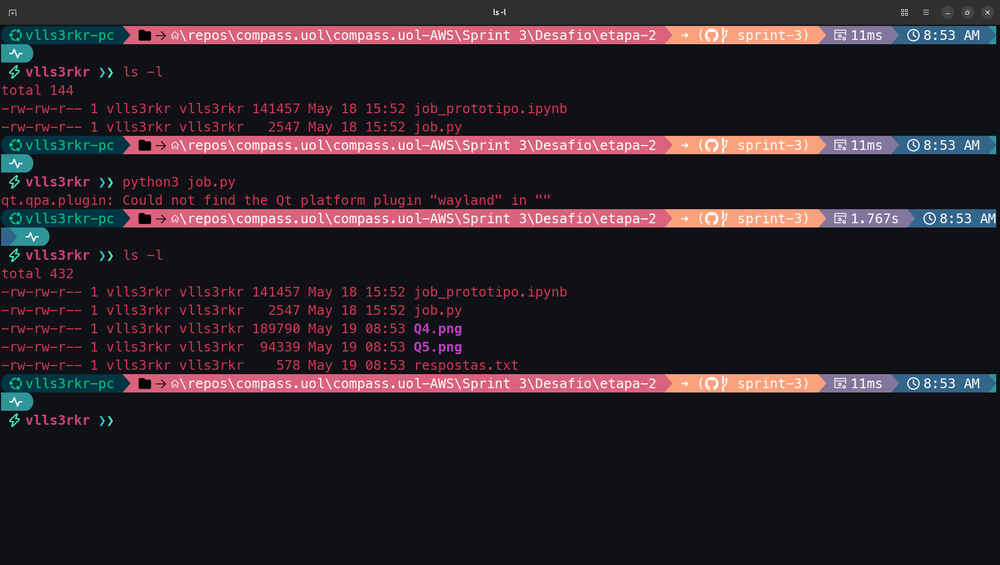

A amostra à seguir mostra o arquivo obtido **respostas.txt** no formato requerido:

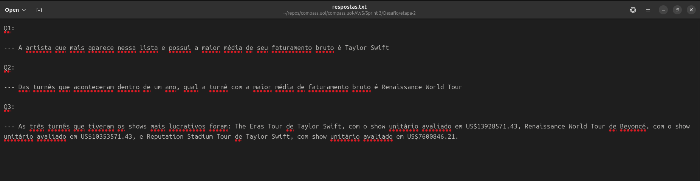

Por fim, as próximas duas amostras trazem os gráficos exportados com o script, um gráfico em linhas e um gráfico de barras horizontais:

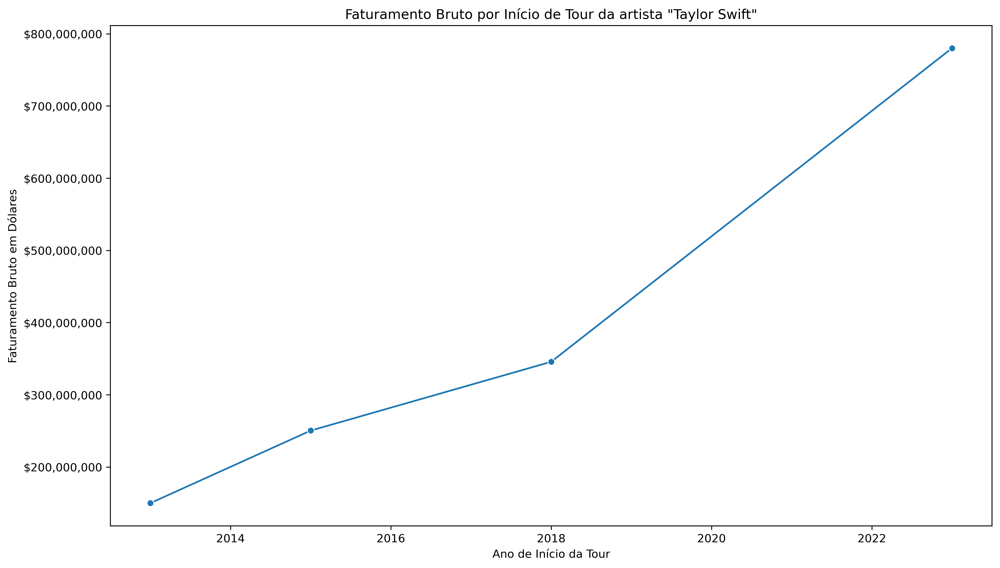

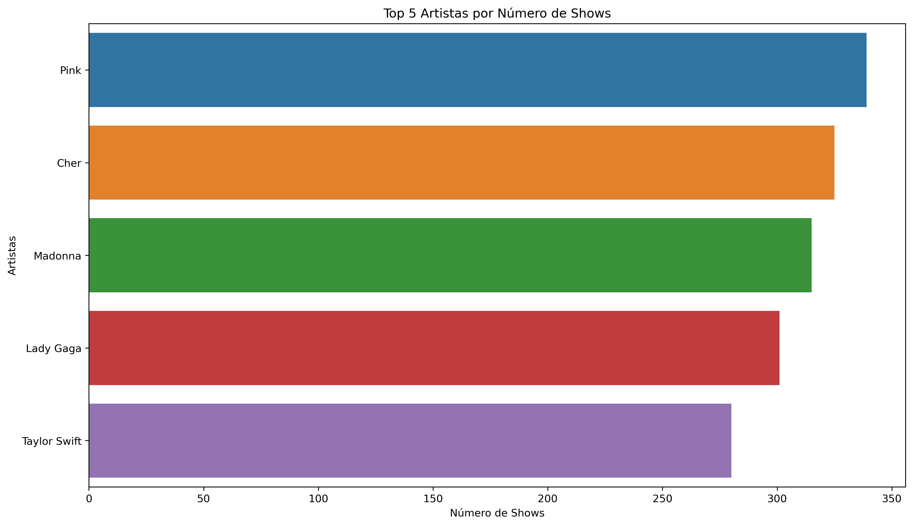

## Etapa 3

Conteinerizamos a Etapa 1 com um Dockerfile, constrói uma imagem com python:3.13.3-alpine (o mesmo utilizado nos Exercícios), ajusta o diretório de trabalho com `WORKDIR /app`, copia para o contêiner o script **etl.py**, a planilha original **concert_tours_by_women.csv**, os requerimentos para instalar a biblioteca **Pandas**, que será instalado com a linha `RUN pip install --no-cache-dir -r requirements.txt`, e, após a construção o script roda com os comandos sinalizados na linha CMD: `CMD ["python3", "etl.py"]`. **Não foi requerida a construção de um volume nessa etapa**, mas nós criamos um *bind mounting* chamado **volume** híbrido no intuito de demonstrar o sucesso do contêiner que ao finalizar, salva o **csv_limpo.csv** no volume.

```yaml
FROM python:3.13.3-alpine

WORKDIR /app

COPY ./etl.py /app/etl.py

COPY ./concert_tours_by_women.csv /app/concert_tours_by_women.csv

COPY requirements.txt /app/requirements.txt

RUN pip install --no-cache-dir -r requirements.txt

VOLUME /app/volume

CMD ["python3", "etl.py"]
```

No terminal, utilizamos o comando `docker build -t etl .` para construir a imagem à partir do **Dockerfile**, que importa os arquivos necessários e instala o requerimento necessário, processo registrado nas próximas duas amostras que trazem a construção da imagem sem encontrar nenhum erro e, adicionalmente, é possível notar que antes desse processo, não há nenhum volume montado ou o arquivo final presente:

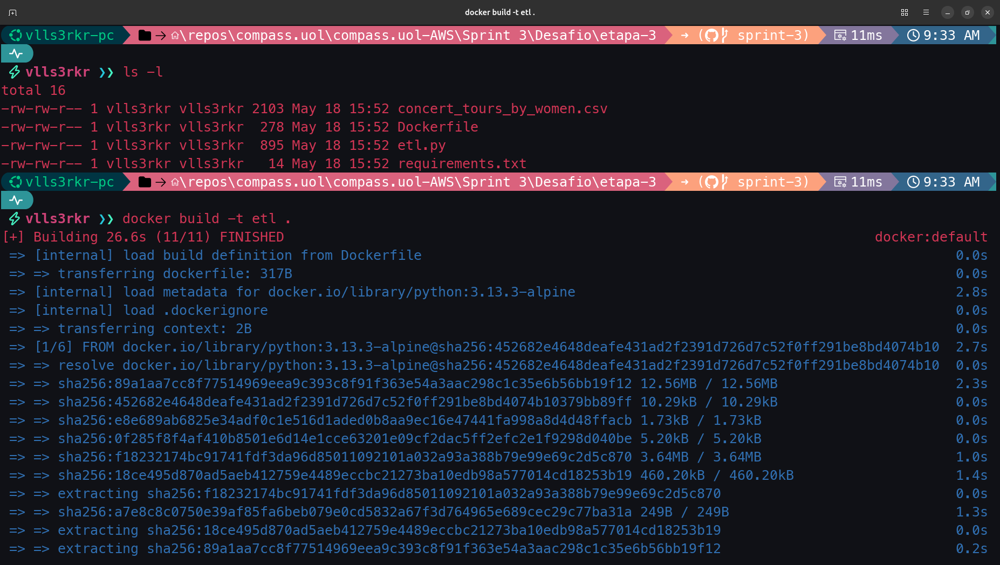

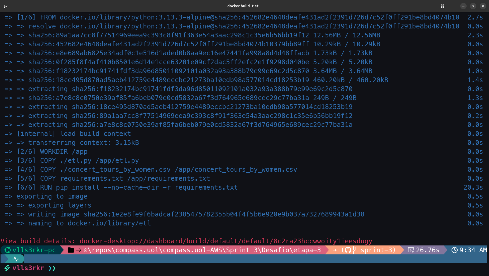

Em seguida, rodamos o contêiner e montamos o volume localmente com `docker run -v ./volume:/app/volume etl`. Novamente, o diretório volume não foi requerido para essa etapa, mas foi uma maneira encontrada para mostrar que o resultado foi obtido satisfatoriamente. Em seguida recuperamos o conteúdo do diretório volume com o comando `tree` que mostra a presença do arquivo **csv_limpo.csv**.

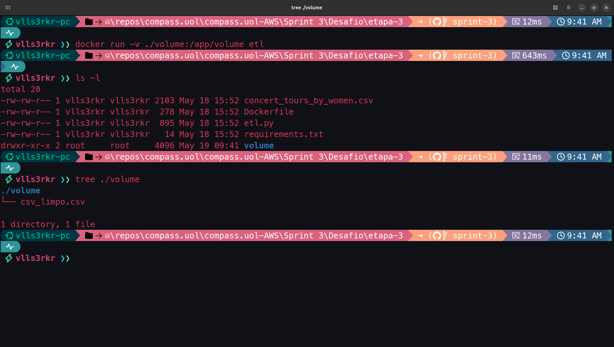

## Etapa 4

Conteinerizamos a Etapa 2 com um Dockerfile, constrói uma imagem com python:3.13.3-alpine, ajusta o diretório de trabalho com `WORKDIR /app`, copia para o contêiner o script **job.py**, a planilha modificada **csv_limpo.csv**, os requerimentos para instalar as bibliotecas necessárias, que será instalado com a linha `RUN pip install --no-cache-dir -r requirements.txt`, e, após a construção o script roda com os comandos sinalizados na linha CMD: `CMD ["python3", "job.py"]`. **Também não foi requerida a construção de um volume nessa etapa**, mas nós criamos um *bind mounting* chamado **volume** híbrido no intuito de demonstrar o sucesso do contêiner que ao finalizar, salva o arquivo **respostas.txt** e as imagens **Q4.png** e **Q5.png** no volume.

```yaml
FROM python:3.13.3-alpine

WORKDIR /app

COPY ./job.py /app/job.py

COPY ./csv_limpo.csv /app/csv_limpo.csv

COPY requirements.txt /app/requirements.txt

RUN pip install --no-cache-dir -r requirements.txt

VOLUME /app/volume

CMD ["python3", "job.py"]

```

De modo parecido ao da etapa anterior, no terminal, utilizamos o comando `docker build -t job .` para construir a imagem à partir do **Dockerfile**, que importa os arquivos necessários e instala os requerimento necessários. Esse processo é visto nas próximas duas amostras que trazem a construção da imagem sem encontrar nenhum erro e, adicionalmente, é possível notar que antes desse processo, não há nenhum volume montado ou o arquivo final presente:

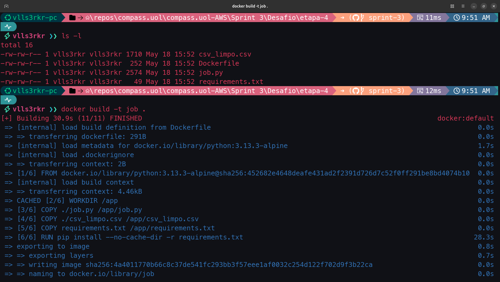

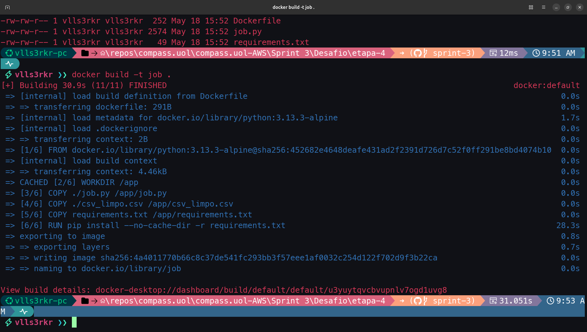

Logo após isso, rodamos o contêiner e montamos o volume localmente com `docker run -v ./volume:/app/volume job`. Mais uma vez, o diretório volume não foi requerido para essa etapa, mas foi uma maneira encontrada para mostrar que o resultado foi obtido. Em seguida recuperamos o conteúdo do diretório volume com o comando `tree` que mostra a presença dos arquivos requisitados. Todos esse processo pode ser encontrado à seguir:

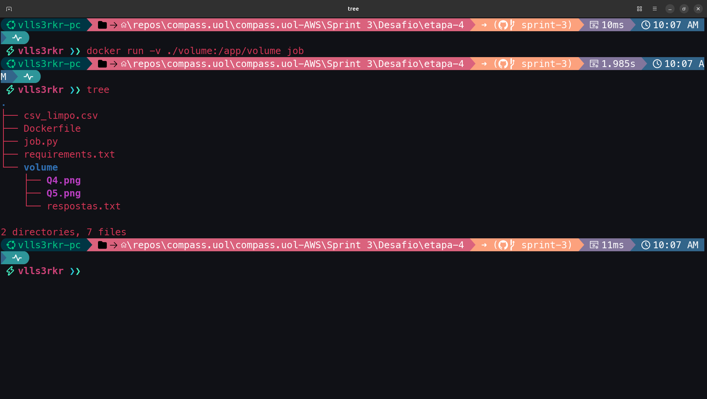


## Etapa 5

Para a última etapa, construímos um arquivo docker-compose que pudesse, simultaneamente (como requisitado pelo desafio) lançar os contêiners e as tarefas dos scripts de etl e job das etapas 1 e 2. **Nunca havíamos feito essa tarefa em docker-compose à partir de diferentes Dockerfile** e ficamos satisfeitos com o resultado. Como toda a estrutura já havia sido montado anteriormente nos respectivos diretórios, aqui só criamos o arquivo [docker-compose.yml](./etapa-5/docker-compose.yml) e entregamos as coordenadas dos Dockerfiles de cada tarefa, montamos os volumes e os comandos a ser realizados e sinalizamos que o serviço de **job** só aconteceria se e quando o serviço de **etl** fosse completado com sucesso. Esse é um jeito muito **elegante** de realizar a tarefa.

**ATENÇÃO** é necesśario fazer uma observação rápida, pois houve uma alteração no I/O dos arquivos de script **etl.py** e **job.py**: como o primeiro script leu o arquivo csv inicial no diretório de trabalho, realizou o serviço de limpeza e exportou o arquivo limpo para a pasta volume, que é compartilhada entre contêiners, o segundo serviço teve que pegar o arquivo limpo nessa pasta e exportar para ela o arquivo das respostas e os dois gráficos, de modo que esse pequeno ajuste de onde eles vão ler e onde vão salvar os arquivos foi necessário.

O arquivo docker-compose.yml ficou da seguinte maneira:

```yaml
services:
  etl:
    build:
      context: ../etapa-3
      dockerfile: Dockerfile
    volumes:
      - ./volume:/app/volume
    command: python3 etl.py

  job:
    build:
      context: ../etapa-4
      dockerfile: Dockerfile
    depends_on:
      etl:
        condition: service_completed_successfully
    volumes:
      - ./volume:/app/volume
    command: python3 job.py

volumes:
  volume:
```


De maneira semelhante verificamos apenas a presença do arquivo do docker-compose no diretório. Construímos a iamgem e rodamos os contêiners com docker-compose com `docker compose up --build` e, em seguida, usamos o comando `tree` para verificar a construção do diretório volume com os arquivos requisitados (se após isso, quisermos apenas rodar os contêiners, usamos `docker compose up`). As amostras seguintes trazem esse processo e demonstram o sucesso do processo:

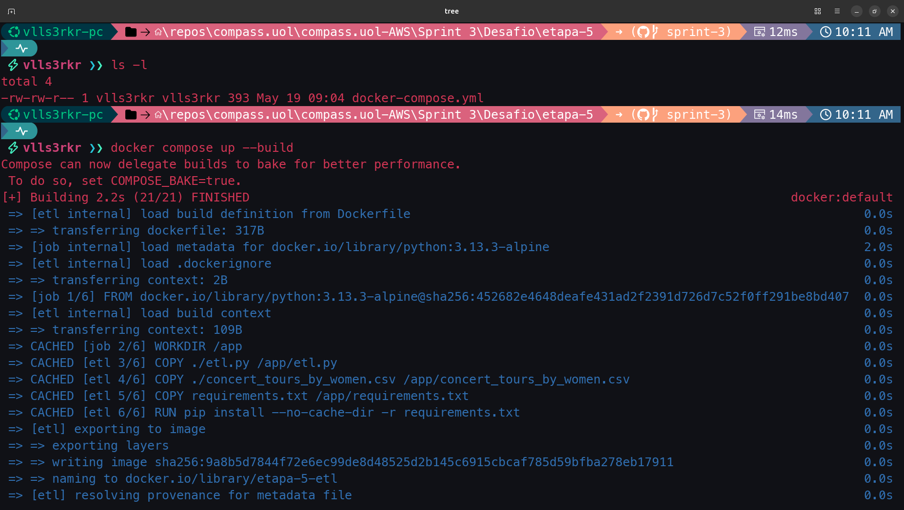

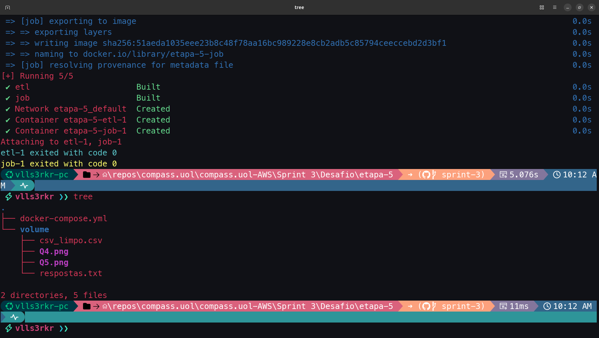

## Etapa 5 (Alternativa)

Uma alternativa, semelhante ao que já fizemos em outros projetos, foi o de recriar todo o processo com docker-compose. Estamos mais acostumados com essa solução por duas razões:

1. se modificarmos qualquer um dos componentes nos diretórios das etapas anteriores, o docker-compose não vai conseguir terminar a construção da imagem ou o processo das tarefas vai falhar (pode haver erros de importação, execução, instalação ou mesmo de comunicação entre os contêiners);

2. um projeto pode não começar com Dockerfiles e escalar para vários contêiners funcionando em paralelo com diferentes serviços, ele já pode ser planejado dessa maneira desde o início. Se existir uma demanda na arquitetura da solução, não há razão para não planejar o uso de docker-compose desde o início (e isso é mais fácil de enxergar de antemão quando há um objetivo claro, ou em um contexto de projeto de estudos ou de portifólio).

Essencialmente o que fizemos foi importar para dentro dos contêiners os arquivos necessários para o trabalho de cada contêiner. No caso do primeiro serviço, o **etl**, importamos o script, o arquivo csv inicial (que vai ser limpo nesse trabalho), um arquivo de requirements a ser instalado e o volume. O conjunto de comandos precisa ser passado explicitamente, como a imagem base `image: python:3.13.3-alpine` não possui bash instalado, o comando é sinalizado para rodar no **shell** como **comando** com `sh -c`. O serviço de **job** é arquitetado de maneira semelhande, passamos a mesma condição para rodar apenas quando o serviço anterior tiver êxito, mas só precisamos importar o script e os requirements, além de apontar a criação do volume, porque o csv_limpo.csv vai ser entregue justamente pelo serviço anterior. Como são dois contâiners que realizam tarefas diferentes e que dependem de bibliotecas diferentes, reparem que preparamos dois requirements diferentes, o **requirements_etl.txt** e o **requirements_job.txt**, mas que ao ser importados para seus devidos contêiners são renomeados como **requirements.txt**, evitando que eles tenham um tamanho maior que o necessário por instalação de bibliotecas que sejam desnecessárias para as suas tarefas. O resultado é o mesmo apresentado no outro modelo da Etapa 5. 

O arquivo do docker-compose.yml ficou da seuginte maneira:
 
```yaml
services:
  etl:
    image: python:3.13.3-alpine
    working_dir: /app
    volumes:
      - ./etl.py:/app/etl.py
      - ./concert_tours_by_women.csv:/app/concert_tours_by_women.csv
      - ./requirements_etl.txt:/app/requirements.txt
      - ./volume:/app/volume
    command: >
      sh -c "
      pip install --no-cache-dir -r requirements.txt;
      mkdir -p /app/volume;
      python3 etl.py
      "

  job:
    image: python:3.13.3-alpine
    working_dir: /app
    depends_on:
      etl:
        condition: service_completed_successfully
    volumes:
      - ./job.py:/app/job.py
      - ./requirements_job.txt:/app/requirements.txt
      - ./volume:/app/volume
    command: >
      sh -c "
      pip install --no-cache-dir -r requirements.txt;
      mkdir -p /app/volume;
      python3 job.py
      "
volumes:
  volume:

```

De maneira parecida ao feito na Etapa 5, consultamos o conteúdo do diretório, que dessa vez trouxe todos os vários arquivos necessários para essa etapa. Construímos a iamgem e rodamos os contêiners com docker-compose com `docker compose up --build` e, em seguida, com o comando `tree` verifica-se a construção do diretório volume com os arquivos que foram pedidos. As amostras seguintes trazem esse processo e demonstram o sucesso do processo:

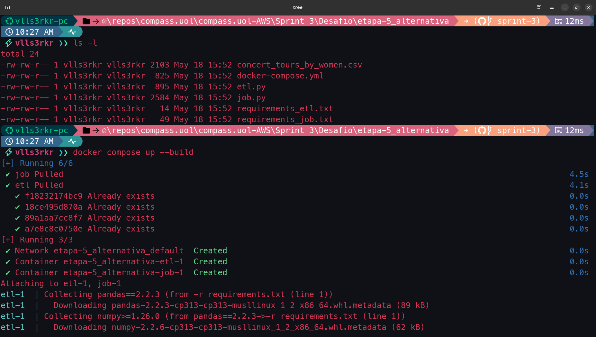

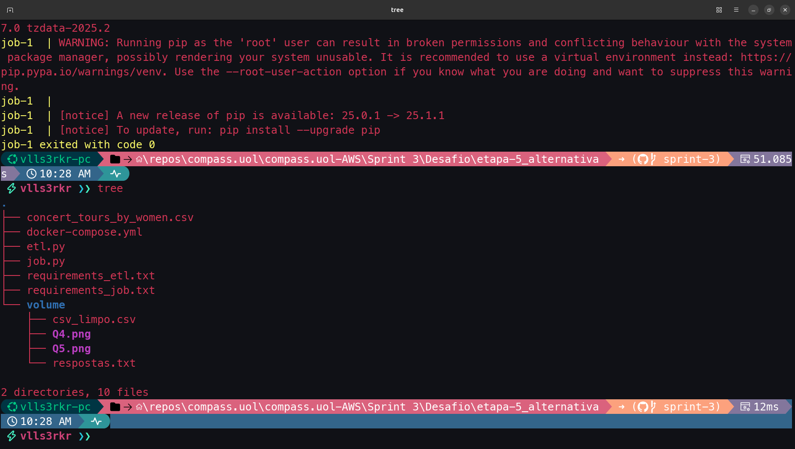