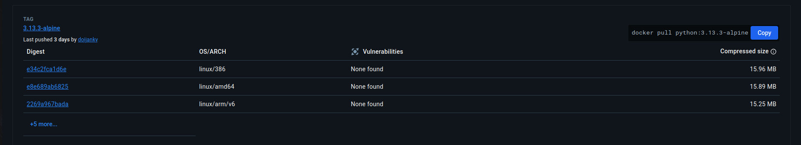
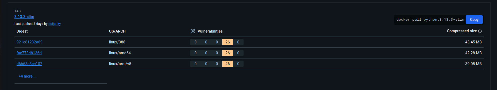
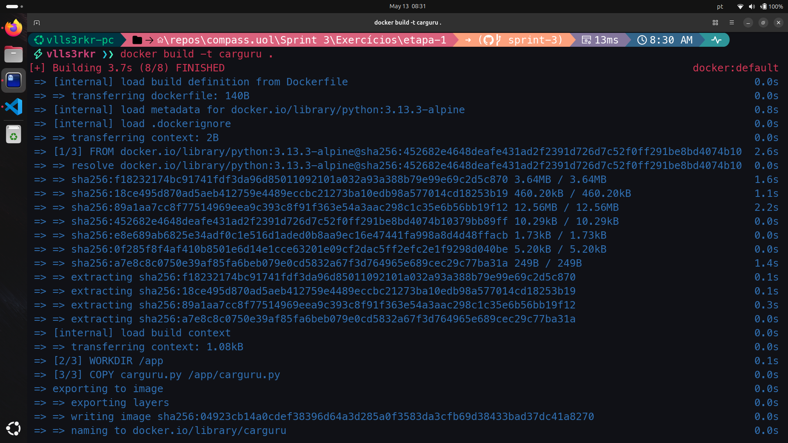
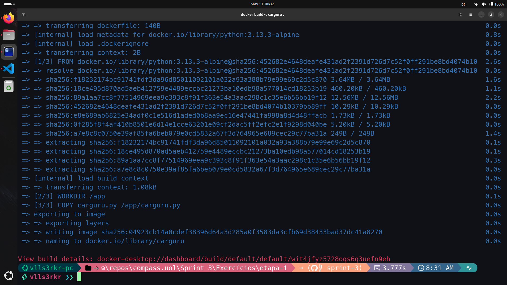
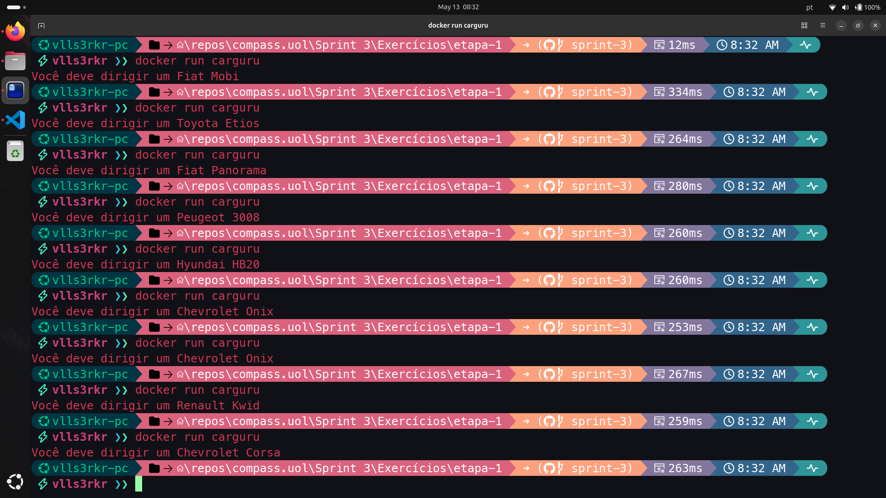
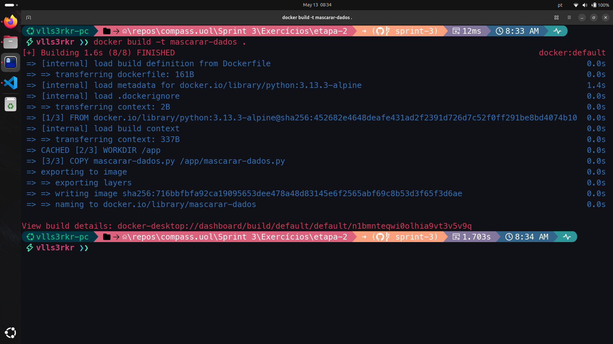
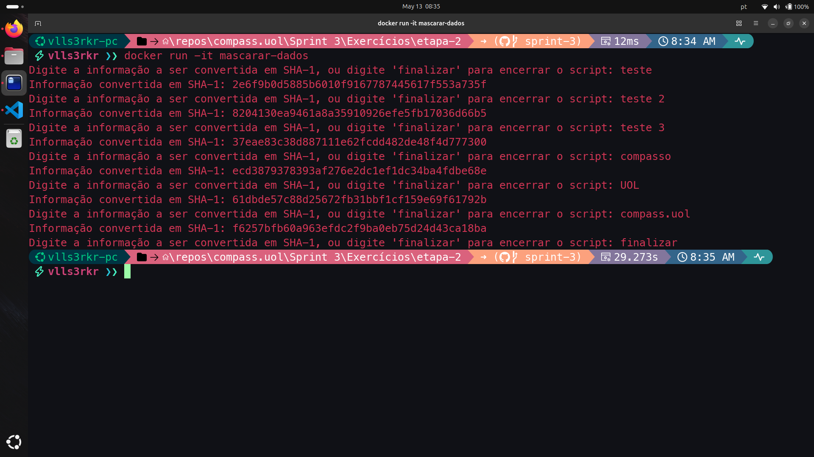

# Resumo da Sprint 3

Como de costume, a *Sprint* 3 foi dividida em duas semanas, onde na primeira semana exploramos tópicos relacionados a Contêiner com a ferramenta Docker, aliado a orquestração com Docker Swarm e Kubernetes, além de Expressões Regulares (*Regex*) e serviços essenciais da AWS - Amazon Web Services.

- **Docker**: o curso de Docker foi extenso, versou sobre elementos basilares como comandos básicos, definições de imagens e contêiners, criação de diferentes tipos de redes e volumes. Além disso, houve lições sobre montagem de contêiners com Docker Compose, operações com Docker Swarm e Kubernetes.

- **Expressões Regulares**: fizemos uma revisão de expressões regulares que foi útil inclusive para o desafio dessa *Sprint*. Vimos como encontrar e filtrar caractéres de diferentes maneiras usando Python (mas o conhecimento adquirido pode ser aplicado em diferentes linguages de programação).

- **AWS**: foi realizado dois cursos da AWS na plataforma [AWS Skill Builder](https://explore.skillbuilder.aws/learn): um dele estava na esteira do programa, o **AWS Partner Accreditation** que, por sua vez, pede que façamos o curso **AWS Technical Essentials** para dar prosseguimento no seu próprio conteúdo. O primeiro foi sobre a adoção dos serviços da AWS para as operações de cloud, e o segundo sobre os serviços essenciais da AWS (instâncias, contêiners, armazenamento de dados, redes, monitoramento, escalonamento de serviços, etc).

# Sumário

- [Desafio](#desafio)
- [Exercícios](#exercícios)
    - [Etapa 1](#exercício-etapa-1)
    - [Etapa 2](#exercício-etapa-2)
- [Evidências](#evidências)
    - [Amostras Etapa 1](#amostras-etapa-1)
    - [Amostras Etapa 2](#amostras-etapa-2)
- [Certificados](#certificados)

# Desafio

O README.md, bem como os arquivos pertinentes ao Desafio se encontram na pasta [Desafio](./Desafio/)

O desafio da *Sprint* 3 versou acerca de processos de limpeza e análise de dados e da conteinerização desses processos. Foi um desafio com dificuldades variadas: as etapas iniciais foram superadas unindo o conhecimento adquirido na *Sprint* passada com Python e algumas bibliotecas já conhecidas (Pandas para manipulação, Matplotlib e Seaborn para plotar gráficos), as etapas finais foram realizadas com o conhecimento adquiridos em Docker.

Todas as evidências do desafio se encontra na própria pasta de [Evidências](./Evidências/)

> Nós já temos experiência prévia em Docker e em serviços da AWS. No caso da AWS foi bom rever alguns conhecimentos que não temos muitas oportunidades de exercitar, como a adoção dos serviços desde o início em uma empresa, ou mesmo monitoramento dos serviços com Cloud Front. No caso de Docker, excetuando a última parte do desafio, a construção das imagens e contêineres foram realizadas sem problemas com Dockerfile. Na última parte do desafio utilizamos Docker Compose para a execução simultânea dos processos anteriores. Fizemos de duas maneiras: **o desafio não foi explícito** em dizer se queria ou não o uso dos Dockerfiles das etapas anteriores, mas por uma questão de segurança fizemos com a utilização dos Dockerfiles (e aqui aprendemos bastante, porque nunca havíamos feito antes), disponível na pasta [etapa-5](./Desafio/etapa-5/) e sem os Dockerfiles, disponível na [etapa-5_alternativa](./Desafio/etapa-5_alternativa/).

# Exercícios

O objetivo dos exercícios é praticar Python com Contêineres Docker, sendo necessária a entrega de arquivos **Dockerfile** e scripts no formato **.py**, além das evidências da execução bem sucedida.

Todos os arquivos dos exercícios, bem como as evidências podem ser encontrados na pasta [Exercícios](./Exercícios/), abaixo fornecemos o caminho para cada etapa específica: 

- [Etapa 1](./Exercícios/etapa-1/)

- [Etapa 2](./Exercícios/etapa-2/)

## Exercício Etapa 1

- Entregável:
    - [Dockerfile da Etapa 1](./Exercícios/etapa-1/Dockerfile)

- Comandos utilizados:
    - `docker build -t carguru .`
    - `docker run carguru`

## Exercício Etapa 2

- Entregáveis:
    - [Script em Python](./Exercícios/etapa-2/app.py)
    - [Dockerfile da Etapa 2](./Exercícios/etapa-2/Dockerfile)

- Comandos utilizados:
    - `docker build -t mascarar-dados .`
    - `docker run -it mascarar-dados`

# Evidências

## Amostras Etapa 1

1. A primeira etapa foi selecionar a imagem adequada para rodar no contêiner já que várias imagens são disponibilizadas no DockerHub - https://hub.docker.com/_/python e as nossas considerações foram as seguintes:

- Decidimos escolher **a última atualização da penúltima versão do Python** para minimizarmos possíveis problemas de compatibilidade, já que a versão atual ainda está recebendo atualizações. 

- Entre as diferentes tags (**alpine**, **slim**, **bookworm**, **bullseye** e **windows server core**) a própria documentação do site oferece algumas orientações em relação a *single* e *share* *tags*, além do que exatamente são essas tags (em relação a tamanho e distribuições). Selecionamos a tag **alpine** pertencente ao *Alpine Linux project* por ser a imagem mais leve e na qual podemos adicionar o que for necessário no Dockerfile. Adicionalmente, a imagem com a tag **alpine não apresentou nenhuma vulnerabilidade**.

A amostra abaixo traz o tamanho da imagem no python3.13.3-alpine:


Em relação ao tamanho da imagem no python3.13.3-slim na amostra à seguir:


O código escrito no Dockerfile foi o seguinte:

```Dockerfile
FROM python:3.13.3-alpine

WORKDIR /app

COPY carguru.py /app/carguru.py

CMD ["python3", "carguru.py"]
```

No diretório [etapa-1](./Exercícios/etapa-1/) além do Dockerfile se encontra o script [carguru.py](./Exercícios/etapa-1/carguru.py) que foi entregue para esse exercício. Com o comando `FROM python:3.13.3-alpine` indicamos a imagem base que vai ser usada na construção do contêiner, definimos o diretório /app como o diretório de trabalho com `WORKDIR /app` que é onde vamos rodar nosso comando para rodar o script carguru, mas antes vamos copiá-lo do diretório base para o diretório /app com o comando `COPY carguru.py /app/carguru.py` e daí rodá-lo com `CMD ["python3", "carguru.py"]` que executa o script dentro do contêiner.

2. As amostras à seguir demonstram que o contêiner foi construído com sucesso utilizando o comando `docker build -t carguru .`, onde construímos o contêiner com **docker build**, atribuímos a tag carguru com o comando **-t carguru** e assinalamos que a construção deve ser feita no diretório atual com **.**. Nas amostras, ao rodar o comando, foi necessário também fazer o download da imagem base **python:3.13.3-alpine**:



A amostra seguinte traz apenas o fim do processo de construção:



3. Em seguida foi rodado com sucesso com o comando `docker run carguru`, onde rodamos o contêiner do qual foi atribuído a tag **carguru**. Como toda vez que o código for acionado, ele deve trazer o nome aleatório de um carro a ser dirigido por nós (curiosamente o modelo de um carro veio repetido), rodamos o script dentro do contêiner várias vezes para nos certificarmos que era esse o caso e que ele roda sem complicações, como prova a amostra à seguir:



## Amostras Etapa 2

1. Primeiro tivemos que criar um script em Python que deve: **receber uma string via input**, **gerar um hash da string por meio do algoritmo SHA-1**, **imprimir o hash em tela, utilizando o método hexdigest** e **RETORNAR ao passo início**. Ou seja, o código não finaliza depois que imprime o hash em tela, mas ele deve continuar funcionando, pedindo mais input. Abaixo está o código desenvolvido e nomeado como [mascarar-dados.py](./Exercícios/etapa-2/mascarar-dados.py):

```Python
import hashlib

while True:
    entrada = input("Digite a informação a ser convertida em SHA-1, ou digite 'finalizar' para encerrar o script: ")
    if entrada.lower() == 'finalizar':
        break
    print("Informação convertida em SHA-1:", hashlib.sha1(entrada.encode()).hexdigest())
```

Aqui a primeira dificuldade foi como realizar a conversão da string com o algoritmo. Na documentação do Python encontramos a biblioteca **hashlib** que traz todo o aparato necessário para implementar o que foi requerido nessa etapa dos exercícios. Após a importação da biblioteca, como a tarefa pedia para que voltássemos ao início, que era o recebimento da string, implementamos um **loop while**, sendo a condição de quebra o usuário entrar a palavra "finalizar". A conversão da entrada é utilizada com a função **sha1** que recebe o input aplicado a função **encode** e é convertida em dígitos em hexadecimal com a função **hexdigest**, conforme havia sido requisitado.

Abaixo a documentação consultada para a implementação da conversão da string em SHA-1:

- hashlib: https://docs.python.org/3/library/hashlib.html

- convertendo em SHA-1 com a função sha1: https://docs.python.org/3/library/hashlib.html#hashlib.sha1

- função hexdigest no hashlib: https://docs.python.org/3/library/hashlib.html#hashlib.hash.hexdigest


2. Em seguida foi requisitada a criação da imagem chamda **mascarar-dados** para executar o script python. Devemos também rodar o contâiner baseado na imagem, e enviar algumas palavras para o mascaramento. O código escrito no Dockerfile foi o seguinte:

```Dockerfile
FROM python:3.13.3-alpine

WORKDIR /app

COPY mascarar-dados.py /app/mascarar-dados.py

CMD ["python3", "mascarar-dados.py"]
```

Os códigos utilizados foram similares ao da etapa anterior: primeiro criamos a imagem com o código `docker build -t mascarar-dados .` onde nomeamos a imagem utilizando a flag **-t** como **mascarar-dados**, e rodamos o contêiner com o código `docker run -it mascarar-dados`, onde a flag **-it** foi necessária para interagir com o código que estava rodando dentro do contêiner, já que foi necessário entrar o input manualmente e visualizar o output no meu terminal (a flag i permite a interatividade e a flag t abre um pseudo-terminal se comunicando com o meu terminal).

À seguir, a amostra comprova que a imagem foi criada com sucesso à partir do nosso Dockerfile. Como a imagem base do python 3.13.3-alpine é a mesma do exercício anterior, não foi necessário realizar nenhum download e esse reaproveitamento trouxe celeridade na construção da imagem:



Adicionalmente, a amostra seguinte traz o código rodando à partir do contêiner, recebendo vários inputs e devolvendo o output hasheado com o algoritmo SHA-1. Conforme orientado, o script continua rodando até ser finalizado com o comando "finalizar" (ou com ctrl+C), várias strings foram entradas no input para o teste, que foi também um requisito do exercício:



# Certificados

Abaixo se encontram dois certificados nominais a Pablo Miranda de cursos da plataforma [AWS Skill Builder](https://explore.skillbuilder.aws/learn), um é parte dos cursos requeridos para essa *Sprint*, o AWS Partner Accreditation, e o outro é parte do curso anterior, de modo que foi necessário finalizar ele também, o AWS Technical Essentials. Ambos os certificados se encontram na pasta de [Certificados](./Certificados/): 

- [AWS Partner Accreditation](./Certificados/aws_accreditation.pdf)

- [AWS Technical Essentials](./Certificados/aws_technical_essentials.pdf)