# Desafio da Sprint 2 - Análise de Dados

## Entregáveis

- [x] Dois arquivos no formato `.ipynb`(Jupyter Notebook) contendo o código usado para a execução de cada etapa correspondente do problema;
    - [etapa-1.ipynb](./etapa-1/etapa-1.ipynb)
    - [etapa-2.ipynb](./etapa-2/etapa-2.ipynb)

- [x] Arquivo **README.md** com as análises completas escolhidas;
    - As análises completas podem ser encontradas no corpo deste README.md do desafio ou em separado no [README.md](./etapa-2/README.md) do diretório da etapa-2.

- [x] Imagens evidenciando a execução completa e correta das etapas;
    - imagens encontradas na pasta [Evidências](../Evidências/) e renderizadas na explicação do Desafio.

- [x] Arquivos **JSON** ou **CSV** baixado e resultante.
    - arquivo original: [anuario-2024-dados_abertos-tabela2-19.csv](./data/anuario-2024-dados_abertos-tabela2-19.csv)
    - arquivo resultante: [dataset_final.csv](./data/dataset_final.csv)

## Sumário

- [Preparação](#preparação)
    - [Dicionário de Dados](#dicionário-de-dados)
- [Desafio](#desafio)
    - [Etapa 1 - Upload do Dataset](#etapa-1---upload-do-dataset)
    - [Etapa 2 - Análises](#etapa-2---análises)
        - [Questão 1](#questão-1-qual-a-diferença-total-somando-todos-os-anos-no-recebimento-dos-royalties-entre-cada-estado-e-os-seus-municípios)
        - [Questão 2](#questão-2-que-região-do-brasil-recebeu-mais-royalties-e-que-região-recebeu-menos)
        - [Questão 3](#questão-3-qual-foi-a-evolução-de-royalties-para-beneficiários-que-não-os-estados-ou-os-municípios-desses-estados)
        - [Relatório e Passos Adicionais](#relatório-e-passos-adicionais)
    - [Etapa 3 - Salvar Arquivo no Bucket](#etapa-3---salvar-arquivo-no-bucket)

## Preparação

Foi requisitado que procurássemos um arquivo JSON ou CSV no portal de dados públicos do Governo Brasileiro, na URL http://dados.gov.br e garantir que o arquivo fosse o único na turma. 

Utilizamos um conjunto de dados originado do **Anuário Estatístico Brasileiro do Petróleo, Gás Natural e Biocombustível 2024**, e segundo as informações do repositório: "O Anuário Estatístico Brasileiro do Petróleo, Gás Natural e Biocombustíveis 2024 consolida os dados referentes ao desempenho da indústria do petróleo, gás natural e biocombustíveis e do sistema de abastecimento nacionais no período 2014-2023. Estão disponíveis para consulta e download as tabelas integrantes do Anuário 2024 representadas em metadados e no formato CSV."

Utilizamos a **"Tabela 2.19 - Distribuição de royalties sobre a produção de petróleo e de gás natural, segundo beneficiários - 2014-2023"**, disponibilizada em formato "CSV" e um dicionário de dados em formato "DOCX" (no site apontado consta como PDF, mas o link do dicionário abre um arquivo em `.docx`) e que podem ser acessados na URL https://dados.gov.br/dados/conjuntos-dados/anuario-estatistico-2024, e, adicionalmente, em modo local seguindo os links abaixo:

- [Dicionário dos Dados](./dicionario/anuario-abertos-metadados-tabela2-19.docx)

- [Conjunto de Dados](./data/anuario-2024-dados_abertos-tabela2-19.csv)

### Dicionário de Dados

| NOME DA COLUNA                           | DESCRIÇÃO                                                                 | TIPO DO DADO     |
|:----------------------------------------:|--------------------------------------------------------------------------|:----------------:|
| **BENEFICIÁRIO**                         | Estados;<br>Municípios;<br>Depósitos Judiciais;<br>Fundo Especial;<br>Educação e Saúde;<br>União - Comando da Marinha;<br>União - Ministério da Ciência e Tecnologia;<br>União - Fundo Social. | `Texto`          |
| **ANO**                                  | Ano                                                                      | `Número inteiro` |
| **DISTRIBUIÇÃO DE ROYALTIES**<br>(sobre a produção de petróleo e gás natural) | Distribuição de royalties segundo beneficiários.                          | `Número real`    |

# Desafio

O objetivo para essa sprint é a prática utilizando serviços da AWS. Aqui o desafio foi separado em três etapas: 

Na **primeira etapa** deve se analisar o conjunto de dados escolhido localmente no editor de texto da nossa preferência para conhecer os dados e o que pode ser analisado. 3 questionamentos ou análises que pretendemos trazer com os dados escolhidos precisam ser definidos. Por fim, deve-se utilizar a biblioteca **boto3** para carregar o arquivo para um bucket à partir de um script Python.

Na **segunda etapa**, em um outro script Python e, **a partir do arquivo que está dentro do S3**, se deve criar um dataframe com pandas ou com polars e executar as análises definidas na etapa anterior. **As análises devem ser baseadas nas seguintes manipulações (obrigatoriamente uma por análise no mínimo)**:

- Uma cláusula que filtra dados usando ao menos dois operadores lógicos;

- Uma função de agregação;

- Uma função condicional;

- Uma função de conversão;

- Uma função de data;

- Uma função de string.

Na **terceira etapa**, após finalizar a análise e realizar as manipulações, deve-se salvar o(s) arquivo(s) resultantes no mesmo bucket criado para o desafio e no formato de entrada deles.

## [Etapa 1 - Upload do Dataset](./etapa-1/)

- Foi feito o download do arquivo csv e armazenado dentro da pasta [data](./data/) no nome original, que é [anuario-2024-dados_abertos-tabela2-19.csv](./data/anuario-2024-dados_abertos-tabela2-19.csv).

- Criamos um Jupyter notebook, o [etapa-1.ipynb](./etapa-1/etapa-1.ipynb) para explorar os dados e realizar o upload do dataset no bucket com **boto3**. Importamos os dados, realizamos uma exploração simples para conferir:
    - Dimensão dos dados;
    - Tipos dos dados;
    - Dados faltantes;
    - Dados duplicados.

- No notebook formulamos as seguintes questões que serão exploraradas na próxima etapa:

    1. Qual a diferença total (somando todos os anos) no recebimento dos royalties entre cada estado e os seus municípios?

    2. Que região do Brasil recebeu mais royalties e que região recebeu menos?

    3. Qual foi a evolução de royalties para beneficiários que não os estados ou os municípios desses estados?

- Para não termos problemas de vazamento das nossas credenciais, foram criados dois arquivos: um arquivo **.gitignore** e um arquivo **.env**. O **.gitignore** impede que nossas credenciais armazenadas no arquivo **.env**, que, por sua vez, é acessado na execução do código e fornece essas credenciais como variáveis para que o **boto3** possa enviar os arquivos para o nosso bucket.

- **Apesar de não ter sido requisitado**, o processo também foi armazenado em um script python, [etapa-1.py](./etapa-1/etapa-1.py).

- Criamos o bucket usando a **AWS cli**, e para isso primeiro logamos no nosso terminal usando o profile criado com **AWS SSO**. e utilizando o comando `aws sso login --profile pgdm` (profile criado usando as credenciais já entregues a nós). Ao final é possível observar a mensagem de sucesso.

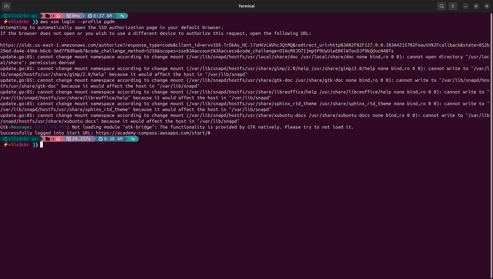

- Em seguida criamos um bucket chamado sprint4-pgdm com o comando `aws s3api create-bucket --bucket sprint4-pgdm --profile pgdm region us-east-1`, listamos todos os nossos buckets com o comando `aws s3 ls --profile pgdm` e observamos que só possuímos esse único bucket, e ao listarmos seu conteúdo com o comando `aws s3 ls s3://sprint4-pgdm/ --profile pgdm`, percebemos que o bucket se encontra vazio. A amostra abaixo traz a evidência de todos esses passos:

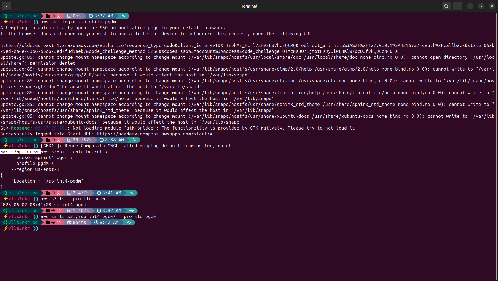

- O upload para o bucket com boto3 foi feito com o código abaixo. No início do notebook, havíamos importado as bibliotecas **os** (nativa do Python), **pandas**, **dotenv** e **boto3**. Carregamos as variáveis de ambiente com a biblioteca dotenv utilizando o comando `load_dotenv()` (como as variáveis de ambiente são as mesmas para esse Desafio, podemos usar um arquivo **.env** compartilhado, de modo que não foi necessário passar o *path* do arquivo). Com a biblioteca **os** definimos as variáveis de ambiente, e listamos quais variáveis poderiam estar faltando ou que não foi detectada. O cliente s3 foi definido com nossas variáveis e a região **us-east-1**. Para ter certeza que o arquivo nomeado **dataset.csv** foi enviado para o bucket, implementamos dois prints que devem aparecer como outputs em tela e que confirmam essa operação: um que avisa que o Bucket foi encontrado, **importante porque se nossas credenciais não for autorizado para ler e escrever no bucket**, ele simplesmente não será encontrado, e outro que informa que o upload realizado. Caso haja algo de errado, o erro é capturado pelo `except`. A evidência à seguir demonstra o sucesso dessa operação à partir do nosso Jupyter notebook e depois a evidência mostrando que o arquivo é listado dentro do bucket com o comando `aws s3 ls s3://sprint4-pgdm/ --profile pgdm`:

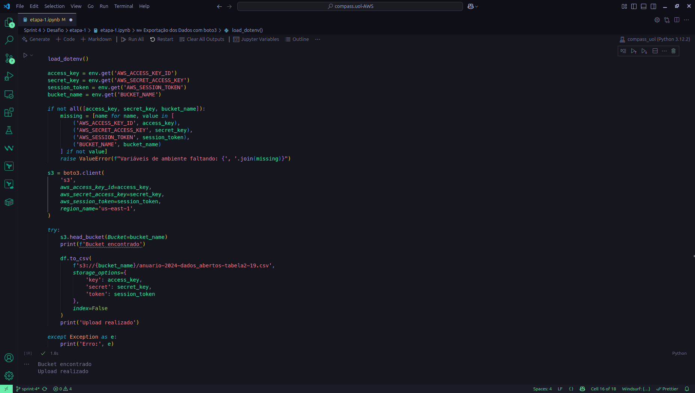

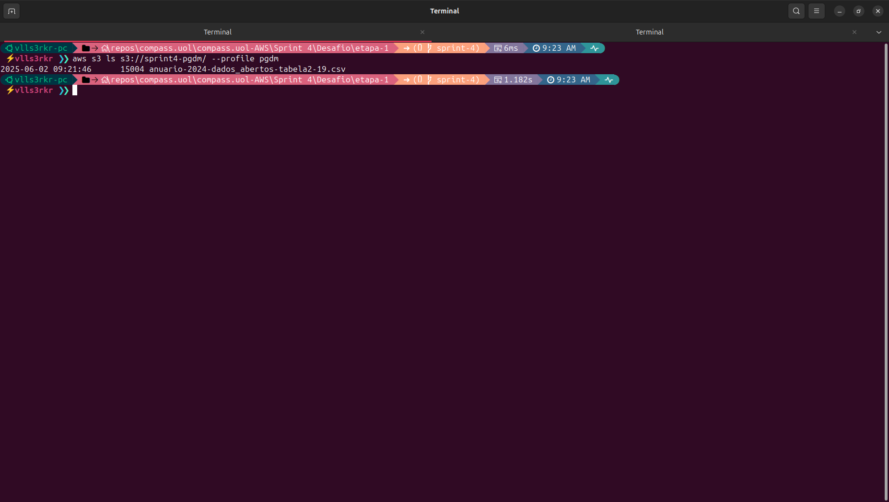

## [Etapa 2 - Análises](./etapa-2/)

- Para a resolução dessa etapa, realizamos uma série de manipulações para resolver as questões que propomos na etapa anterior em um notebook Jupyter. **A planilha original foi lida diretamente do Bucket**, como é possível observar na amostra abaixo, onde o dataframe é criado à partir da leitura do arquivo `.csv` no bucket com a biblioteca **pandas**:

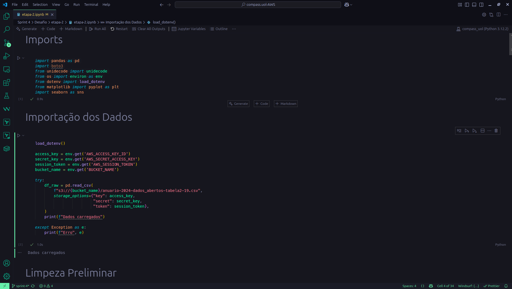


- Como o conjunto de dados é pequeno, não tendo dados faltantes e nem duplicados, os tipos dos dados podem ser modificados se necessário nos questionamentos, de modo que **a única limpeza e ajustes iniciais nos dados** foi transformar as colunas em *snake case*, retirar acentuações e cedilhas e modificar o nome de uma das colunas para algo menor, que pudesse nos ajudar na hora da manipulação, a amostra em seguida traz o sucesso dessa operação:

```Python
def to_snake_case(coluna):
    coluna = unidecode(coluna)
    return coluna.strip().lower().replace(" ", "_")

df_raw.columns = [to_snake_case(coluna) for coluna in df_raw.columns]
df_raw = df_raw.rename(columns={
    'distribuicao_de_royalties_sobre_a_producao_de_petroleo_e_de_gas_natural': 'distribuicao_de_royalties'
    })
```

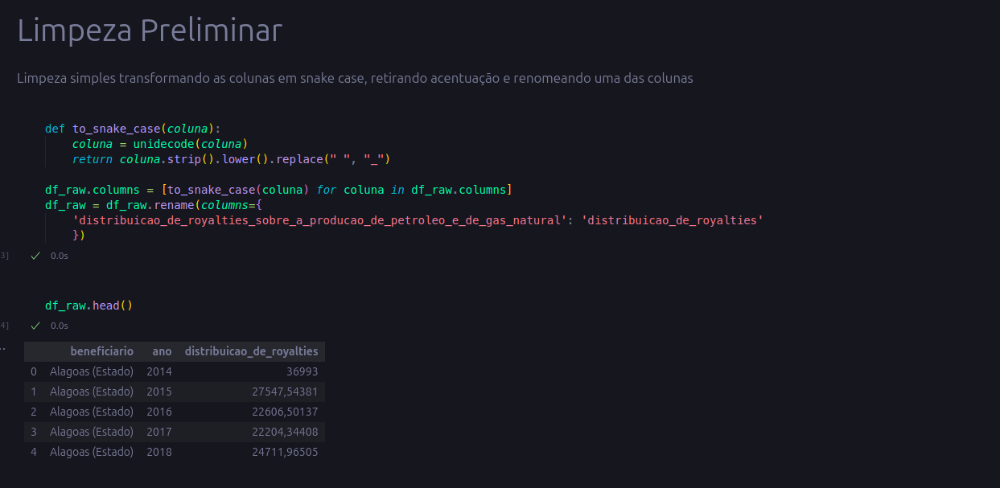

À partir daqui, a realizamos todas as manipulações requeridas para responder nossos questionamentos e apresentamos a execução dos códigos abaixo.

### Questão 1: qual a diferença total (somando todos os anos) no recebimento dos royalties entre cada estado e os seus municípios?

**Manipulações Utilizadas**
- Função de string: `str.endswith()`, `str.extract()` e `str.contains()` foram usadas para manipulação de texto

- Função de conversão: `.astype(float)` para converter os valores para numérico

- Função de agregação: `.sum()` no groupby para somar os royalties

- Função condicional: `.map({True: 'Estado', False: 'Municípios'})` realizou uma estrutura condicional

**Explicação do Código**
- Copiamos o dataframe original com o intuito de usar os dados originais, convertemos a coluna **distribuicao_de_royalties** para float.
    
- Realizamos a filtragem dos beneficiários entre Estado e Municípios com `str.endswith()` e extraímos os valores da coluna **beneficiario** com expressões regulares em uma nova coluna chamada **entidade**.

- Criamos a coluna **tipo** e adicionamos os valores baseados na palavra "Estado". Agregamos os valores por entidade e tipo, somando os valores de royalties com `groupby().sum()`.

- Pivoteamos a tabela usando `pivot()` e criamos a coluna diferenca com o valor absoluto da subtração entre royalties de Estados e Municípios.

- Mantivemos apenas as colunas relevantes (entidade e diferenca) e ordenamos por diferença em ordem decrescente. Reiniciamos o índice para ter uma numeração sequencial limpa com `reset_index(drop=True)`.

- Por fim, o dataframe df_diferenca traz a lista das entidades federativas e das diferenças buscadas.

- As evidências a seguir mostram o sucesso das execuções do código, bem como a exportação do CSV que pode ser conferido integralmente no sub-diretório [planilhas](./etapa-2/planilhas/) dessa etapa:

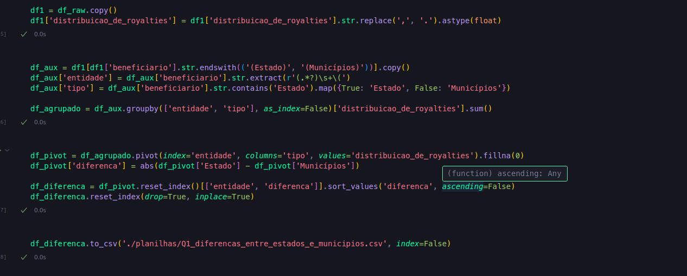

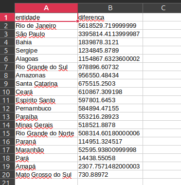

### Questão 2: Que região do Brasil recebeu mais royalties e que região recebeu menos?

**Manipulações Utilizadas**
- Função de agregação: `.sum()` para somar os valores de **distribuicao_de_royalties** agrupados por região

- Função condicional: a função lambda com `next()` verifica se a entidade existe nas regiões e retorna a região correspondente ou o valor 'Outros'

- Função de conversão: `.astype(str)` para converter para string na formatação

- Função de string: `.str.endswith()` para filtrar beneficiários que terminam com padrões específicos e `.str.extract()` com expressões regulares para extrair partes do texto

**Explicação do Código**
- Copiamos o dataframe original com o intuito de usar os dados originais, convertemos a coluna **distribuicao_de_royalties** para float.

- Criamos um dicionário `regioes` que organiza todos os estados brasileiros por suas respectivas regiões geográficas (Norte, Nordeste, Centro-Oeste, Sudeste e Sul).

- Filtramos os beneficiários no dataframe **df_aux2** que contém apenas registros onde o beneficiário termina com '(Estado)' ou '(Municípios)' e extraímos o nome das entidades usando expressões regulares.

- Aplicamos uma função lambda que compara cada entidade com o dicionário de regiões, atribuindo a região correspondente ou 'Outros' se não encontrar com a ajuda das funções `next()` e `items()`.

- Agrupamos os dados por região usando a função `groupby()` e soma os valores de distribuição de royalties com a função `sum()`, ordenando do maior para o menor valor e criamos uma coluna **total_formatado** que apresenta os valores em formato brasileiro (R$) com duas casas decimais. convertemos de volta para string com a função `astype(str)`.

- As evidências a seguir mostram o sucesso das execuções do código, bem como a exportação do CSV que pode ser conferido integralmente no sub-diretório [planilhas](./etapa-2/planilhas/) dessa etapa:

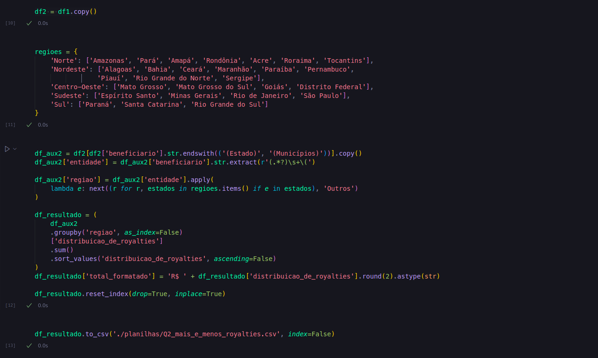

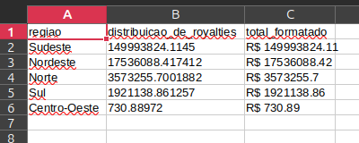

### Questão 3: Qual foi a evolução de royalties para beneficiários que não os estados ou os municípios desses estados?

**Funções cumpridas:**
- Uma cláusula que filtra dados usando ao menos dois operadores lógicos: usamos **not** e **and** na função `.query()`

- Uma função de conversão: utilizamos `.astype(float)` e `pd.to_datetime()` para conversões de tipo de dados

- Uma função de data: usamos `pd.to_datetime()` para conversão e `.dt.year` para extração de componente temporal

- Uma função de string: foi usado `.str.replace()` tanto para vírgulas quanto para remoção de dígitos com expressões regulares

**Explicação do Código**
- Cria uma nova cópia do DataFrame para preservar os dados originais, convertemos a coluna **distribuicao_de_royalties** que tem suas vírgulas substituídas por pontos e é convertida para tipo float.

- Filtramos os dados com diferentes operadores lógicos usando `.query()` com `not` e `and` para excluir registros que terminam com '(Estado)' ou '(Municípios)', mantendo apenas outros tipos de beneficiários.

- Convertemos de ano para data transformando a coluna **ano** em formato datetime usando `pd.to_datetime()` com formato específico '%Y', em seguida extraímos o componente ano criando, para isso, a coluna **ano_fiscal** extraindo apenas o ano da data convertida usando a função `.dt.year`.

- Removemos todos os dígitos numéricos da coluna 'beneficiario' usando regex, mantendo apenas texto (dois valores apresentaram essa ocorrência).

- As evidências a seguir mostram o sucesso das execuções do código, bem como a exportação do CSV que pode ser conferido integralmente no sub-diretório [planilhas](./etapa-2/planilhas/) dessa etapa:

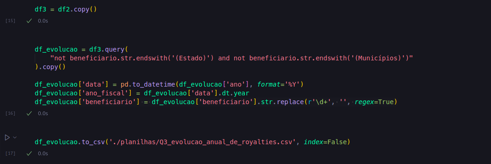


### Relatório e Passos Adicionais
Adicionalmente, **conforme requisitado**, produzimos um relatório com as análises das questões, incluindo gráficos, em um arquivo [README.md](./etapa-2/README.md) que se encontra na pasta dessa etapa. Durante nossa exploração dos dados, produzimos uma série de imagens que se encontra na pasta [img](./etapa-2/img/) e arquivos `.csv` que foram salvos na pasta [planilhas](./etapa-2/planilhas/). O arquivo **dataset_final.csv** foi salvo localmente no diretório [data](./data/) junto com o arquivo `.csv` original. Abaixo está o corpo desse arquivo com o nosso relatório:

### Q1 - Qual a diferença total (somando todos os anos) no recebimento dos royalties entre cada estado e os seus municípios?

O conjunto original de dados trouxe beneficiários diversos que se beneficiam dos Royalties recebidos das exploração de Petróleo e de Gás Natural. Há unidades federativas, e os seus municípios, e órgãos de diferentes naturezas, e os valores recebidos por esses beneficiários ao longo dos anos. Ao isolar as unidades federativas, e subtrair os valores acumulados pelo estado dos valores acumulados pelos municípios desses estados, nos deparamos com os seguintes valores:

| Entidade            | Diferença    |
| ------------------- | ------------ |
| Rio de Janeiro      | 5.618.529,72 |
| São Paulo           | 3.395.814,41 |
| Bahia               | 1.839.878,31 |
| Sergipe             | 1.234.845,88 |
| Alagoas             | 1.154.867,63 |
| Rio Grande do Sul   | 978.896,61   |
| Amazonas            | 956.550,48   |
| Santa Catarina      | 675.515,25   |
| Ceará               | 610.867,31   |
| Espírito Santo      | 597.801,65   |
| Pernambuco          | 584.894,47   |
| Paraíba             | 553.216,29   |
| Minas Gerais        | 518.521,89   |
| Rio Grande do Norte | 508.314,60   |
| Paraná              | 114.951,32   |
| Maranhão            | 52.595,94    |
| Pará                | 14.438,55    |
| Amapá               | 2.307,76     |
| Mato Grosso do Sul  | 730,89       |

Como podemos observar no gráfico abaixo, os **Top 5** beneficiários possuem uma diferença de mais de um milhão de reais entre os valores obtidos pelo Estado e os valores obtidos pelo Município, somados todos os anos registrados, o que mostra que há uma grande discrepância entre esses valores, especialmente nos dois primeiros lugares, o caso do Rio de Janeiro e de São Paulo. 


O resultado que foi tabulado pode ser examinado no seguinte CSV: [Q1_diferencas_entre_estados_e_municipios.csv](./etapa-2/planilhas/Q1_diferencas_entre_estados_e_municipios.csv)

### Q2 - Que região do Brasil recebeu mais royalties e que região recebeu menos?

Dando seguimento na exploração, os valores receebidos pelas unidades federativas em todos os anos registrados foram somados, e em seguida esses valores foram agregados conforme a região de cada unidade federativa. E o resultado mostra a discrepância entre os valores recebidos pelo Sudeste e os valores recebidos por outras regiões.

| Região       | Distribuição de Royalties |
| ------------ | ------------------------- |
| Sudeste      | 149.993.824,11            |
| Nordeste     | 17.536.088,42             |
| Norte        | 3.573.255,70              |
| Sul          | 1.921.138,86              |
| Centro-Oeste | 730,89                    |

Como podemos observar abaixo, enquanto o Sudeste recebeu um total acima de 140 milhões de reais, as outras regiões receberem menos de 20 milhões de reais.

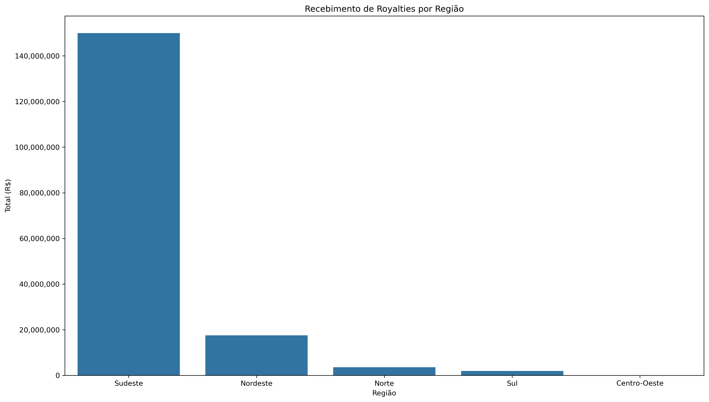

Resultado em CSV: [Q2_mais_e_menos_royalties.csv](./etapa-2/planilhas/Q2_mais_e_menos_royalties.csv)

### Q3 - Qual foi a evolução de royalties para beneficiários que não os estados ou os municípios desses estados?

Para responder esse questionamento, tivemos que filtrar entre todos os beneficiários aqueles que não pertenciam as unidades federativas. Encontramos 7 beneficiários cujo os ganhos em Royalties podem ser analisados no gráfico abaixo:

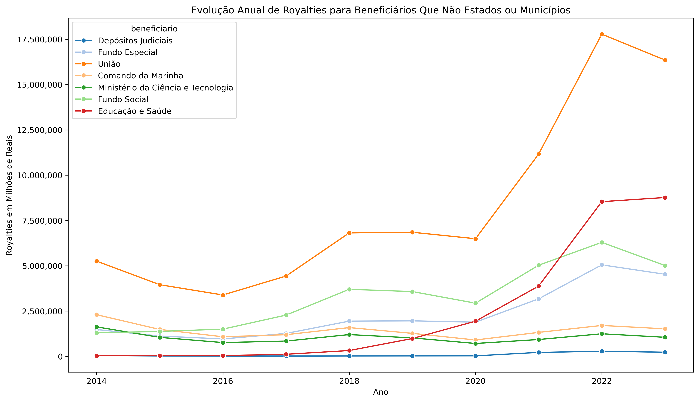

A União é o beneficiário que mais recebeu valores de Royalties, recebendo valores maiores de 5 milhões após 2018 com um aumento acentuado à partir de 2020. Esse comportamento de elevação dos valores à partir de 2020 também pode ser encontrado em outros beneficiários como Fundo Especial, Fundo Social e Educação e Saúde, apesar do montante recebido ter sido bem menor.

Resultado em CSV: [Q3_evolucao_anual_de_royalties.csv](./etapa-2/planilhas/Q3_evolucao_anual_de_royalties.csv)

## Etapa 3 - Salvar Arquivo no Bucket

- Por fim, fizemos os mesmos procedimento realizados para a limpeza e transformação da etapa anterior, mas aqui criamos um script `.py` para ler o arquivo direto do Bucket, realizar as transformações e gravar no bucket o **arquivo resultante** com o nome de **dataset_final.csv**, de modo que **toda a operação seja feita com o arquivo já na nuvem e o processamento local, mas com o envio também para a nuvem**.

- As amostra abaixo é uma evidência de que não tínhamos o arquivo do arquivo CSV resultante, o sucesso após rodar o nosso código e então o arquivo sendo listado no bucket, e em seguida o nosso bucket no console da AWS com os arquivos no bucket.

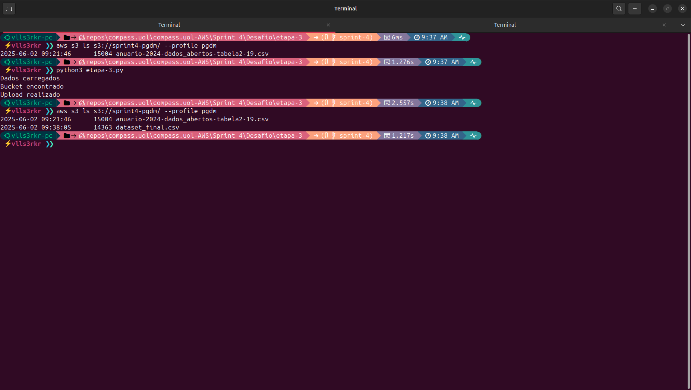

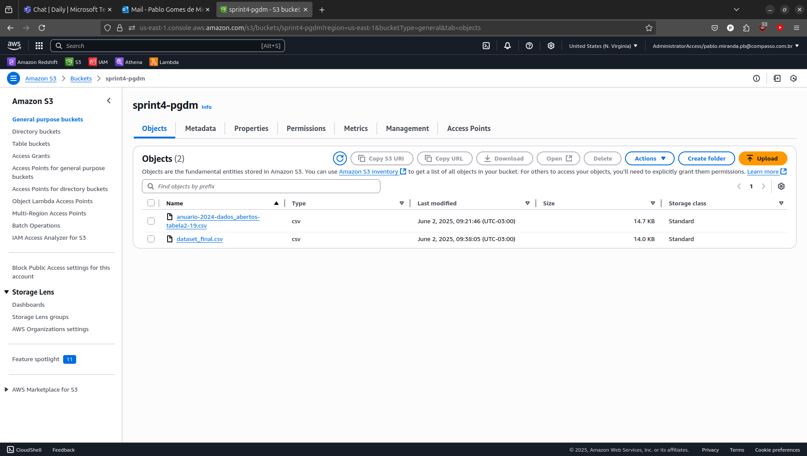