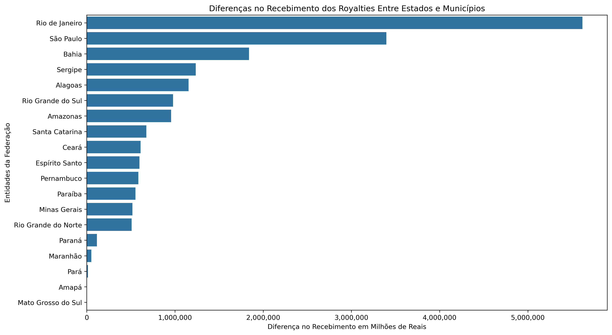

# Análises da Etapa 2 do Desafio da Sprint 4

Este arquivo README.md contém a análise requisitada na segunda etapa do Desafio da quarta Sprint. O dataset foi lido à partir de um arquivo `.csv` em um bucket da AWS S3, foram realizadas uma série de manipulações que resultaram em um arquivo `.csv` para cada questão proposta e um gráfico `.png` que nos ajude a visualizar essas informações. As imagens estão armazenadas no diretório [img](./img/) e as planilhas no diretório [planilhas](./planilhas/). Os códigos, os comentários dos códigos e as Evidências encontram-se no README.md do próprio Desafio, aqui pensamos em nos concentrar apenas na análise das questões propostas. 

## Análise da Questão 1
### Qual a diferença total (somando todos os anos) no recebimento dos royalties entre cada estado e os seus municípios?

O conjunto original de dados trouxe beneficiários diversos que se beneficiam dos Royalties recebidos das exploração de Petróleo e de Gás Natural. Há unidades federativas, e os seus municípios, e órgãos de diferentes naturezas, e os valores recebidos por esses beneficiários ao longo dos anos. Ao isolar as unidades federativas, e subtrair os valores acumulados pelo estado dos valores acumulados pelos municípios desses estados, nos deparamos com os seguintes valores:

| Entidade            | Diferença    |
| ------------------- | ------------ |
| Rio de Janeiro      | 5.618.529,72 |
| São Paulo           | 3.395.814,41 |
| Bahia               | 1.839.878,31 |
| Sergipe             | 1.234.845,88 |
| Alagoas             | 1.154.867,63 |
| Rio Grande do Sul   | 978.896,61   |
| Amazonas            | 956.550,48   |
| Santa Catarina      | 675.515,25   |
| Ceará               | 610.867,31   |
| Espírito Santo      | 597.801,65   |
| Pernambuco          | 584.894,47   |
| Paraíba             | 553.216,29   |
| Minas Gerais        | 518.521,89   |
| Rio Grande do Norte | 508.314,60   |
| Paraná              | 114.951,32   |
| Maranhão            | 52.595,94    |
| Pará                | 14.438,55    |
| Amapá               | 2.307,76     |
| Mato Grosso do Sul  | 730,89       |

Como podemos observar no gráfico abaixo, os **Top 5** beneficiários possuem uma diferença de mais de um milhão de reais entre os valores obtidos pelo Estado e os valores obtidos pelo Município, somados todos os anos registrados, o que mostra que há uma grande discrepância entre esses valores, especialmente nos dois primeiros lugares, o caso do Rio de Janeiro e de São Paulo. 

O resultado que foi tabulado pode ser examinado no seguinte CSV: [Q1_diferencas_entre_estados_e_municipios.csv](./planilhas/Q1_diferencas_entre_estados_e_municipios.csv)

## Análise da Questão 2
### Que região do Brasil recebeu mais royalties e que região recebeu menos?

Dando seguimento na exploração, os valores receebidos pelas unidades federativas em todos os anos registrados foram somados, e em seguida esses valores foram agregados conforme a região de cada unidade federativa. E o resultado mostra a discrepância entre os valores recebidos pelo Sudeste e os valores recebidos por outras regiões.

| Região       | Distribuição de Royalties |
| ------------ | ------------------------- |
| Sudeste      | 149.993.824,11            |
| Nordeste     | 17.536.088,42             |
| Norte        | 3.573.255,70              |
| Sul          | 1.921.138,86              |
| Centro-Oeste | 730,89                    |

Como podemos observar abaixo, enquanto o Sudeste recebeu um total acima de 140 milhões de reais, as outras regiões receberem menos de 20 milhões de reais.

Resultado em CSV: [Q2_mais_e_menos_royalties.csv](./planilhas/Q2_mais_e_menos_royalties.csv)

## Análise da Questão 3
### Qual foi a evolução de royalties para beneficiários que não os estados ou os municípios desses estados?

Para responder esse questionamento, tivemos que filtrar entre todos os beneficiários aqueles que não pertenciam as unidades federativas. Encontramos 7 beneficiários cujo os ganhos em Royalties podem ser analisados no gráfico abaixo:

A União é o beneficiário que mais recebeu valores de Royalties, recebendo valores maiores de 5 milhões após 2018 com um aumento acentuado à partir de 2020. Esse comportamento de elevação dos valores à partir de 2020 também pode ser encontrado em outros beneficiários como Fundo Especial, Fundo Social e Educação e Saúde, apesar do montante recebido ter sido bem menor.

Resultado em CSV: [Q3_evolucao_anual_de_royalties.csv](./planilhas/Q3_evolucao_anual_de_royalties.csv)