# Resumo da Sprint 4

A *Sprint* 4 foi dividida em duas semanas, onde na primeira semana recebemos instruções sobre boas práticas relativas a nossa experiência na cloud utilizando os serviços da AWS e realizamos os cursos **AWS Partner: Sales Accreditation** e **AWS: Cloud Economics**; na segunda semana realizamos uma atividade educativa chamada **AWS Cloud Quest: Cloud Practitioner**, além dos exercícios e desafio. As três atividades da AWS foram realizadas na plataforma [AWS Skill Builder](https://explore.skillbuilder.aws/learn) e as comprovações de nossa devida participação está na sessão de Certificados mais abaixo e no diretório [Certificados](./Certificados/). 

- **AWS Partner: Sales Accreditation**: aqui tivemos noções de vendas como uma forma de comunicar propostas de valores da AWS, além de conceitos básicos da nuvem, valor comercial (não apenas custos), maneiras de contornar objeções de cliente e com isso fomos obtendo uma maior dimensão das operações da plataforma. Nos foi apresentado também a AWS Cloud Value Framework como uma forma de embasar nossos argumentos em favor dos serviços da AWS.

- **AWS: Cloud Economics**: foram apontadas a importância do valor comercial e do gerenciamento financeiro na nuvem, como uma forma de ajudar potenciais clientes a adotarem os serviços da AWS justamente pelos benefícios econômicos oferecidos. Mais uma vez foram discutidos os pilares do AWS Cloud Value Framework, bem como os conceitos principais do gerenciamento financeiro na nuvem.

- **AWS Cloud Quest: Cloud Practitioner**: para essa atividade realizamos tarefas práticas de forma lúdica onde fomos desafiados a trazer soluções práticas à problemas reais, explorando conceitos de computação, rede, segurança e armazenamento, este curso prepara você para a certificação e estabelece as bases para conceitos avançados de nuvem.

> Não havíamos nenhuma experiência na área de vendas e de valor comercial, seja na AWS ou em qualquer outra Cloud pública, de modo que essa foi uma sprint que nos agregou muito em termos profissionais. O **Cloud Quest** foi uma maneira interessante de praticar o conteúdo que havia sido repassado na *Sprint* anterior. Não houve maiores dificuldades, mas com certeza colocar em prática o que nós aprendemos foi sim um bom desafio.

# Sumário

- [Desafio](#desafio)
- [Exercícios](#exercícios)
- [Evidências](#evidências)
- [Certificados](#certificados)

# Desafio

O desafio dessa sprint se dividiu em três estapas, onde na primeira tivemos que selecionar um dataset original para trabalhar e realizar o upload desse dataset para o nosso bucket, para em uma etapa posterior realizar uma série de manipulações e daí salvar esse dataset resultante também no nosso bucket. O desafio foi realizado sem maiores problemas, aproveitamos a documentação providenciada pela AWS sobre **AWS CLI** e **Boto3** para a construção da infraestrutura e envio dos arquivos.

O README.md, bem como os arquivos pertinentes ao Desafio se encontram na pasta [Desafio](./Desafio/)

Todas as evidências do desafio se encontra na própria pasta de [Evidências](./Evidências/)

- Documentação da AWS Cli: https://docs.aws.amazon.com/cli/

- Documentação da biblioteca Boto3: https://boto3.amazonaws.com/v1/documentation/api/latest/index.html

# Exercícios

Como todos os exercícios foram realizados na própria AWS, os arquivos apresentados nesse repositório são as etapas realizadas para cada solução no formato **.txt** e os arquivos fornecidos para os exercícios, bem como as evidências que podem ser encontradas nas sub-pastas do diretório [Exercícios](./Exercícios/). Abaixo fornecemos o caminho para cada exercício específico:

## [1 - AWS S3](./Exercícios/1-aws_s3/)

Abaixo se encontram 1. o arquivo com o passo a passo para a solução do exercício e 2. o documento de erro que foi requisitada a formulação. O resto dos arquivos do diretório foram fornecidos na trilha ou são as evidências da execução do exercício.

- [solução do exercício 1](./Exercícios/1-aws_s3/exercicio1-solucao.txt)

- [documento de índice](./Exercícios/1-aws_s3/index.html)

- [documento de erro](./Exercícios/1-aws_s3/404.html)

- [dataset de nomes](./Exercícios/1-aws_s3/dados/nomes.csv)

## [2 - AWS Athena](./Exercícios/2-aws_athena/)

Abaixo se encontram 1. o arquivo com o passo a passo para a solução do exercício, 2. o notebook com uma exploração rápida dos dados e 3. o resultado da query de teste, e o resultado da query que foi pedida para realizarmos após tudo estar configurado: 
- [solução do exercício 2](./Exercícios/2-aws_athena/exercicio2-solucao.txt)

- [notebook da exploração dos dados](./Exercícios/2-aws_athena/exercicio2.ipynb)

- [resultado do teste](./Exercícios/2-aws_athena/dados/teste.csv)

- [resultado da query](./Exercícios/2-aws_athena/dados/query.csv)

## [3 - AWS Lambda](./Exercícios/3-aws_lambda/)
    - [solução do exercício 3](./Exercícios/3-aws_lambda/exercicio3-solucao.txt)

## [4 - Limpeza de Recursos](./Exercícios/4-limpeza_recursos/)
    - [solução do exercício 4](./Exercícios/4-limpeza_recursos/exercicio4-solucao.txt)

# Evidências

As evidências de cada exercício podem ser encontradoss nos subdiretórios de cada exercício na pasta Exercícios.

## [1 - AWS S3](./Exercícios/1-aws_s3/evidencias/)

Acessamos o serviço **AWS S3**, criamos um bucket com o nome **pgdem-compass** e nos certificamos que estávamos na região **us-east-1**, nas propriedades do bucket selecionamos *"Static Website Hosting"* e selecionamos a opção para opção para hospedagem de site. No campo de Index document, selecionamos index.html e no campo Error document, selecionamos **404.html** (que precisamos formular de antemão) e salvamos as mudanças. Separamos o endpoint fornecido. Editamos a opção *Block public access* e desmarcamos todos os bloqueios e, na aba *Permissions*, editamos a *Bucket Policy*, passando a seguinte política de bucket:

```
{
    "Version": "2012-10-17",
    "Statement": [
        {
            "Sid": "PublicReadGetObject",
            "Effect": "Allow",
            "Principal": "*",
            "Action": [
                "s3:GetObject"
            ],
            "Resource": [
                "arn:aws:s3:::pgdm-compass/*"
            ]
        }
    ]
}
```
Por fim passamos a pasta dados com o arquivo nomes.csv e abaixo é possível notar que o bucket foi criado com sucesso:


Ao acessarmos o endpoint fornecido, é aberto o arquivo índice index.html como podemos ver na amostra abaixo:


A amostra a seguir comprova que é possível baixar o arquivo nomes.csv clicando no link fornecido pelo website e que é referenciado ao caminho no próprio bucket:

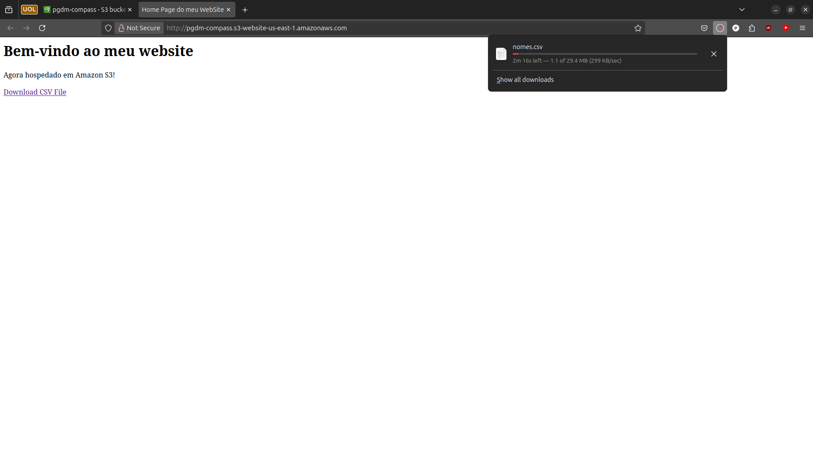

E por fim, a próxima amostra comprova que, ao acessar uma url diferente dentro do fornecido pelo bucket, somos levados ao Documento de erro:

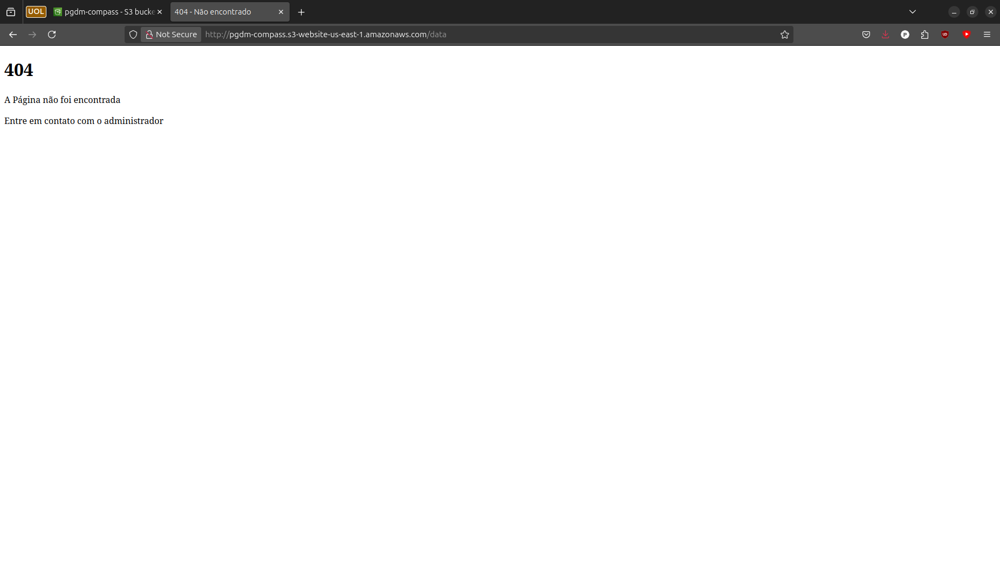

## 2 - AWS Athena

Acessamos o serviço **AWS Athena** e aproveitamos o bucket **pgdm-compass** do exercício anterior e em paralelo exploramos localmente o arquivo nomes.csv utilizando um Jupyter Notebook e criamos um diretório chamado "queries" a ser usado pelo Athena, e na configuração passamos o endereço do bucket como **s3://pgdm-compass/queries**. A amostra abaixo mostra que obtivemos sucesso ao rodar a query `CREATE DATABASE meubanco`:


Criamos uma tabela chamada **nomes** no banco de dados **meubanco** e importamos os dados do arquivo **nome.csv** para dentro dessa tabela com o seguinte código que foi parcialmente entregue pela trilha:

```
CREATE EXTERNAL TABLE IF NOT EXISTS meubanco.nomes (
    nome STRING,
    sexo STRING,
    total INT,
    ano INT
)
ROW FORMAT SERDE 'org.apache.hadoop.hive.serde2.lazy.LazySimpleSerDe'
WITH SERDEPROPERTIES (
     'serialization.format' = ',',
     'field.delim' = ',',
     'skip.header.line.count' = '1'
)
STORED AS TEXTFILE
LOCATION 's3://pgdm-compass/dados/';
```

A amostra abaixo traz o sucesso obtido ao rodar a query acima:

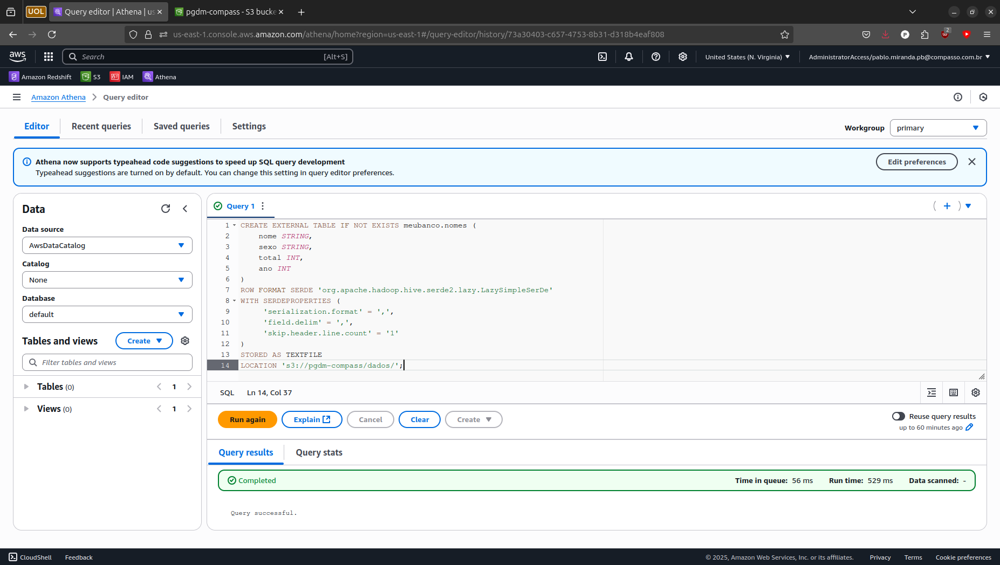

Para nos certificarmos que os dados foram importados corretamente para a tabela, fizemos o teste rodando a seguinte query: `select nome from meubanco.nomes where ano = 1999 order by total limit 15` e as amostras seguintes apontam o sucesso ao rodar a query, bem como os resultados parciais:

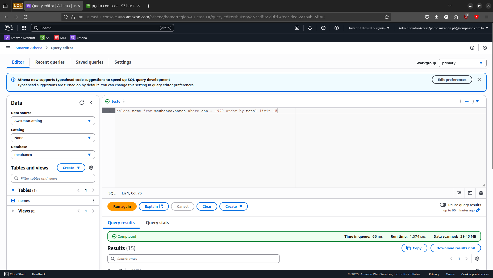

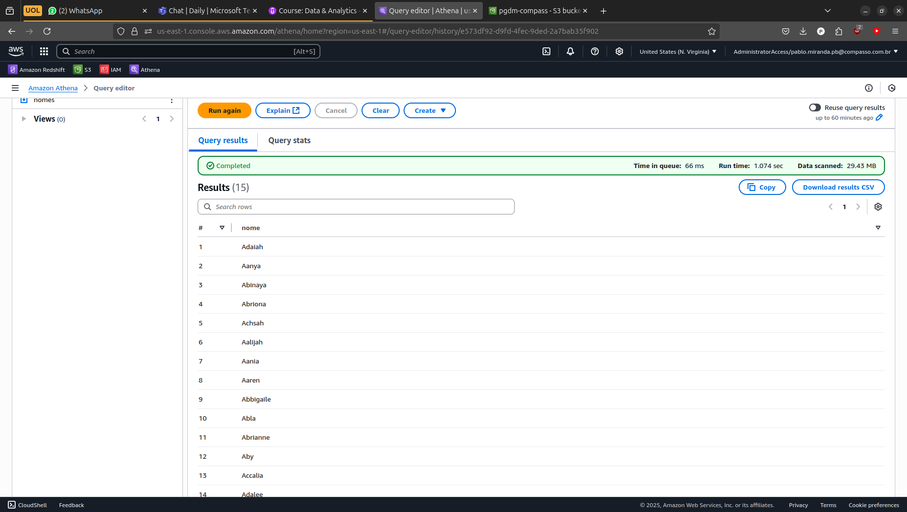

Os resultados completos podem ser obtidos no arquivo [teste.csv](./Exercícios/2-aws_athena/dados/teste.csv). Por fim, nos foi pedido que criássemos uma consulta que listasse os 3 nomes mais usados em cada década desde o 1950 até hoje, o que foi realizado com a query abaixo:

```
with contagem as (
    select 
        nome,
        (floor(ano / 10) * 10) as decada,
        sum(total) as resultado
    from meubanco.nomes
    where ano >= 1950
    group by nome, (floor(ano / 10) * 10)
),
ranqueamento as (
    select
        nome,
        decada,
        resultado,
        row_number() over (partition by decada order by resultado desc) as posicao
    from contagem
)
select
    nome,
    decada,
    resultado as total
from ranqueamento
where posicao <= 3
order by decada, total desc;
```

As amostras à seguir comprovam que a query rodou com sucesso, e que trouxe o resultado esperado:

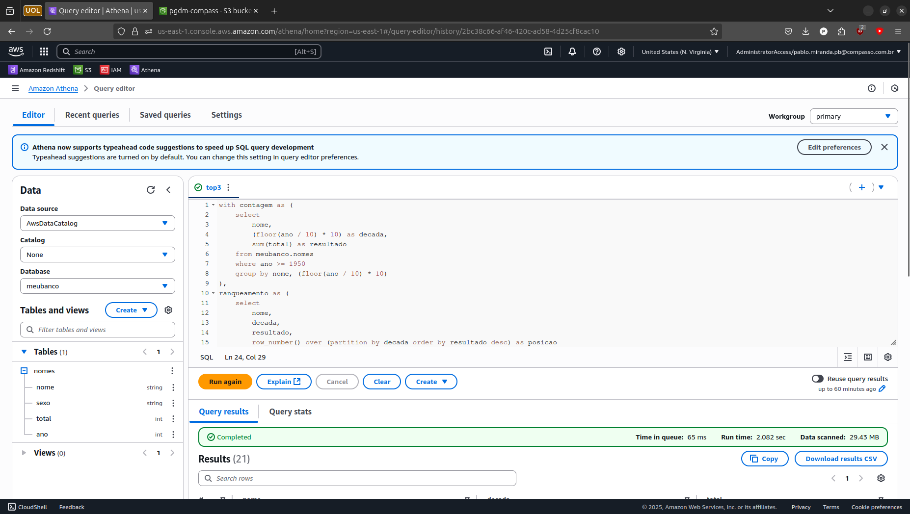

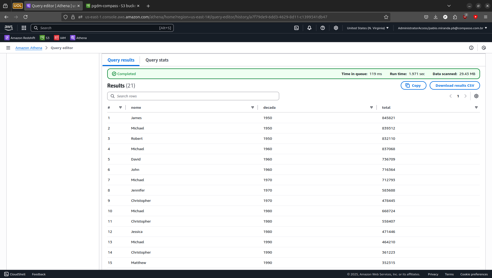

Mais uma vez, os resultados completos podem ser obtidos no arquivo [query.csv](./Exercícios/2-aws_athena/dados/query.csv). 

## 3 - AWS Lambda

Construímos uma função lambda utilizando o código fornecido pela trilha, o mesmo que se encontra abaixo, e o deploy foi feito com sucesso, como apontado na amostra seguinte:

```
import json
import pandas
import boto3
 
 
def lambda_handler(event, context):
    s3_client = boto3.client('s3')
 
    bucket_name = 'pgdm-compass'
    s3_file_name = 'dados/nomes.csv'
    objeto = s3_client.get_object(Bucket=bucket_name, Key=s3_file_name)
    df=pandas.read_csv(objeto['Body'], sep=',')
    rows = len(df.axes[0])
 
    return {
        'statusCode': 200,
        'body': f"Este arquivo tem {rows} linhas"
    }
```

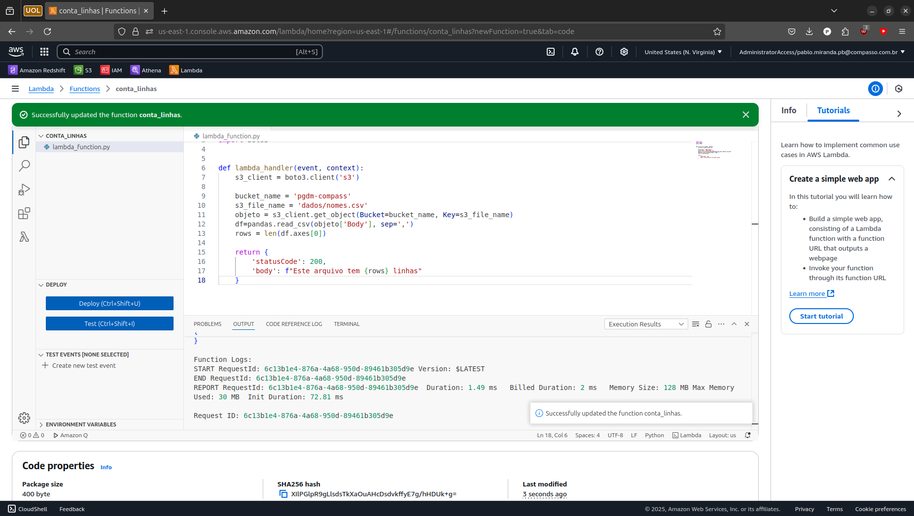

Contudo, ao rodar o teste para a função, recebemos um erro de execução, informando que não havíamos importado a biblioteca Pandas:

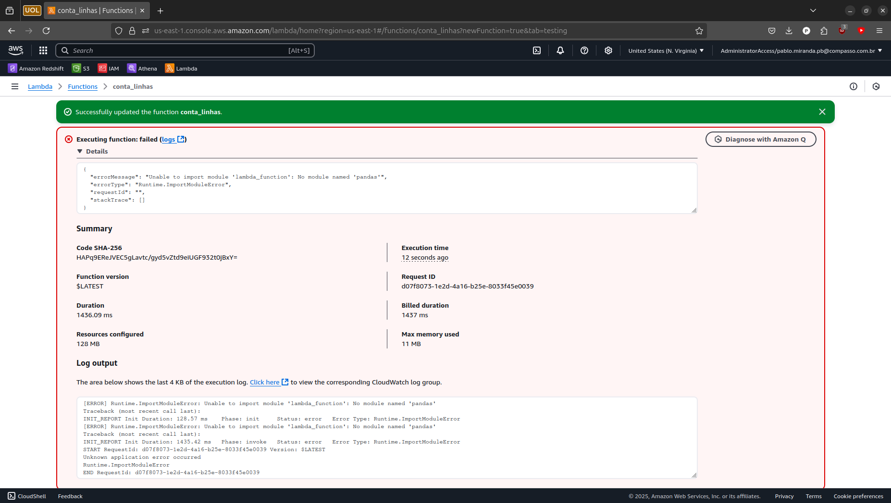

As amostras seguintes trazem a construção local de uma imagem e conteinerização da biblioteca pandas, bem como a sua exportação em formato zip. Primeiro construímos a imagem à partir de um [Dockerfile](./Exercícios/3-aws_lambda/layer/Dockerfile) que foi feita com sucesso, como pode ser observado na amostra à seguir:

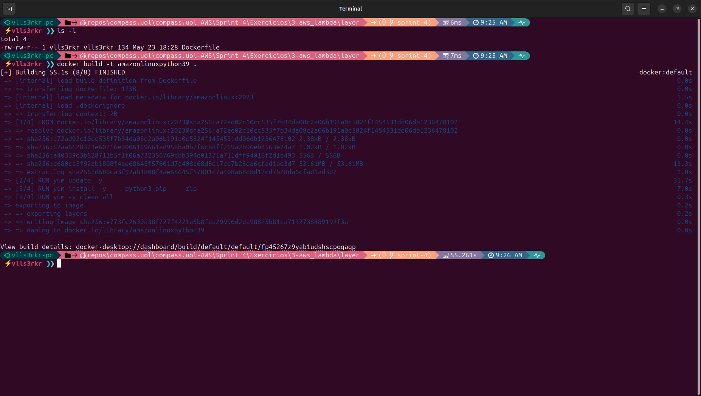

Com um comando bash, realizamos uma série de operações dentro do contêiner que culminou na instalação da biblioteca **Pandas** com a ajuda do **pip**, como pode ser observado na amostra abaixo:

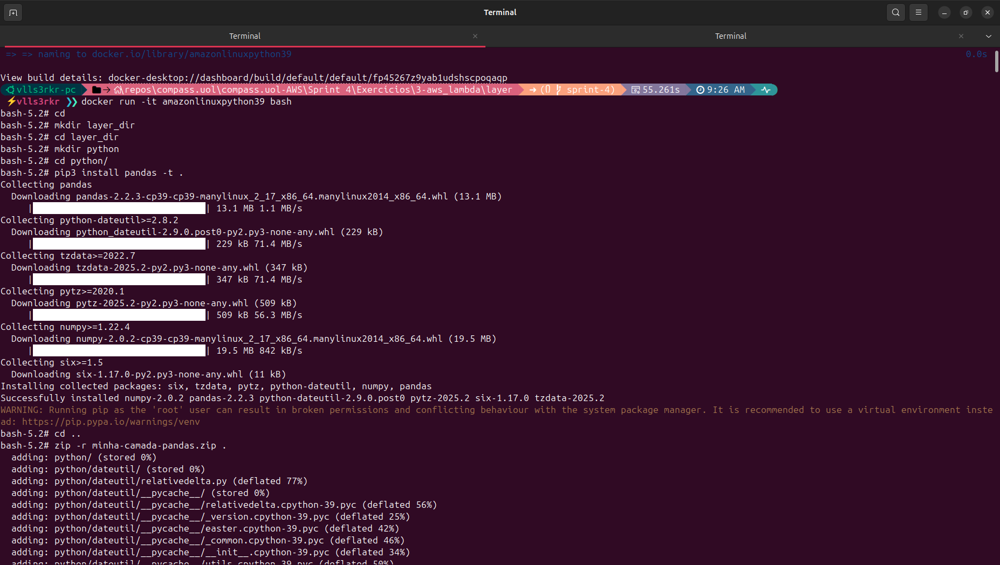

Por fim, em outra aba do terminal, procuramos saber qual o ID do contêiner e, interagindo com ele, exportamos a biblioteca instalada em um arquivo zip, como é possível observar na evidência à seguir:

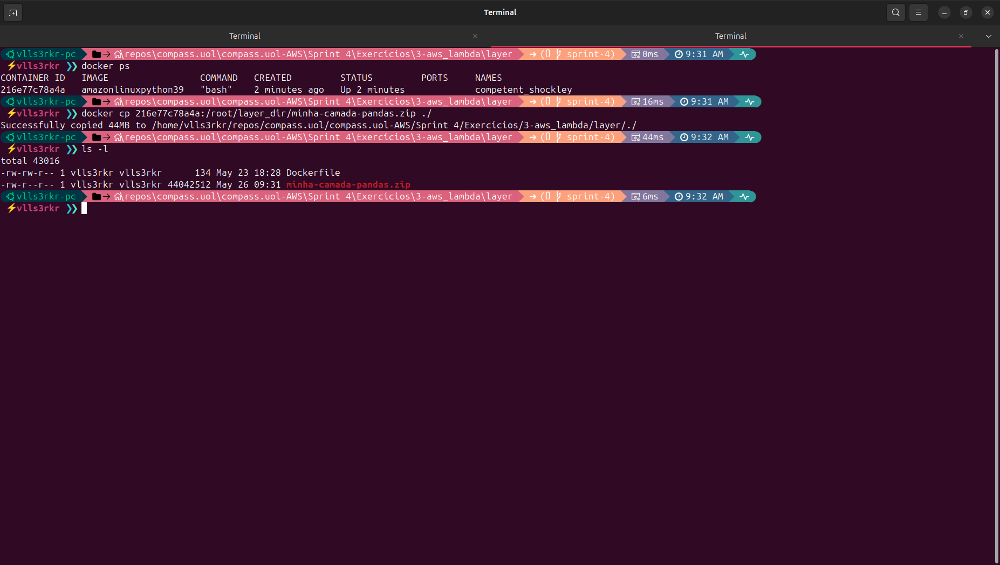

Retornamos ao **AWS Lambda** e criamos uma camada chamada PandasLayer, como mostra a evidência à seguir:

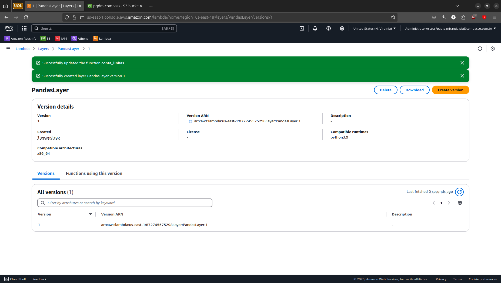

Por fim, o código foi executado com sucesso, para isso precisamos aumentar a memória e o tempo de execução do código. A amostra seguinte traz o sucesso do código:

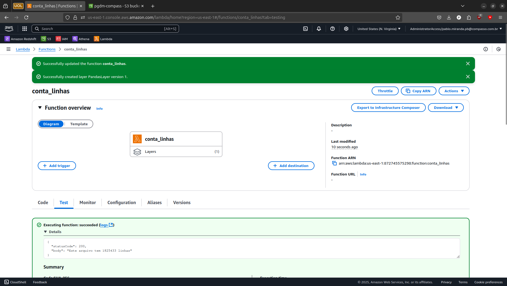

## 4 - Limpeza de Recursos

Precisamos desfazer os recursos criados nos exercícios anteriores, cada uma das amostras abaixo traz provas da limpeza desses recursos:

### Bucket no AWS S3

Abaixo está uma amostra do nosso bucket com todos os arquivos e pastas utilizados nos exercícios:

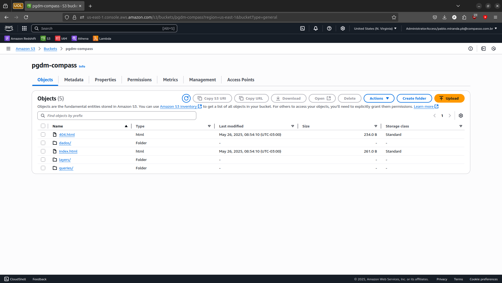

Tivemos, então, que esvaziar o bucket para daí deletá-lo. A seguir temos uma amostra da página inicial do serviço **AWS S3** que aparece quando não há buckets criados, e uma mensagem de sucesso no topo indicando a deleção:

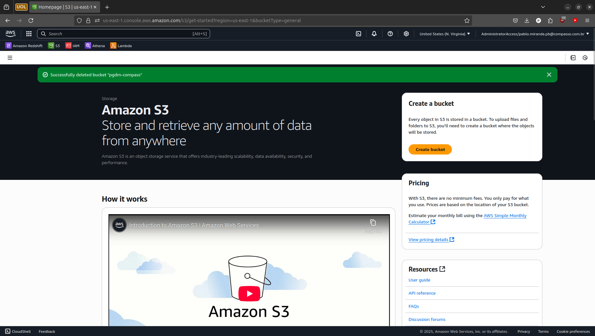

### Banco de Dados, Tabela e Queries no AWS Athena 

No **AWS Athena** criamos um banco de dados, uma tabela e salvamos queries. As queries estavam armazenadas no Bucket que já foi apagado na etapa anterior. A próxima amostra traz a deleção da tabela (com o código selecionado) e a mensagem de sucesso confirmando essa deleção:

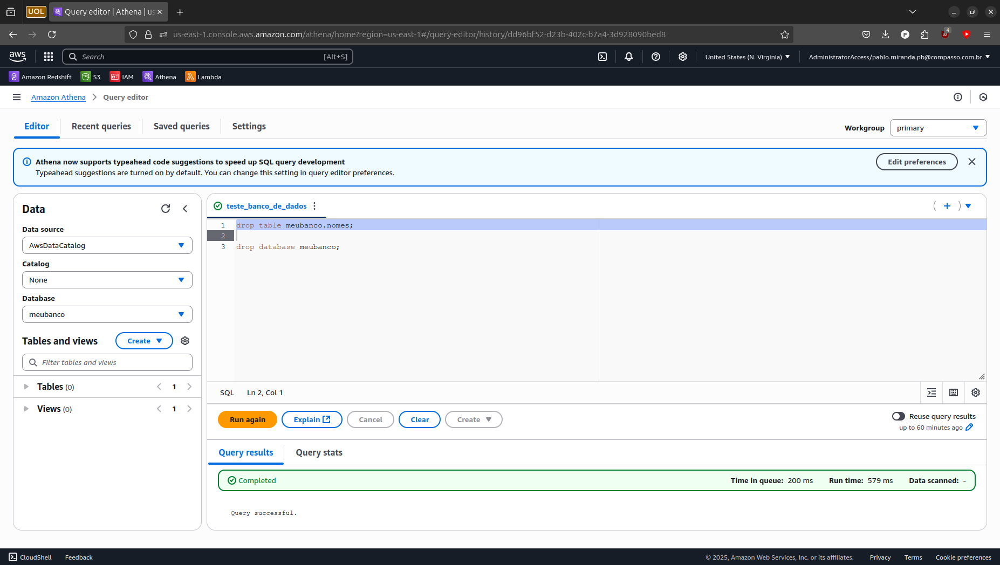

Adicionalmente, deletamos o banco de dados com o código selecionado e a deleção é confirmada com uma mensagem de sucesso, como mostra a evidência à seguir:

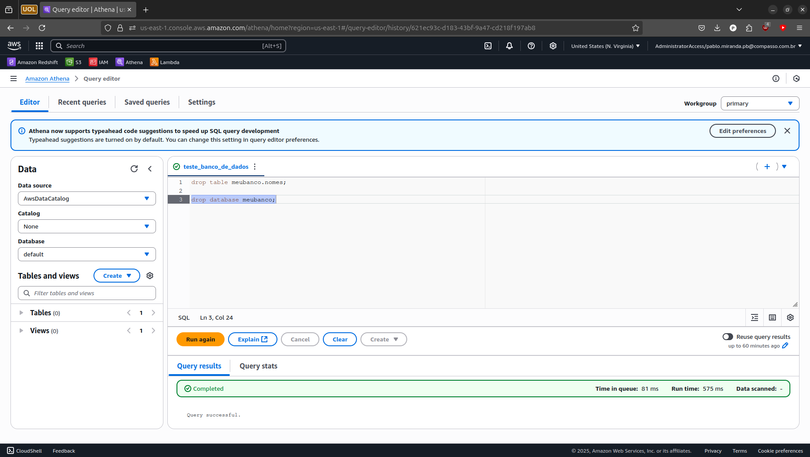

### Layer e Lambda Function

No **AWS Lambda** tivemos que apagar o layer criado e nomeado como PandasLayer, as amostras seguintes trazem o painel de Layers com a camada que construímos e depois sem a camada:

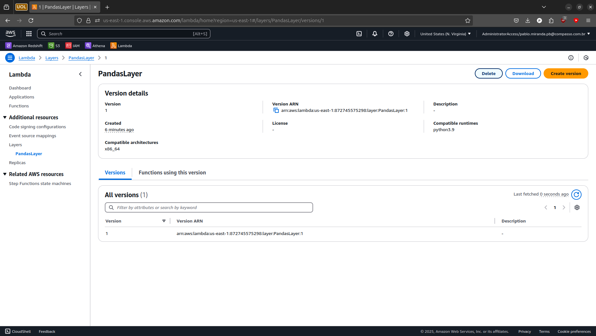

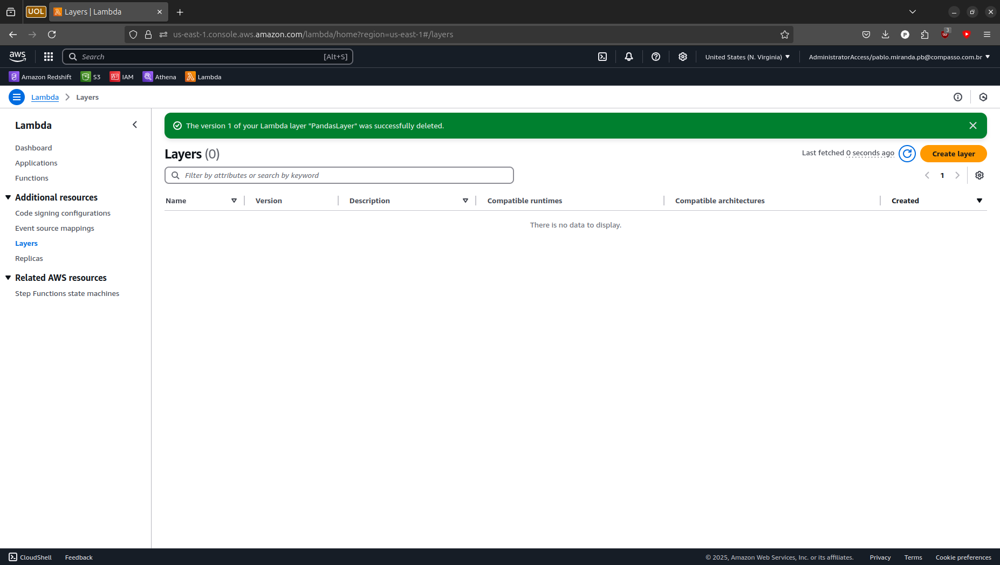

Por fim, apagamos a função lambda que havia sido nomeada como **conta_linhas**, como mostra a mensagem de sucesso:

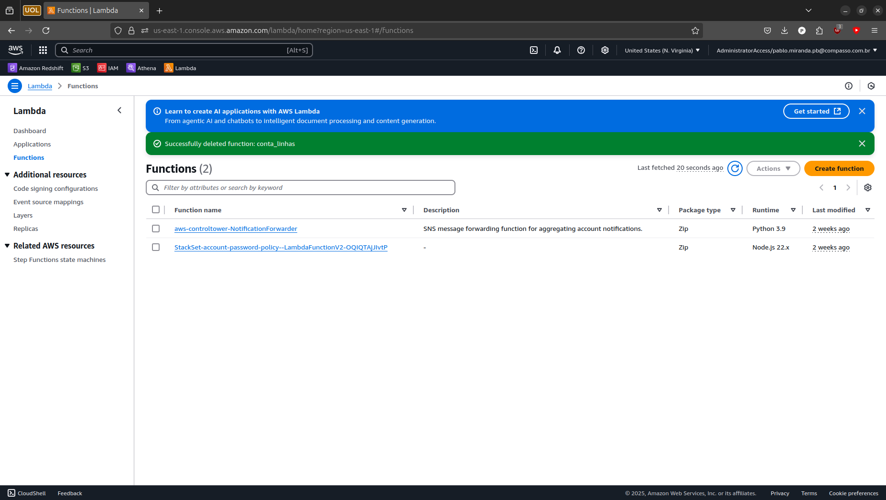

# Certificados

Abaixo se encontram dois certificados nominais a Pablo Miranda e uma *badge* não nominal, todos relacionados aos cursos realizados na plataforma [AWS Skill Builder](https://explore.skillbuilder.aws/learn). Para essa *Sprint*, a conclusão dos cursos **AWS Partner: Sales Accreditation** e **AWS Partner: Cloud Economics** resultaram no fornecimento dos certificados nominais: ambos os certificados (bem como a *badge* não nominal) se encontram na pastda de [Certificados](./Certificados/). **A conclusão do Cloud Quest resultou em uma *badge* não nominal, mas cuja autenticidade, incluindo ter sido creditada a Pablo Miranda, pode ser conferida na URL abaixo**. 

- [AWS Partner: Sales Accreditation](./Certificados/aws_sales_accreditation.pdf)

- [AWS Partner: Cloud Economics](./Certificados/aws_cloud_economics.pdf)

- Badge da Cloud Quest: https://www.credly.com/badges/9c903b4b-777e-4ee7-bddd-4ef5f4999f4b/public_url