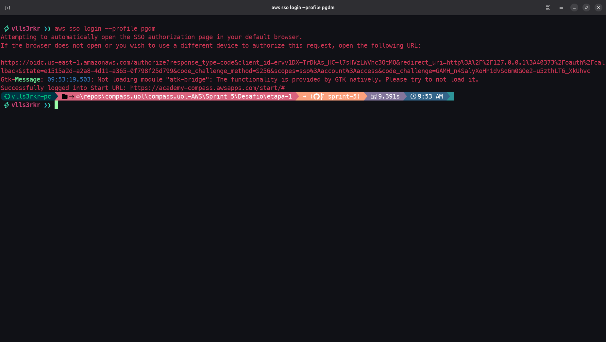
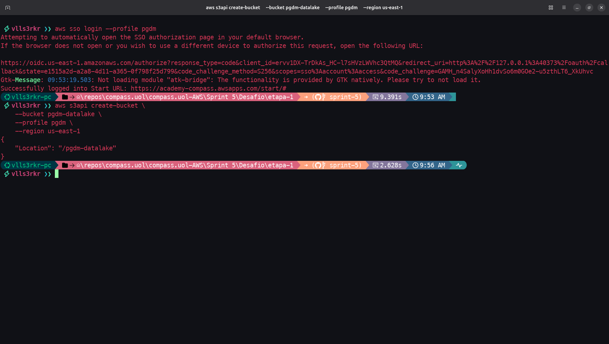
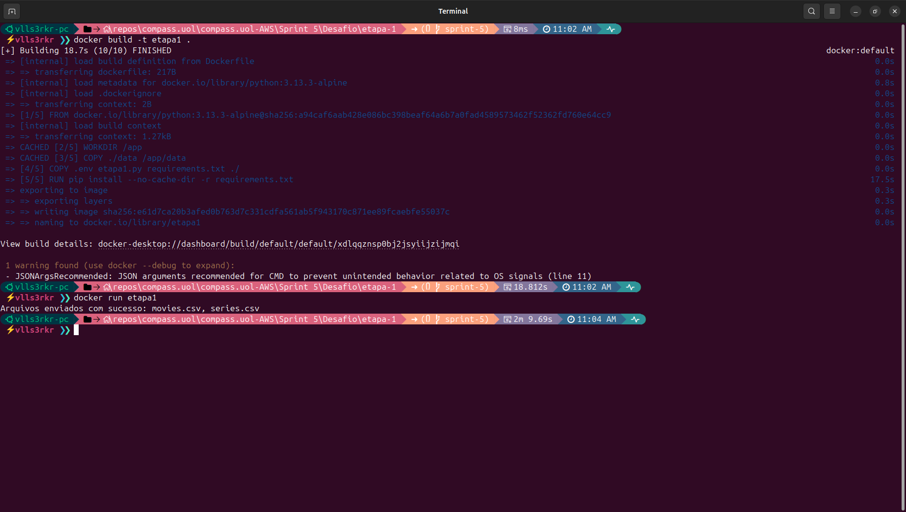
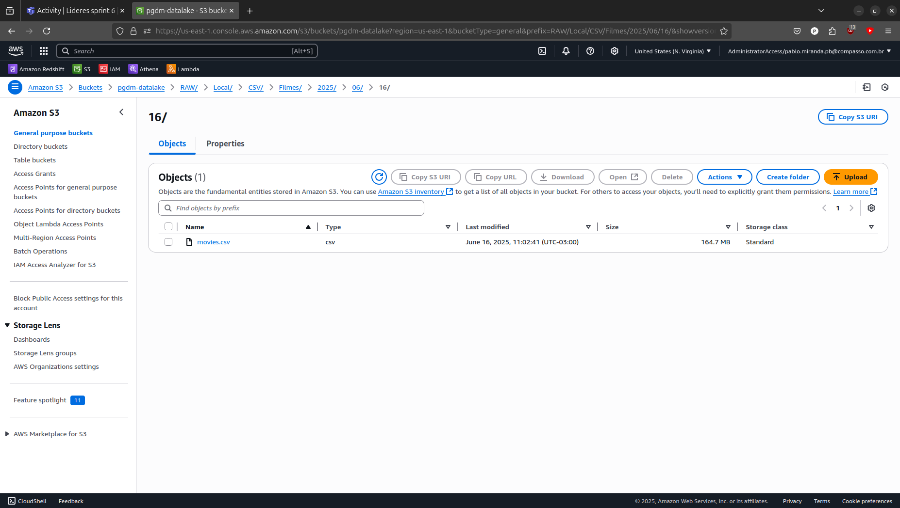
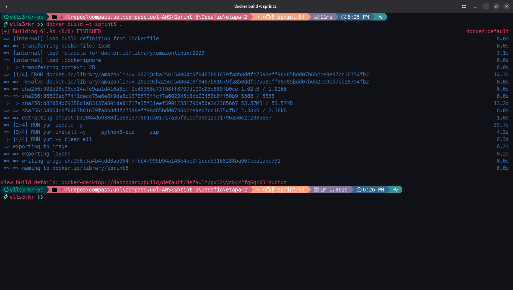
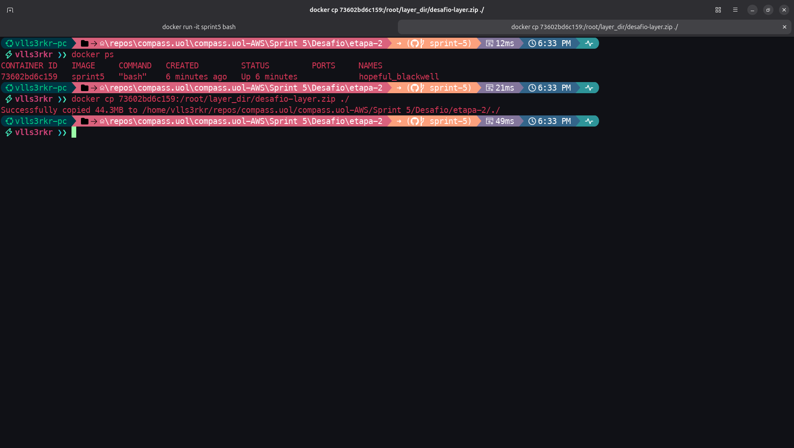
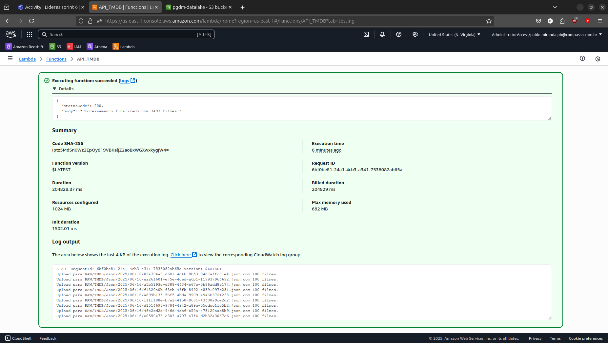
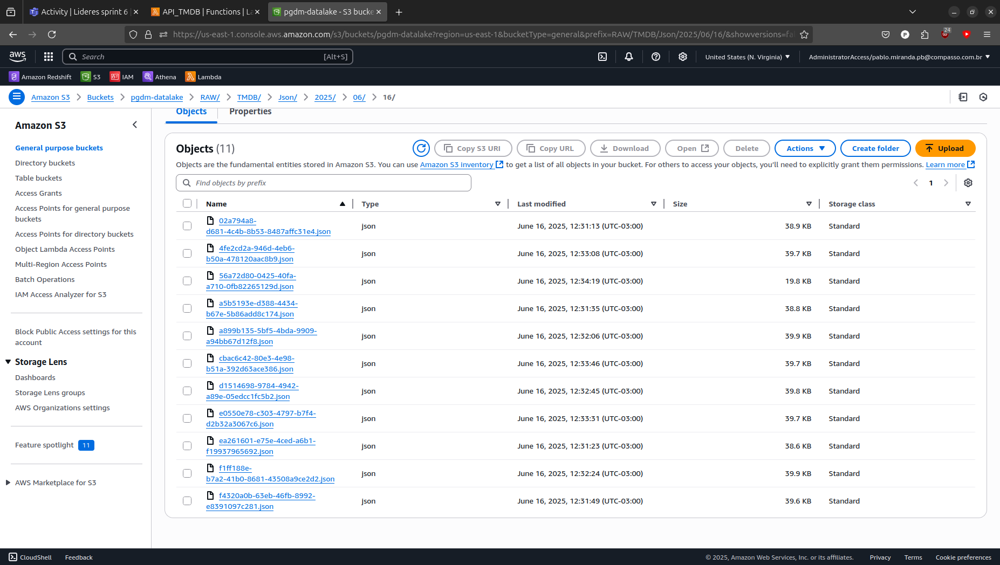

# Desafio da Sprint 2 - Análise de Dados

O objetivo é praticar a combinação de conhecimentos vistos no Programa, fazer um mix de tudo que já foi feito.

## Entregáveis

- [x] Todo o código, comentários, evidências e demais artefatos desenvolvidos para resolver o desafio;

- [x] Arquivo **README.md** com evidências imagens/prints de realização do desafio, bem como documentação de explicação de cada parte executada;

- Entregáveis Etapa 1:
    - [x] **Dockerfile**;
        - [Dockerfile](./etapa-1/Dockerfile) da etapa 1;
    - [x] Arquivo contendo código Python no formato `.py`;
        - [etapa1.py](./etapa-1/etapa1.py) contendo código da etapa 1.

- Entregáveis Etapa 2:
    - [x] Arquivo contendo código Python no formato `.py` representando a Lambda (executada no Console AWS);
        - [etapa2.py](./etapa-2/etapa2.py) contendo código da etapa 2 a ser executado no Lambda;
    - [x] Explicitar suas questões que serão respondidas na última etapa do desafio e relacionar com os resultados da consulta da API;
        - Questões explicitadas na sessão [Preparação](#preparação) e no arquivo [questoes.txt](./etapa-2/questoes.txt).


## Sumário

- [Etapa 1](#etapa-1---upload-do-dataset)

- [Etapa 2](#etapa-2---requisições-com-api)

## Preparação

Primeiramente tivemos que entender os vários passos do projeto e a sua arquitetura para compreender como cada uma das etapas se conectam e, assim, conseguirmos fornecer uma solução que seja satisfatória. Os arquivos **CSV** nos foram entregues já nessa etapa e a API do TMDB foi adquirida durante a resolução dos exercícios. Nos restou explorar os dados existentes nos arquivos **CSV**, bem como as possibilidades das **APIs do TMDB** para formularmos nossas questões e dar início ao projeto.

Nos foi requisitado também a elaboração de questões que vão guiar a ingestão dos dados, bem como todo o projeto desenvolvido. Ao **Squad 2** do qual fazemos parte, foi dado o tema Guerra/Crime, de modo que demos predileção aos filmes de Guerra. Tendo em vista o andamento do conflito Rússia e Ucrânia, fizemos a ingestão de filmes de guerra produzidos pela Rússia e pela Ucrânia à partir de 2015 (o evento se inicia em 2017, mas é possível que as tensões pré-guerra tenham fomentado a indústria cinematográfica de ambos os países). Esses dados serão confrontados com a produção de um outro conflito muito mais longevo entre os Estados Unidos e a Ex-União Soviética, em que analisaremos a produção cinematográfica desses países desde a 2a Guerra Mundial até a dissolução dos blocos soviéticos em 1991.

```
Filmes de Guerra Produzidos pelos EUA e Ex-URSS entre 1945 e 1991 e Filmes de Guerra Produzidos pela Rússia e Ucrânia após 2014.
1. Nas décadas posteriores quais foram os gastos dos EUA e da ex-URSS em filmes de guerra?
2. A cada década, quem recebeu os melhores votos médios por filme?
3. Em termos de lucro, é possível mapear quem bloco lucrou mais?
4. A Rússia consegiu manter uma produção de filmes nos mesmos parâmetros de qualidade da Ex-União Soviética?
5. Quais foram os gastos realizados pela Ucrânia e Rússia, deflagrado o conflito entre eles?
```

# Desafio

Realizamos nessa Sprint duas das cinco etapas do Desafio de Filmes e Séries, que se trata da construção de um Data Lake com etapas de ingestão, armazenamento, processamento e consumo.

O projeto todo possui várias etapas que envolvem: construir 2 ingestões, uma com base em arquivos `.csv`, e outra com base em dados da API do TMDB. Os dados ingeridos serão armazenados em uma primeira camada do nosso Data Lake, a ser processados para uma segunda camada do Data Lake, padronizando o formato de armazenamento e catalogando esses dados em taelas. Será definido o modelo de dados dimensional a ser utilizado na nossa análise, e um novo processamento de dados será feito com Apache Spark, que, porventura, serão armazenados e catalogados em uma terceira camada. O consumo das informações na terceira camada será realizada através de Dashboards analíticos, desenvolvidos para responder perguntas definidas no início do desafio.

Fazemos parte do Squad 2 que recebeu o tema "CRIME/GUERRA" de modo que nossas questões precisaram ser guiadas por esse tema.

## [Etapa 1 - Upload do Dataset](./etapa-1/)

Essa primeira etapa diz respeito a ingestão dos arquivos `.csv` de forma local para o nosso bucket na AWS que vai servir de datalake. Os arquivos foram enviados de maneira integral, sem nenhuma alteração. **Estruturamos o nosso código de maneira a modularizar melhor as tarefas**, criamos uma classe chamada `GerenciadorS3` que vai receber nossas variáveis de ambiente, vai ser responśvel pelo envio dos arquivos para diferentes destinos, e por gerar o caminho dos arquivos baseados no dia de envio (seguindo as instruções dadas). A função `carregar_variaveis_ambiente` carrega nossas chaves e variáveis à partir de um arquivo `.env` e confere se todas as variáveis estão presentes, e a função `executar_processo` é ativada pelo método de inicialização.

O script foi executado dentro de um contêiner Docker que importou os dados, os requerimentos do código que podem ser encontrado em [requirements.txt](./etapa-1/requirements.txt), as credenciais e o script utilizado que pode ser encontrado em [etapa1.py](./etapa-1/etapa1.py), ou examinado abaixo:

```python
import os
import sys
from datetime import datetime
from pathlib import Path

import boto3
from botocore.exceptions import ClientError, NoCredentialsError
from dotenv import load_dotenv


class GerenciadorS3:
    def __init__(
        self, aws_access_key_id, aws_secret_access_key, bucket_name, aws_session_token
    ):
        self.bucket_name = bucket_name
        self.cliente_s3 = boto3.client(
            "s3",
            aws_access_key_id=aws_access_key_id,
            aws_secret_access_key=aws_secret_access_key,
            aws_session_token=aws_session_token,
            region_name="us-east-1",
        )

    def enviar_arquivo(self, caminho_local, caminho_s3):
        if not caminho_local.exists():
            return False

        try:
            self.cliente_s3.upload_file(
                str(caminho_local), self.bucket_name, caminho_s3
            )
            return True
        except (ClientError, NoCredentialsError):
            return False

    def gerar_caminho_s3(self, nome_arquivo):
        data_atual = datetime.now()
        ano = data_atual.strftime("%Y")
        mes = data_atual.strftime("%m")
        dia = data_atual.strftime("%d")

        if "movies" in nome_arquivo.lower():
            categoria = "Movies"
        elif "series" in nome_arquivo.lower():
            categoria = "Series"
        else:
            categoria = "Outros"

        return f"RAW/Local/CSV/{categoria}/{ano}/{mes}/{dia}/{nome_arquivo}"

    def enviar_lote_arquivos(self, lista_arquivos, pasta_local):
        resultados = {"sucesso": [], "falha": [], "nao_encontrado": []}

        for arquivo in lista_arquivos:
            caminho_completo = pasta_local / arquivo

            if not caminho_completo.exists():
                resultados["nao_encontrado"].append(arquivo)
                continue

            destino_s3 = self.gerar_caminho_s3(arquivo)
            if self.enviar_arquivo(caminho_completo, destino_s3):
                resultados["sucesso"].append(arquivo)
            else:
                resultados["falha"].append(arquivo)

        return resultados


def carregar_variaveis_ambiente():
    load_dotenv()

    variaveis_necessarias = {
        "aws_access_key_id": os.getenv("AWS_ACCESS_KEY_ID"),
        "aws_secret_access_key": os.getenv("AWS_SECRET_ACCESS_KEY"),
        "bucket_name": os.getenv("BUCKET_NAME"),
        "aws_session_token": os.getenv("AWS_SESSION_TOKEN"),
    }

    variaveis_faltantes = [
        nome for nome, valor in variaveis_necessarias.items() if not valor
    ]
    if variaveis_faltantes:
        raise ValueError(
            f"Variáveis de ambiente faltando: {', '.join(variaveis_faltantes)}"
        )

    return variaveis_necessarias


def executar_processo():
    ARQUIVOS_CSV = ["movies.csv", "series.csv"]
    DADOS = Path("./data")

    try:
        credenciais = carregar_variaveis_ambiente()
        gerenciador = GerenciadorS3(
            aws_access_key_id=credenciais["aws_access_key_id"],
            aws_secret_access_key=credenciais["aws_secret_access_key"],
            bucket_name=credenciais["bucket_name"],
            aws_session_token=credenciais["aws_session_token"],
        )

        if not DADOS.exists():
            print(f"Pasta de dados não encontrada: {DADOS}")
            sys.exit(1)

        relatorio = gerenciador.enviar_lote_arquivos(ARQUIVOS_CSV, DADOS)

        print(f"Arquivos enviados com sucesso: {', '.join(relatorio['sucesso'])}")
        if relatorio["falha"]:
            print(f"Falha no envio: {', '.join(relatorio['falha'])}")
        if relatorio["nao_encontrado"]:
            print(f"Arquivos não encontrados: {', '.join(relatorio['nao_encontrado'])}")

        if relatorio["falha"] or relatorio["nao_encontrado"]:
            sys.exit(1)

    except ValueError as erro:
        print(f"Erro de configuração: {erro}")
        sys.exit(1)
    except Exception as erro:
        print(f"Erro inesperado: {erro}")
        sys.exit(1)


if __name__ == "__main__":
    executar_processo()
```

A criação do bucket foi realizada utilizando **AWS Cli**, conforme mostra os prints abaixo:





Criamos um contêiner com o Docker usando o comando `docker build -t etapa1 .` e em seguida rodamos o nosso script através do contêiner com o comando `docker run etapa1`. Recebemos uma mensagem de sucesso, como mostra a evidência abaixo:



Os arquivos se encontram nos seus respectivos caminhos dentro da camada RAW, conforme o dia de envio (16/06/2025):




## [Etapa 2 - Requisições com API](./etapa-2/)

Para a etapa 2 fizemos diversas requisições com a API do TMDB para responder as questões que formulamos anteriormente e que foram apresentadas na seção de [Preparação](#preparação) desse README.md, mas que podem ser examinadas em separado no arquivo [questoes.txt](./etapa-2/questoes.txt). As informações requisitadas com a API do TMDB estão listadas abaixo. Algumas delas se repetem, como vote_average e vote_count, mas fizemos isso por entender que a API está trazendo informações atualizadas.

- movie_id,
- imdb_id,
- title,
- original_title,
- release_date,
- vote_average,
- vote_count,
- budget,
- revenue,
- paises_codigo,
- paises_nome.

Antes de mais nada, fizemos uma exploração simples e testamos nosso código localmente em um Jupyter notebook e depois reformulamos nosso código para o formato compatível com o **AWS Lambda**. O código pode ser encontrado no arquivo [etapa2.py](./etapa-2/etapa2.py) e examinado abaixo. Ele é estruturalmente mais simples que o da etapa 1, mas fizemos isso para sermos o mais objetivo possível. O código executa um lambda_handler que vai listar o conteúdo do diretório Movies no nosso datalake e recuperar o último arquivo que foi modificado (a ideia é que, caso haja múltiplos arquivos, de cargas diferentes, vamos estar pegando o último arquivo sempre). O arquivo é lido com Pandas que importa apenas as colunas necessárias para a nossa análise, para, em seguida, realizar filtragens e exportar a coluna id dos filmes resultantes como lista. A função `upload_chunk_to_s3` realiza o upload das requisições em formato Json, nomeados usando o formato **UUID**, onde cada arquivo Json deve ter até 100 títulos de filmes. A função `processar_filmes` é responsável pelas requisições e filtra, mais uma vez, a seleção pelos países que interessam a nossa pesquisa: US, SU, AU e RU. Com a finalidade de acelerar nossas requisições, utilizamos uma função nativa do Python, `ThreadPoolExecutor` e fizemos 10 requisições em paralelo (limite permitido pelo AWS Lambda).

```python
import json
import uuid
from concurrent.futures import ThreadPoolExecutor, as_completed
from datetime import datetime
import os

import boto3
import pandas as pd
import requests

bucket_name = os.environ.get("BUCKET_NAME")
tmdb_api_key = os.environ.get("TMDB_API_KEY")

s3 = boto3.client("s3")


def lambda_handler(event, context):
    response = s3.list_objects_v2(Bucket=bucket_name, Prefix="RAW/Local/CSV/Movies/")
    objetos_ordenados = sorted(
        response["Contents"], key=lambda obj: obj["LastModified"], reverse=True
    )
    ultimo_objeto = objetos_ordenados[0]["Key"]

    obj = s3.get_object(Bucket=bucket_name, Key=ultimo_objeto)
    df = pd.read_csv(
        obj['Body'],
        sep="|",
        usecols=[
            "id",
            "tituloPincipal",
            "tituloOriginal",
            "anoLancamento",
            "tempoMinutos",
            "genero",
            "notaMedia",
            "numeroVotos",
        ],
        low_memory=False
    )

    df = df.drop_duplicates(subset="id")
    df = df[df["genero"].str.contains("War", na=False)]

    df["anoLancamento"] = pd.to_datetime(df["anoLancamento"], errors="coerce").dt.year
    df = df[
        ((df["anoLancamento"] >= 1945) & (df["anoLancamento"] <= 1992))
        | (df["anoLancamento"] >= 2015)
    ]

    lista_imdb_ids = df["id"].tolist()

    data_atual = datetime.now()
    prefix = f"RAW/TMDB/Json/{data_atual.year}/{data_atual.month:02d}/{data_atual.day:02d}/"

    def upload_chunk_to_s3(chunk):
        filename = f"{uuid.uuid4()}.json"
        key = prefix + filename
        json_bytes = json.dumps(chunk, ensure_ascii=False, indent=4).encode("utf-8")
        s3.put_object(
            Bucket=bucket_name, Key=key, Body=json_bytes, ContentType="application/json"
        )
        print(f"Upload para {key} com {len(chunk)} filmes.")

    def processar_filme(imdb_id):
        try:
            url_find = (
                f"https://api.themoviedb.org/3/find/{imdb_id}"
                f"?api_key={tmdb_api_key}&language=pt-BR&external_source=imdb_id"
            )
            response = requests.get(url_find)
            data_find = response.json()

            movie_results = data_find.get("movie_results", [])
            if not movie_results:
                return None

            movie = movie_results[0]
            movie_id = movie["id"]

            detalhes_url = f"https://api.themoviedb.org/3/movie/{movie_id}?api_key={tmdb_api_key}&language=pt-BR"
            detalhes_response = requests.get(detalhes_url)
            detalhes = detalhes_response.json()

            countries = detalhes.get("production_countries", [])
            codigos_pais = [p["iso_3166_1"] for p in countries]

            if not any(c in ["US", "RU", "SU", "UA"] for c in codigos_pais):
                return None

            nomes_pais = [p["name"] for p in countries]

            return {
                "id": movie_id,
                "id_imdb": detalhes.get("imdb_id"),
                "titulo": detalhes.get("title"),
                "titulo_original": detalhes.get("original_title"),
                "lancamento": detalhes.get("release_date"),
                "media_tmdb": detalhes.get("vote_average"),
                "votos_tmdb": detalhes.get("vote_count"),
                "orcamento": detalhes.get("budget"),
                "recebimento": detalhes.get("revenue"),
                "lucro": detalhes.get("revenue", 0) - detalhes.get("budget", 0),
                "paises_codigo": ", ".join(codigos_pais),
                "paises_nome": ", ".join(nomes_pais),
            }

        except Exception as e:
            print(f"Erro ao processar {imdb_id}: {e}")
            return None

    chunk = []
    chunk_size = 100

    with ThreadPoolExecutor(max_workers=10) as executor:
        futures = [executor.submit(processar_filme, imdb_id) for imdb_id in lista_imdb_ids]
        for future in as_completed(futures):
            resultado = future.result()
            if resultado:
                chunk.append(resultado)
                if len(chunk) >= chunk_size:
                    upload_chunk_to_s3(chunk)
                    chunk = []

    if chunk:
        upload_chunk_to_s3(chunk)

    return {
        "statusCode": 200,
        "body": f"Processamento finalizado com {len(lista_imdb_ids)} filmes.",
    }
```

As duas variáveis de ambiente utilizadas foram armazenadas no próprio console, as bibliotecas pandas e requests foram exportadas como layer utilizando uma imagem docker (não foi necessário exportar boto3, já que vamos rodar o código direto do console), como havíamos feito na sprint passada. As evidências seguintes mostram o sucesso dessa operação:





Criamos uma nova função Lambda no console da AWS chamado `API_TMDB` onde colamos o código já comentado. Na aba de configuração mudamos o timeout para 15 minutos (máximo permitido pelo Lambda) e alteramos a memória para ajudar a execução do código. Passamos nosso acesso ao API do TMDB e o nome do bucket de destino como variáveis de ambiente na aba de mesmo nome. Construímos uma layer chamada DesafioLayer que havia sido criada com o arquivo `desafio-layer.zip`. Por último, adicionamos uma nova *Policy* na AWS IAM para que a nossa função Lambda pudesse ter acesso aos recursos necessários no S3, e criar logs com CloudWatch caso fosse necessário realizar algum debug.

```json
{
  "Version": "2012-10-17",
  "Statement": [
    {
      "Effect": "Allow",
      "Action": [
        "s3:GetObject",
        "s3:PutObject",
        "s3:ListBucket"
      ],
      "Resource": [
        "arn:aws:s3:::pgdm-datalake",
        "arn:aws:s3:::pgdm-datalake/*"
      ]
    },
    {
      "Effect": "Allow",
      "Action": [
        "logs:CreateLogGroup",
        "logs:CreateLogStream",
        "logs:PutLogEvents"
      ],
      "Resource": "*"
    }
  ]
}
```

Ao executar o código nós obtivemos sucesso, o código foi executado em 6 minutos, como é possível observar na evidência abaixo:



A próxima amostra traz o resultado da execução do lambda, que são os arquivos `.json` armazenados devidamente na camada RAW:



