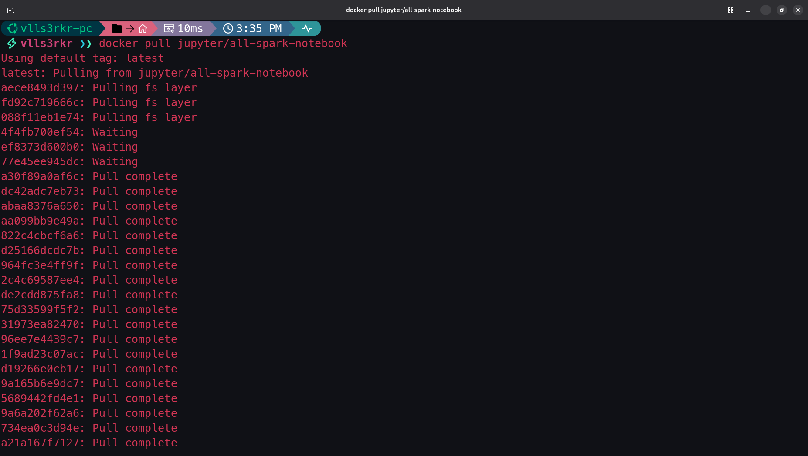
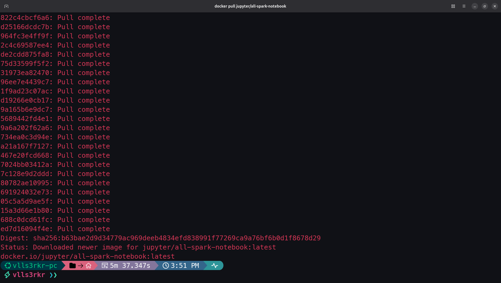
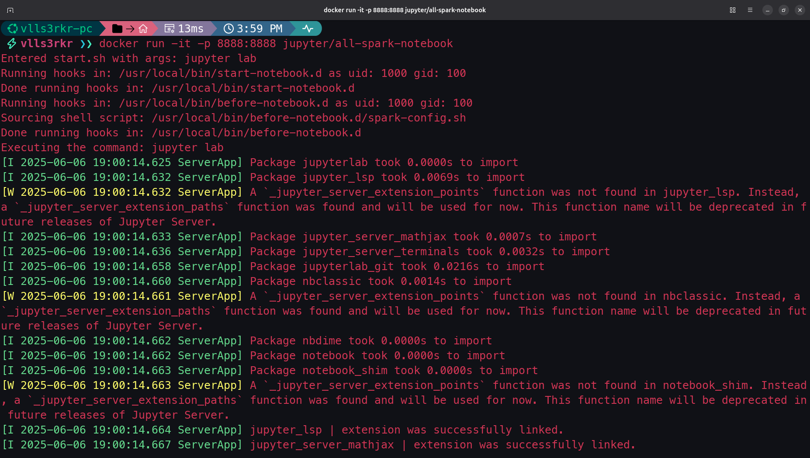
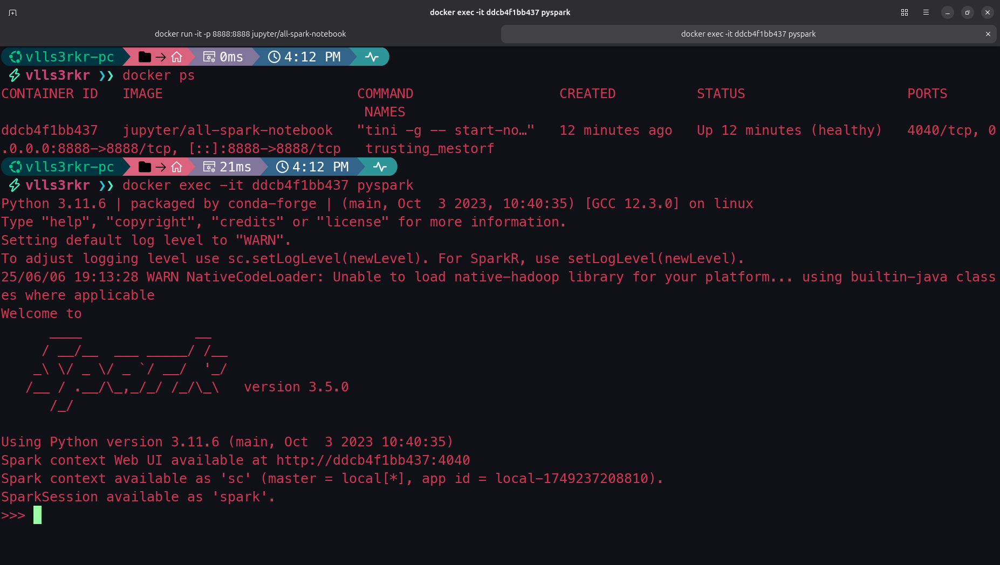
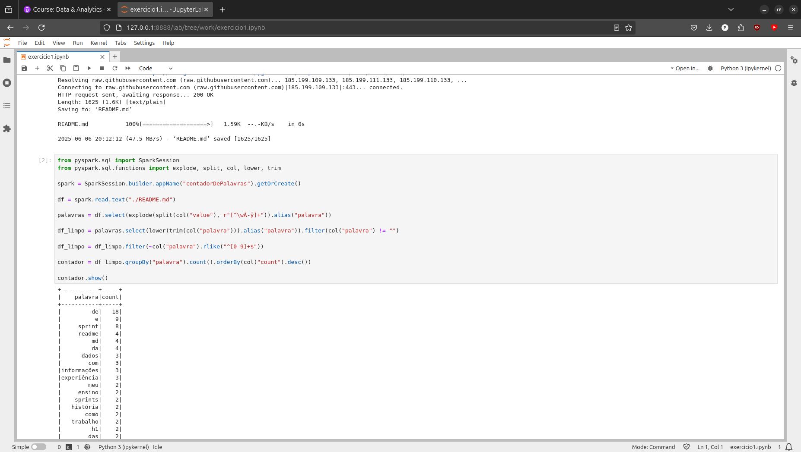
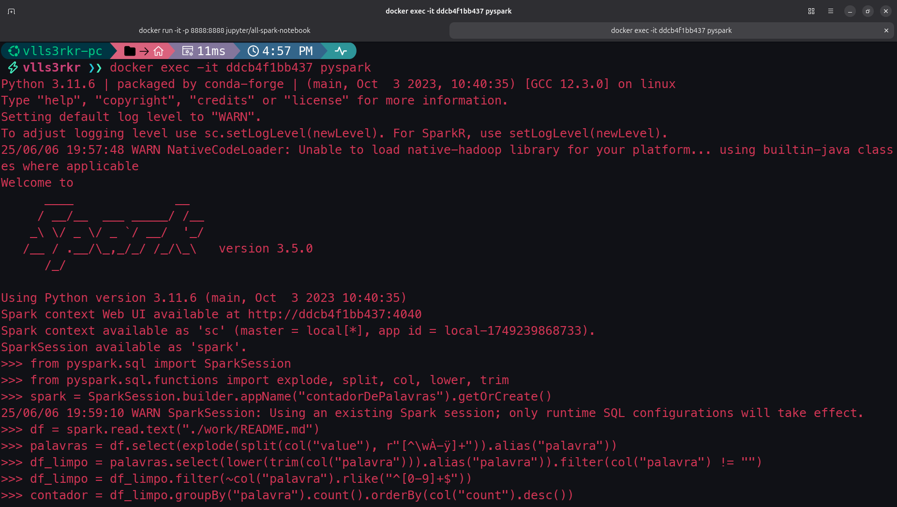
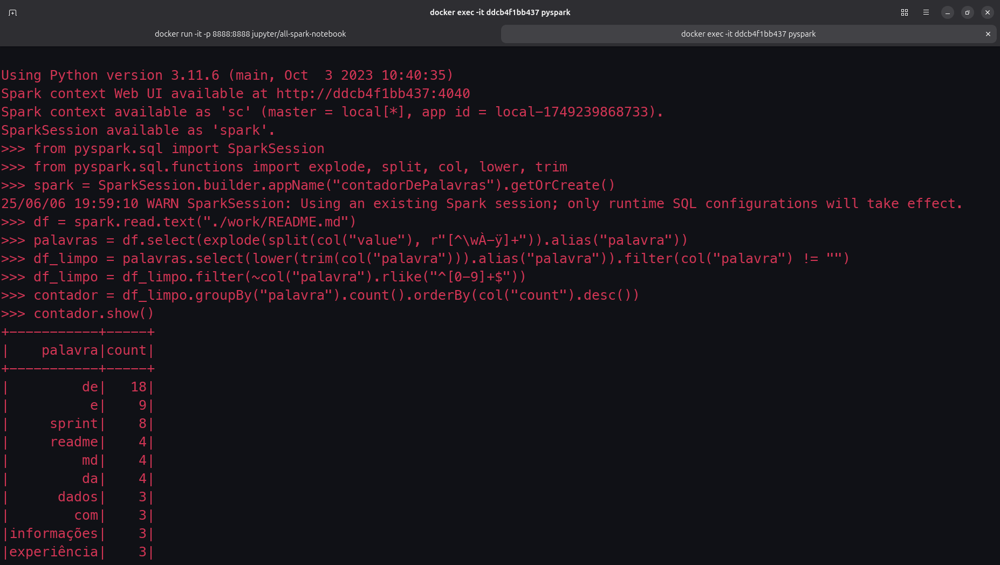
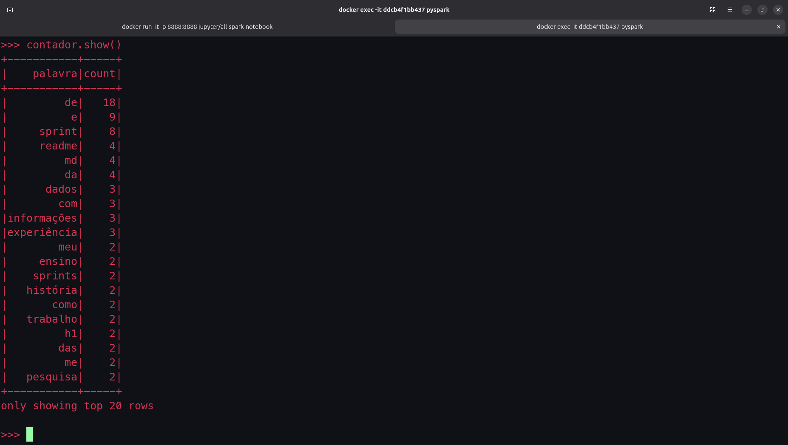
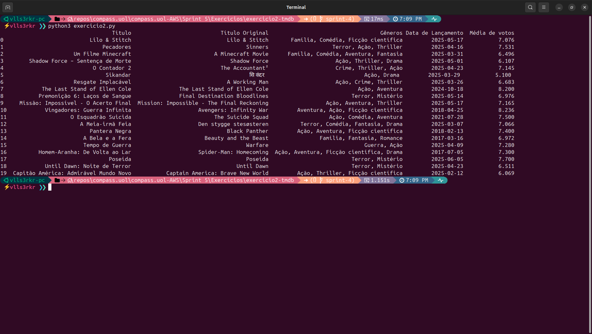

# Resumo da Sprint 5

A *Sprint* 5 foi dividida em duas semanas, onde na primeira semana realizamos um curso de **Apache Spark** (especificamente de **PySpark**) e em seguida estudamos fundamentos de operações analíticas na AWS através dos cursos **Fundamentals of Analytics on AWS - part 1**, **Introduction to Amazon Athena** e **Serverless Analytics**; na segunda semana realizamos os exercícios e o desafio. As três atividades da AWS foram realizadas na plataforma [AWS Skill Builder](https://explore.skillbuilder.aws/learn) e as comprovações de nossa devida participação está na sessão de Certificados mais abaixo e no diretório [Certificados](./Certificados/). 

- **Fundamentals of Analytics on AWS - part 1**: o curso versou essencialmente sobre os desafios e serviços da AWS para os 5 "V"s do Big Data: Volume, Velocidade, Variedade, Veracidade e Valor. Para cada um desses "V", foram dados exemplos reais de como determinados serviços poderiam oferecer uma solução tangível, seus possíveis desdobramentos com o cliente e como essa solução poderia estar relacionado a outros desafios futuros.

- **Introduction to Amazon Athena**: neste curso fomos apresentados a operações básicas de importação de dados à partir do S3, criar bancos, tabelas e realizar queries no Amazon Athena.

- **Serverless Analytics**: Nos foi apresentada uma solução de ETL de *end-to-end* à partir do serviço AWS IoT.

> Os cursos da AWS foram úteis para aprendermos ainda mais como contornar os desafios a ser enfrentados nesse ecossistema, especialmente o curso Fundamentals of Analytics on AWS trouxe uma boa dose de reflexão sobre os serviços para Analytics. Com o aprendizado de Spark temos agora tudo que é necessário para enfrentar projetos com grandes volumes de dados. Não houve maiores dificuldades na resolução dos exercícios, mas aprendemos bastante sobre processo de otimização com o curso de Spark, e com o monitor, além de tudo, como otimizar dados em memória com alguns comandos úteis de Python.

# Sumário

- [Desafio](#desafio)
- [Exercícios](#exercícios)
    - [Exercício 1: Apache Spark - Contador de Palavras](#exercício-1-apache-spark---contador-de-palavras)
    - [Exercício 2: TMDB](#exercício-2-tmdb)
- [Evidências](#evidências)
    - [Exercício 1: Apache Spark - Contador de Palavras](#apache-spark---contador-de-palavras)
    - [Exercício 2: TMDB](#tmdb)
- [Certificados](#certificados)

# Desafio

O desafio dessa sprint se dividiu em duas estapas, ambas relacionadas a ingestão. Na primeira tivemos que realizar a ingestão de dois arquivos **CSV** para a camada RAW do nosso datalake, nosso bucket na S3. Para a segunda etapa, realizamos uma série de *requests* para a API do TMDB, referente a filmes do gênero Guerra e que têm como objetivo responder uma série de perguntas formuladas para ser respondidas nas etapas seguintes do Projeto Final. Essa segunda ingestão ocorreu à partir de uma Lambda e armazenou uma série de arquivos **Json** também na camada RAW do nosso datalake. Não houve maiores dificuldades na execução desse desafio, mas o limite de tempo de 15 minutos do Lambda mostrou ser um problema que foi resolvido utilizando a biblioteca `concurrent.futures` que nos ajudou a paralelizar essas chamadas obedecendo os limites impostos na documentação do TMDB e da AWS Lambda.

O README.md, bem como os arquivos pertinentes ao Desafio se encontram na pasta [Desafio](./Desafio/)

Todas as evidências do desafio se encontra na própria pasta de [Evidências](./Evidências/)

- Paralelização na AWS Lambda: https://aws.amazon.com/blogs/compute/efficiently-processing-batched-data-using-parallelization-in-aws-lambda/

- Escalonamento de processamento na AWS Lambda: https://docs.aws.amazon.com/lambda/latest/dg/lambda-concurrency.html

- Documentação da biblioteca nativa concurrent.future: https://docs.python.org/3/library/concurrent.futures.html 

- Exemplo de uso de concurrent.future no Stac Overflow: https://stackoverflow.com/questions/58115437/concurrent-futures-in-aws-lambda-function-implementation

# Exercícios

Os entregáveis dos exercícios, bem como as evidências, podem ser encontradas nas sub-pastas do diretório [Exercícios](./Exercícios/). Ademais, fornecemos abaixo o caminho para cada exercício específico:

## [Exercício 1: Apache Spark - Contador de Palavras](./Exercícios/exercicio1-spark/)

Abaixo se encontra a sequência de códigos utilizadas para a resolução do exercício 1 onde 1. realizamos o *pull* da imagem jupyter/all-spark-notebook; 2. criamos o container e obtivemos o acesso ao Jupyter Lab; 3. executamos o pyspark à partir do contêiner; 4. usamos o **Spark Shell** para contar a quantidade de ocorrências de cada palavra contida no arquivo README.md do nosso repositório no GitHub.

- [solução do exercício 1 - exercicio1.txt](./Exercícios/exercicio1-spark/exercicio1.txt)

## [Exercício 2: TMDB](./Exercícios/exercicio2-tmdb/)

A seguir disponibilizamos o script em Python utilizado para  criar um processo de extração de dados da API do TMDB. Aqui, o processo se desenrolou entre criar a nossa conta e fazer requisições com uma URL estruturada.

- [solução do exercício 2 - exercicio2.py](./Exercícios/exercicio2-tmdb/exercicio2.py)

# Evidências

As evidências de cada exercício podem ser encontradoss nos subdiretórios de cada exercício na pasta Exercícios ou acessadas nos links abaixo:

## [Apache Spark - Contador de Palavras](./Exercícios/exercicio1-spark/evidencias/)

1. realizar o *pull* da imagem jupyter/all-spark-notebook; 2. criar o container e ter acesso ao Jupyter Lab; 3. executar o pyspark à partir do contêiner; 4. usar o **Spark Shell** para contar a quantidade de ocorrências de cada palavra contida no arquivo README.md do nosso repositório no GitHub.

- Utilizamos o comando `docker pull jupyter/all-spark-notebook` para realizar o download da imagem requisitada como pode ser observado nas duas imagens abaixo:

- Em seguida criamos o contêiner e expomos a porta **8888** `docker run -it -p 8888:8888 jupyter/all-spark-notebook`, utilizando as flags -it para interagir com o contêiner. A evidência abaixo demonstra o sucesso dessa operação:

- Em outra aba do terminal, utilizamos o comando `docker ps` para descobrir o **ID** do contêiner que acabamos de criar e iniciamos o shell do **PySpark** interagindo com o contêiner utilizando o comando `docker exec -it ddcb4f1bb437 pyspark`, onde ddcb4f1bb437 corresponde ao **ID do contêiner**. Abaixo a amostra criada traz o sucesso da operação: 

- Rascunhamos a solução em um notebook dentro do contêiner. Como o nosso repositório é privado, realizamos o download do arquivo com o comando `wget` junto ao nosso token de autenticação, que está devidamente ocultado nessa imagem por razões de segurança. A nosa sequência de códigos é simples: realizamos os imports do SparkSession e das funções que serão utilizadas: **explode** para visualizar melhor os valores, **split** para realizarmos as limpezas, **col** para nos ajudar nas filtragens com regex, **lower** e **trim** para normalizarmos os valores em minúsculas e eliminarmos espaços desnecessários. À partir daqui criamos a sessão, importamos o arquivo README.md, selecionamos as palavras (obedecendo nosso padrão linguístico, que deve incluir palavras acentuadas e cedilhas). Agrupamos a contagem das palavras por cada palavra e ordenamos elas de forma descendente. A evidência abaixo traz o sucesso do código: 

- Por fim reproduzimos o código que havia sido rascunhado, diretamente no terminal, abaixo, nas próximas três amostragens, é possível observar que o resultado foi o mesmo que obtido anteriormente:

## [TMDB](./Exercícios/exercicio2-tmdb/evidencias/)

- Para resolver esse exercício rodamos um script Python que carrega nossa chave como variável de ambiente à partir de um arquivo **.env**, que costa também no arquivo **.gitignore** para que as credenciis não suba para nosso repositório remoto. Utilizamos o exemplo dado no exercício como template para a nossa requisição de filmes, e adicionamos um campo para realizar a requisição dos gêneros de filmes, o que se revelou um problema no início já que tivemos que obter requisições em separados para os gêneros (algo que poderia ser revisto em uma próxima iteração de um projeto como esse). Na amostra abaixo é possível observar que o código traz o resultado após rodar com sucesso:

# Certificados
Abaixo se encontram três certificados nominais a Pablo Miranda, todos relacionados aos cursos realizados na plataforma [AWS Skill Builder](https://explore.skillbuilder.aws/learn). Para essa *Sprint*, a conclusão dos cursos **Fundamentals of Analytics on AWS pt.1**, **Introduction to Amazon Athena** e **Serverless Analytics** resultaram no fornecimento dos certificados nominais: os certificados se encontram na pastda de [Certificados](./Certificados/) e podem ser acessado nos links abaixo: 

- [Fundamentals of Analytics on AWS pt.1](./Certificados/fundamentals_of_analytics_on_aws.pdf)

- [Introduction to Amazon Athena](./Certificados/introduction_to_amazon_athena.pdf)

- [Serverless Analytics](./Certificados/serverless_analytics.pdf)