# Desafio da Sprint 6

O objetivo é praticar a combinação de conhecimentos vistos no Programa, fazer um mix de tudo que já foi feito. Para essa Sprint realizamos o processamento dos dados na camada **Trusted**, uma camada do data lake que corresponde àquela em que os dados estão limpos e são confiáveis, sendo o resultado da integração das diversas fontes de origem, que estão na camada anterior, que chamamos de **Raw**.

## Entregáveis

- [x] Todo o código, comentários, evidências e demais artefatos desenvolvidos para resolver o desafio;
    - Os códigos foram disponibilizados em formato `.py` e comentados neste arquivo README.md.

- [x] Arquivo **README.md** com evidências imagens/prints de realização do desafio, bem como documentação de explicação de cada parte executada;
    - As evidências foram armazenadas no diretório [Evidências](../Evidências/) e as observações para resolução do desafio dessa sprint se enconta neste arquivo README.md.

- [x] Código desenvolvido com devidos comentários:
    - [x] Arquivo contendo código Python no formato `.py` representando código *AWS Glue* para **CSV**;
        - [sprint6-etapa1.py](./etapa-1/sprint6-etapa1.py)
    - [x] Arquivo contendo código Python no formato `.py` representando código *AWS Glue* para **JSON**.
        - [sprint6-etapa2.py](./etapa-2/sprint6-etapa2.py)

## Sumário

- [Etapa 1 - Processamento CSV](#etapa-1---processamento-csv)

- [Etapa 2 - Processamento JSON](#etapa-2---processamento-json)

- [Etapas Posteriores](#etapas-posteriores)

## Preparação

Novamente, como na etapa anterior, tivemos que entender os vários passos do projeto e a sua arquitetura para compreender como cada uma das etapas se conectam e, assim, conseguirmos fornecer uma solução que seja satisfatória. Para o processamento da camada **Trusted**, vamos utilizar **Apache Spark** através do *AWS Glue* para que possamos integrar as camadas **Raw** e **Trusted**, gerando uma visão padronizada dos dados a ser disponibilizada em um database do Glue Data Catalog e acessível ao *AWS Athena*. Os dados devem persistir no formato `.parquet`, particionados por data de criação do arquivo no momento da ingestão do dado do TMDB.

Os arquivos já se encontram no nosso bucket que funciona como datalake, o **pgdm-datalake** em diferentes diretórios dentro da camada **Raw**.

# Desafio

Realizamos a terceira etapa do nosso Desafio Final de Filmes e Séries. Os dados devem ser persistidos na camada **Trusted**, gerando uma visão padronizada dos dados, de modo que todos os dados nessa camada estejam no mesmo formato de armazenamento e todos podem ser analisados posteriormente com *AWS Athena* utilizando comandos SQL. Todos os dados precisam persistir como parquet, particionados por data de criação do arquivo **no momento da ingestão do dado do TMDB** considerando o mesmo padrão da sprint passada "origem do dado\formato do dado\especificação do dado\data de ingestão separada por ano\mes\dia\arquivo", com a exceção dos arquivos oriundos do processamento em batch que não precisam ser particionados.

Todo o procecssamento precisa ser realizado em dois jobs: o primeiro vai processar os arquivos CSV e o segundo o processamento dos dados oriundos da API TMDB.

Para essa etapa, não podemos usar notebooks do Glue, os jobs precisam ser desenvolvidos com o *script editor*, e a configuração dos jobs devem atentar para esses detalhes:
    
    - Worker type: G 1x;
    
    - Requested number of workers: 2;

    - Job Timeout (minutes): 60, ou menos, se possível.

Antes de começarmos as etapas nós:

1 - Criamos uma role específica para esse trabalho e assinalamos as autorizações: **AmazonS3FullAccess**, **AWSLakeFormationDataAdmin**, **AWSGlueConsoleFullAccess** e **CloudWatchFullAccess**, e nomeamos como **AWSGlueServiceRole-desafio**.

2 - Ajustamos o serviço *AWS Lake Formation* para funcionar com as nossas catalogações.

3 - Criamos um banco de dados para armazenar as catalogações, e o nomeamos como **pgdm-desafio**.

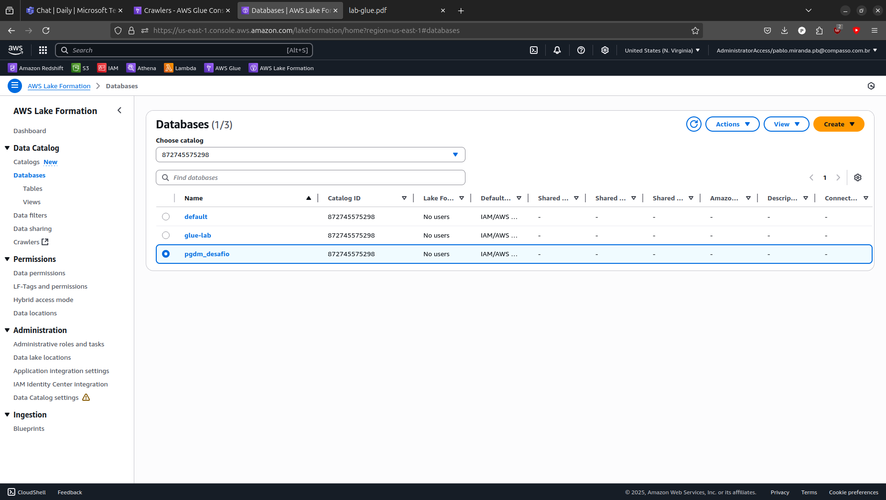

## [Etapa 1 - Processamento CSV](./etapa-1/)

Para a primeira etapa, como nós vamos trabalhar com questões relativas a filmes, movimentamos apenas o arquivo `movies.csv` que constava na pasta **RAW**. Quando configuramos o Job no *AWS Glues, passamos as seguintes variáveis:

1. Para buscar o arquivo na camada **RAW**:
    - chave: `--S3_INPUT_CSV_PATH` 
    - valor: `s3://pgdm-datalake/RAW/Local/CSV/Movies/`

2. Para a carga do arquivo na camada **TRUSTED**:
    - chave: `--S3_TARGET_CSV_PATH` 
    - valor: `s3://pgdm-datalake/TRUSTED/Local/PARQUET/Movies/`

O Job foi configurado conforme requisitado: selecionamos o worker type como G 1x, Glue 3.0, desmarcamos o Spark UI, diminuímos o Timeout para 60 minutos, colocamos o número de workers para 2 (que é o mínimo). O script para realizar a tarefa se encontra em [sprint6-etapa1.py](./etapa-1/sprint6-etapa1.py) e pode ser examinada abaixo:

```python
import sys

from awsglue.context import GlueContext
from awsglue.job import Job
from awsglue.utils import getResolvedOptions
from pyspark import SparkContext

args = getResolvedOptions(
    sys.argv, ["JOB_NAME", "S3_INPUT_CSV_PATH", "S3_TARGET_CSV_PATH"]
)

sc = SparkContext()
glueContext = GlueContext(sc)
spark = glueContext.spark_session
job = Job(glueContext)
job.init(args["JOB_NAME"], args)

source_file = args["S3_INPUT_CSV_PATH"]
target_path = args["S3_TARGET_CSV_PATH"]

df = (
    spark.read.option("header", True)
    .option("inferSchema", True)
    .option("recursiveFileLookup", "true")
    .option("delimiter", "|")
    .csv(source_file)
)

df.write.mode("overwrite").parquet(target_path)

job.commit()


```

Basicamente, o que o nosso script fez foi criar uma sessão Spark usando o contexto do Glue e depois criamos um dataframe `df` que lê o arquivo `.csv`, inferindo o Schema, lendo a primeira linha como o nome das colunas, apontamos o `recursiveFileLookup` apenas como uma opção, caso houvesse mais de um arquivo no mesmo diretório (o que vai ser necessário na próxima etapa, onde o mesmo diretório possui múltiplos arquivos `.json`). O dataframe, em seguida, é salvo como múltiplos `.parquet` no diretório destino. Posteriormente catalogamos esses dados com a ajuda de um crawler para a realização de eventuais consultas utilizando *AWS Athena* (amostras na segunda etapa).

A amostra abaixo traz o sucesso do Job.

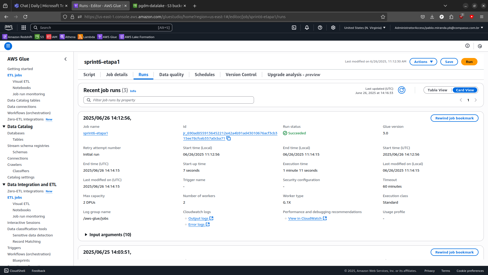

A evidência à seguir traz os arquivos `.parquet` na camada **TRUSTED** em `s3://pgdm-datalake/TRUSTED/Local/PARQUET/Movies/` como resultado dessa movimentação:

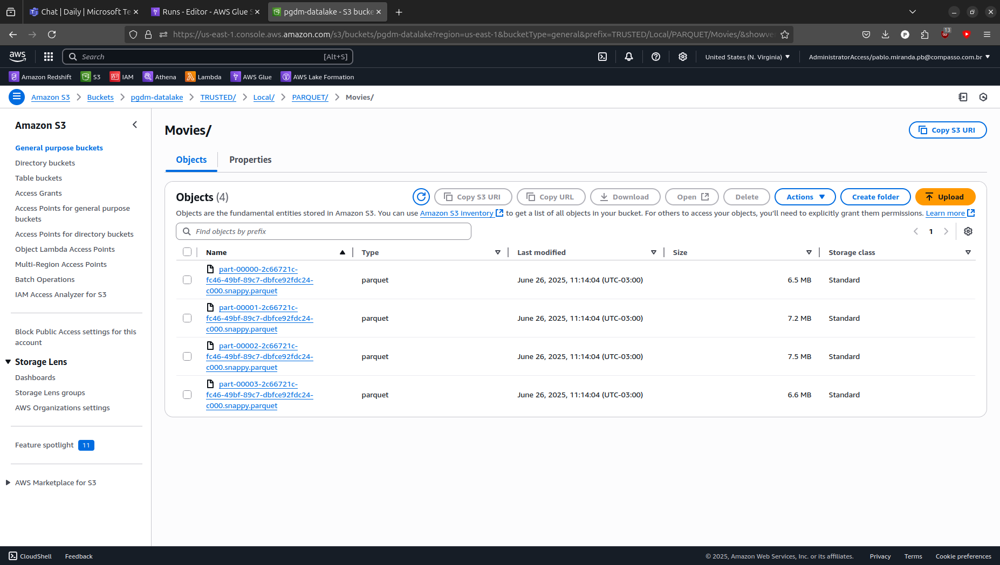

## [Etapa 2 - Processamento JSON](./etapa-2/)

Para a segunda etapa, movimentamos os múltiplos arquivos `.json` que constava no diretório **RAW**. Quando configuramos o Job no *AWS Glues, passamos as seguintes variáveis:

1. Para buscar o arquivo na camada **RAW**:
    - chave: `--S3_INPUT_JSON_PATH` 
    - valor: `s3://pgdm-datalake/RAW/TMDB/Json/`

2. Para a carga do arquivo na camada **TRUSTED**:
    - chave: `--S3_TARGET_JSON_PATH` 
    - valor: `s3://pgdm-datalake/TRUSTED/TMDB/PARQUET/`

Novamente, o Job foi configurado conforme requisitado: selecionamos o worker type como G 1x, Glue 3.0, desmarcamos o Spark UI, diminuímos o Timeout para 60 minutos, colocamos o número de workers para 2 (que é o mínimo). O script para realizar a tarefa se encontra em [sprint6-etapa2.py](./etapa-2/sprint6-etapa2.py) e pode ser examinada abaixo:

```python
import sys

from awsglue.context import GlueContext
from awsglue.job import Job
from awsglue.utils import getResolvedOptions
from pyspark import SparkContext
from pyspark.sql import functions as F

args = getResolvedOptions(
    sys.argv, ["JOB_NAME", "S3_INPUT_JSON_PATH", "S3_TARGET_JSON_PATH"]
)

sc = SparkContext()
glueContext = GlueContext(sc)
spark = glueContext.spark_session
job = Job(glueContext)
job.init(args["JOB_NAME"], args)

input_path = args["S3_INPUT_JSON_PATH"]
output_path = args["S3_TARGET_JSON_PATH"]

df = (
    spark.read.option("multiline", True)
    .option("recursiveFileLookup", "true")
    .json(input_path)
)

df = df.withColumn("input_path", F.input_file_name())

df = (
    df.withColumn("ano", F.regexp_extract("input_path", r"Json/(\d{4})", 1))
    .withColumn("mes", F.regexp_extract("input_path", r"Json/\d{4}/(\d{2})", 1))
    .withColumn("dia", F.regexp_extract("input_path", r"Json/\d{4}/\d{2}/(\d{2})", 1))
)

df = df.drop("input_path")

df.write.mode("overwrite").partitionBy("ano", "mes", "dia").parquet(output_path)


job.commit()

```

O que o nosso script fez foi criar uma sessão Spark usando o contexto do Glue e depois criamos um dataframe `df` que lê os múltiplos arquivos `.json`, com o apontamento do `recursiveFileLookup` para os arquivo no mesmo diretório. Deixamos também o argumento `multiline` como `True` pois os arquivos `.json` poderiam apresentar informações multilineares, trazendo objetos em diferentes linhas em cada um dos seus arquivos. O desafio maior aqui foi manter a estrutura do path e particionar os arquivos por ano, mês e dia da carga realizada à partir da camada **RAW**. Há uma função conveniente para o particionamento, o `partitionBy`, com os argumentos de ano, mês e dia, que foram extraídos diratemente do caminho que havíamos passado. **Com a finalidade de mantermos esse caminho de maneira dinâmica**, foi criada uma coluna que armazenava a origem dos arquivos `json` com a ajuda da função `input_file_name`, os valores para a leitura das variáveis ano, mes e dia foram extraídos dessa coluna, utilizando *regex* com a função `regexp_extract`. A coluna que havíamos criado com essa finalidade é deletada. O dataframe, em seguida, é salvo como múltiplos `.parquet` no diretório destino. A amostra abaixo traz o sucesso do Job:

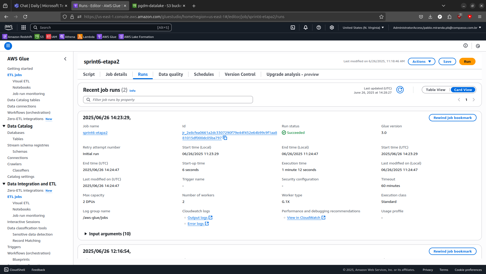

A evidência à seguir traz os arquivos `.parquet` na camada **TRUSTED** em `s3://pgdm-datalake/TRUSTED/TMDB/PARQUET/ano=2025/mes=06/dia=16/` como resultado dessa movimentação:

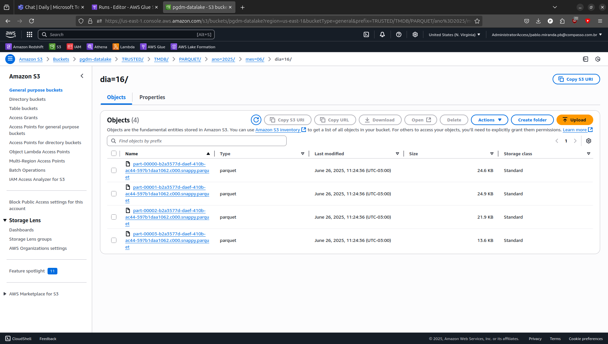

## Etapas posteriores

**Não nos foi requisitado a catalogação dos dados nas etapas do desafio**, mas realizamos ainda assim por ter sido mencionado na descrição do desafio e no esquema dessa etapa. Como havíamos criado um banco de dados previamente nessa sprint, criamos um *crawler* para percorrer os dados da camada **TRUSTED** que eram originalmente em formato `.csv` e criar uma tabela com esses dados. Abaixo podemos observar o sucesso do crawler em realizar essa tarefa e uma consulta simples a esses dados com o *AWS Athena* com a finalidade de mostrar também o sucesso dessa operação nas evidências a seguir:

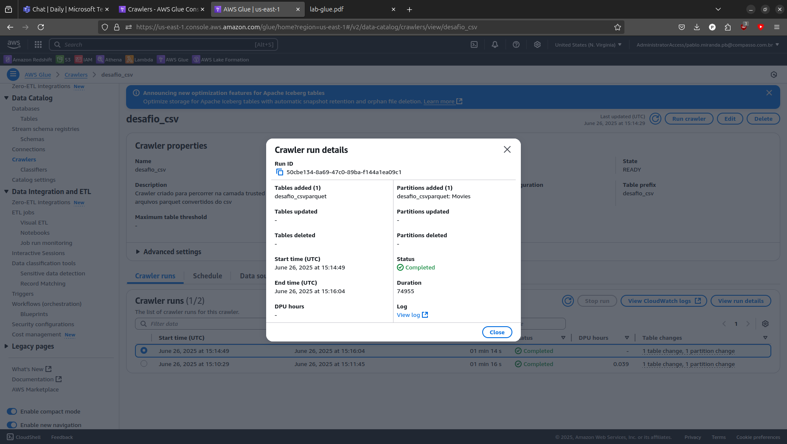

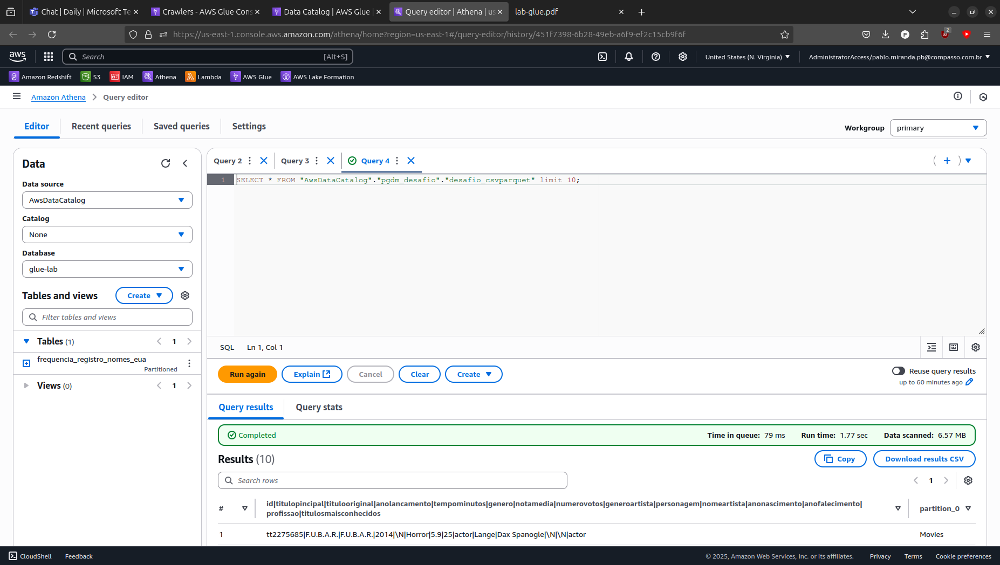

O mesmo foi realizado para os dados provenientes dos arquivos `.json` na camada **RAW** que estão como `.parquet` na camada **TRUSTED**: igualmente, realizamos uma catalogação desses dados usando um crawler só para isso, os dados foram armazenados em uma tabela separada e disponibilizada para a consulta com **AWS Athena**. Nas evidências a seguir é possível observar o sucesso tanto da catalogação dos dados com o *crawler*, como também com a consulta utilizando *AWS Athena* e o detalhe das colunas ano, mes e dia que usamos para o particionamento dos dados:

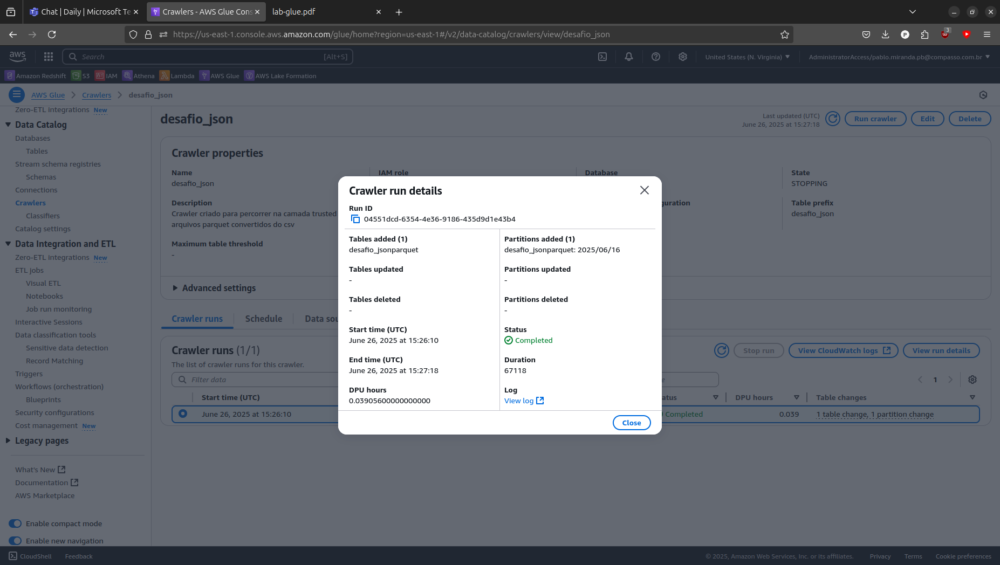

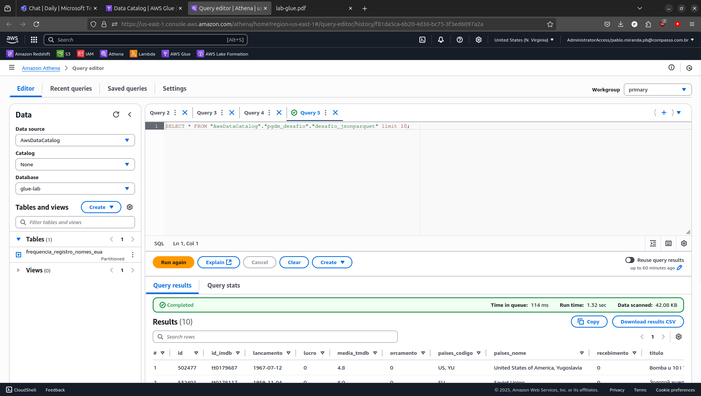

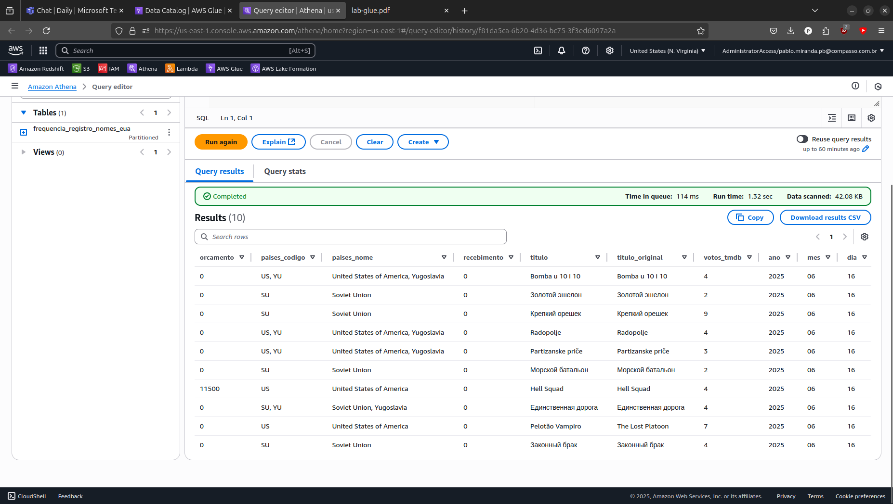

Por último, queremos mostrar também que as tabelas persistiram no nosso banco de dados e estão disponíveis para consultas à partir da camada **TRUSTED**:

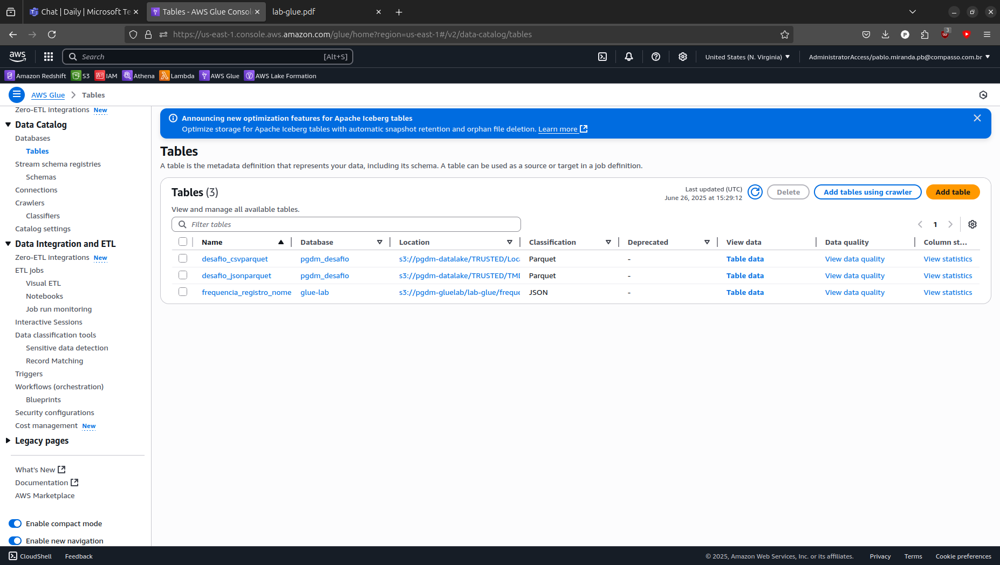