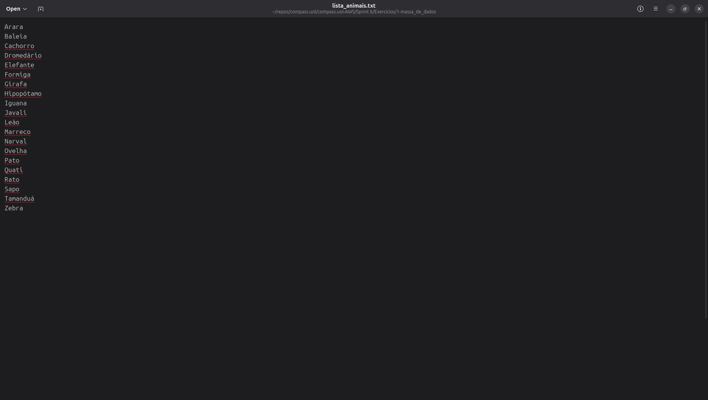
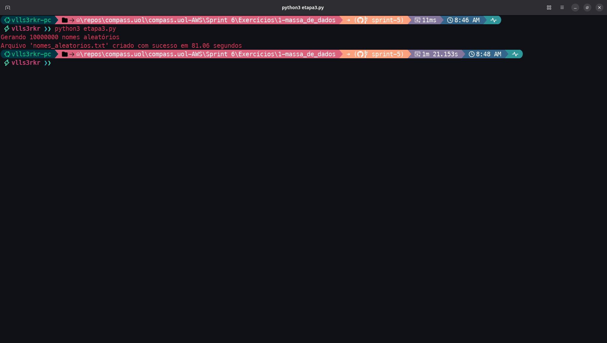
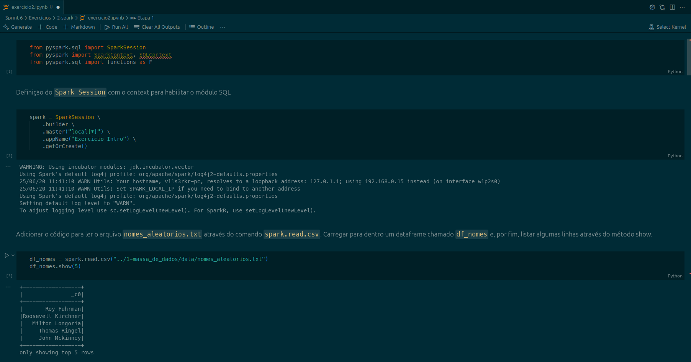
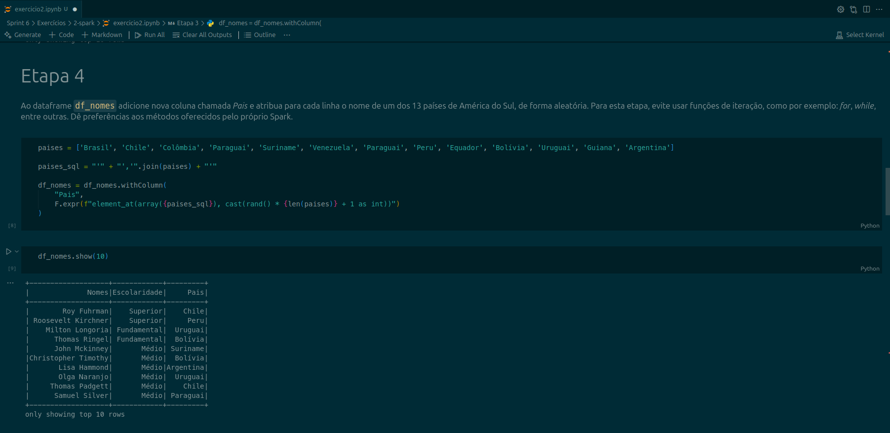
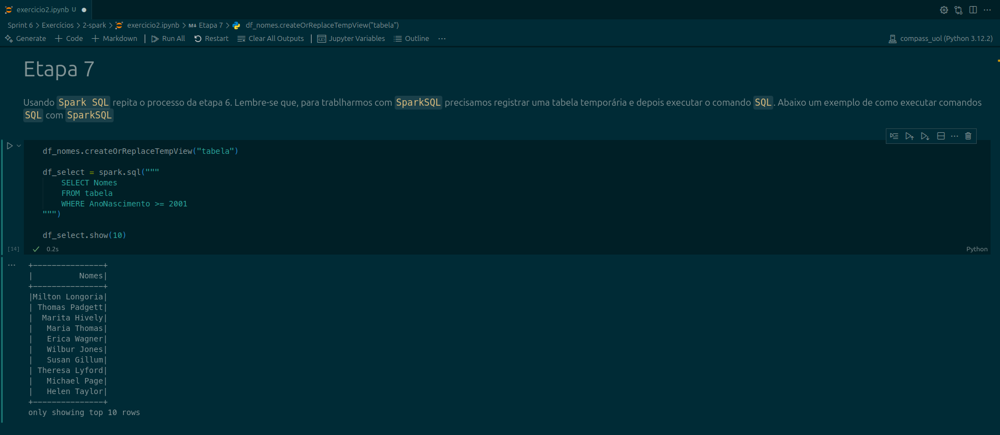
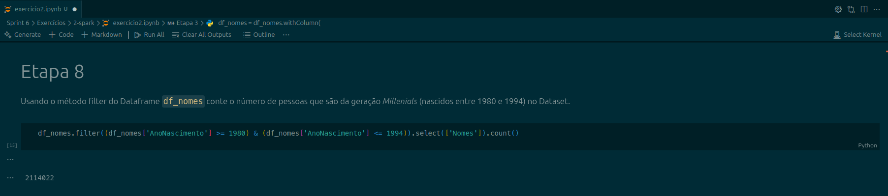
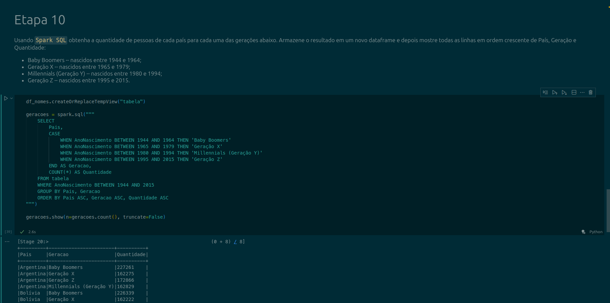
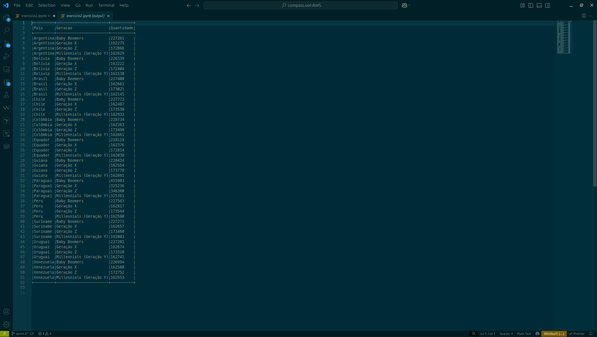

# Resumo da Sprint 6

# Sumário

- [Desafio](#desafio)
- [Exercícios](#exercícios)
- [Evidências](#evidências)
- [Certificados](#certificados)

# Desafio

# Exercícios

Os entregáveis dos exercícios, bem como as evidências, podem ser encontradas nas sub-pastas do diretório [Exercícios](./Exercícios/). Ademais, fornecemos abaixo o caminho para cada exercício específico:

## [Exercício 1 - Geração e Massa de Dados](./Exercícios/1-massa_de_dados/)

- **solução da etapa 1**:
    - [etapa1.py](./Exercícios/1-massa_de_dados/etapa1.py)

- **solução da etapa 2**:
    - [etapa2.py](./Exercícios/1-massa_de_dados/etapa2.py)
    - [lista_animais.txt](./Exercícios/1-massa_de_dados/lista_animais.txt)

- **solução da etapa 3**:
    - [etapa3.py](./Exercícios/1-massa_de_dados/etapa3.py)

## [Exercício 2 - Apache Spark](./Exercícios/2-spark/)

- **solução do exercício 2**:
    - [exercicio2.ipynb](./Exercícios/2-spark/exercicio2.ipynb)

**Obs.**: o arquivo **nomes_aleatorios.txt**, produto da etapa3 do exercício 1 e utilizado no exercício 2 ficou com mais de 140 mb, inviável para armazenamento no repositório remoto, de modo que utilizamos o gitignore para evitarmos o *commit* do arquivo.

# Evidências

## [Exercício 1 - Geração e Massa de Dados](./Exercícios/1-massa_de_dados/)

### Etapa 1

Para o primeiro *Warmup*, importamos a biblioteca random e criamos uma lista com 250 números inteiros entre 0 e 1000 usando list comprehension e depois invertemos a ordem dessa lista com a função `reverse()`. Como no exercício não foi pedido uma ordenação, acabamos não realizando essa etapa para depois reverter. A execução do código pode ser observada no output abaixo:

### Etapa 2

Para o segundo *Warmpup*, declaramos vinte animais em uma lista, usamos a função `sorted()` para ordenar essa lista, e em seguida cada animal da lista vai aparecer no *output* por vez. No fim, essa lista é gravada em um arquivo chamado **lista_animais.txt**, e uma mensagem de output avisa que toda a operação teve sucesso. Tanto o output quanto o arquivo txt aberto podem ser examinados nas evidências abaixo: 

### Etapa 3

Para a terceira etapa, importamos as biblitoecas os, random, time e names. Não foi requisitado nenhum uso para as bibliotecas os e time, de modo que usamos a primeira para checar a existência de um diretório **data** (e criar uma se não existir), e com a segunda cronometramos a operação de criação do arquivo txt. Indicamos o seed como 40 para nossa sequência pseudo-randômica, criamos uma lista vazia chamada aux, e criamos 39080 nomes completos à partir da biblioteca names. Utilizamos esses dados na lista aux para iterar por 10 milhões de nomes e guardar esses dados na lista dados, gravando um arquivo txt chamado **nomes_aleatorios.txt** no final. As evidências abaixo mostram o sucesso da operação e o conteúdo do arquivo **nomes_aleatorios.txt**.

## [Exercício 2 - Apache Spark](./Exercícios/2-spark/)

O exercício 2 foi feito inteiramente em um único **Jupyter notebook** onde realizamos sempre os passos requeridos em cada etapa.

Para a 1a etapa, apenas importamos as bibliotecas necessárias, criamos o *spark session* e fizemos a ingestão dos dados, como é possível observar na evidência abaixo:

Na 2a etapa utilizamos a função `withColumnRenamed' renomeamos a coluna para Nomes e examinamos o schema com `printSchema()`. Observamos o resultado com a função `show(10)` para mostrar as 10 primeiras linhas. A amostra abaixo traz o resultado da execução do *snippet*:  

Na 3a etapa, usamos a função `withColumn` para distribuir valores aleatórios em uma nova coluna chamada Escolaridade. As categorias na coluna foram distribuídas usando as funções `when`, que condiciona o valor a um número randômico assinalado pela função `rand`. O resultado pode ser conferido na evidência à seguir:

> CONTINUAR DAQUI

# Certificados

Abaixo se encontram dois certificados nominais a Pablo Miranda, todos relacionados aos cursos realizados na plataforma [AWS Skill Builder](https://explore.skillbuilder.aws/learn). Para essa *Sprint*, a conclusão dos cursos **Fundamentals of Analytics on AWS pt.2** e **AWS Glue Getting Started** resultaram no fornecimento dos certificados nominais que se encontram no diretório de [Certificados](./Certificados/), mas que também podem ser acessado nos links abaixo:

- [Fundamentals of Analytics on AWS pt.2](./Certificados/fundamentals_of_analytics_on_aws_2.pdf)

- [AWS Glue Getting Started](./Certificados/aws_glue_getting_started.pdf)