# Resumo da Sprint 6

Como de praxe, a *Sprint* 6 foi dividida em duas semanas, onde na primeira realizamos dois cursos visando complementar nosso entendimento nos serviços básicos na AWS, em especial serviços e arquiteturas voltadas para dados, e um curso voltado para 

- **Fundamentals of Analytics on AWS pt.2** e 

- **AWS Glue Getting Started** 

# Sumário

- [Desafio](#desafio)
- [Exercícios](#exercícios)
- [Evidências](#evidências)
- [Certificados](#certificados)

# Desafio

O README.md, bem como os arquivos pertinentes ao Desafio se encontram na pasta [Desafio](./Desafio/)

Todas as evidências do desafio se encontra na própria pasta de [Evidências](./Evidências/)

# Exercícios

Os entregáveis dos exercícios, bem como as evidências, podem ser encontradas nas sub-pastas do diretório [Exercícios](./Exercícios/). Ademais, fornecemos abaixo o caminho para cada exercício específico:

## [Exercício 1 - Geração e Massa de Dados](./Exercícios/1-massa_de_dados/)

- **solução da etapa 1**:
    - [etapa1.py](./Exercícios/1-massa_de_dados/etapa1.py)

- **solução da etapa 2**:
    - [etapa2.py](./Exercícios/1-massa_de_dados/etapa2.py)
    - [lista_animais.txt](./Exercícios/1-massa_de_dados/lista_animais.txt)

- **solução da etapa 3**:
    - [etapa3.py](./Exercícios/1-massa_de_dados/etapa3.py)

## [Exercício 2 - Apache Spark](./Exercícios/2-spark/)

- **solução do exercício 2**:
    - [exercicio2.py](./Exercícios/2-spark/exercicio2.py)

**Obs.**: o arquivo **nomes_aleatorios.txt**, produto da etapa3 do exercício 1 e utilizado no exercício 2 ficou com mais de 140 mb, inviável para armazenamento no repositório remoto, de modo que utilizamos o gitignore para evitarmos o *commit* do arquivo.

## [Exercício 3 - Lab Glue]

- **solução do exercício 3**:
    - [exercicio3.py](./Exercícios/3-lab_glue/exercicio3.py)

**Obs.**: o script em python presente na pasta é o script utilizado com o glue como a solução da etapa **5.2**, o exercício inteiro foi realizado na AWS, e coletamos amostras de todas as etapas.

# Evidências

## [Exercício 1 - Geração e Massa de Dados](./Exercícios/1-massa_de_dados/)

- Para o primeiro *Warmup*, importamos a biblioteca random e criamos uma lista com 250 números inteiros entre 0 e 1000 usando list comprehension e depois invertemos a ordem dessa lista com a função `reverse()`. Como no exercício não foi pedido uma ordenação, acabamos não realizando essa etapa para depois reverter. A execução do código pode ser observada no output abaixo:

- Para o segundo *Warmpup*, declaramos vinte animais em uma lista, usamos a função `sorted()` para ordenar essa lista, e em seguida cada animal da lista vai aparecer no *output* por vez. No fim, essa lista é gravada em um arquivo chamado **lista_animais.txt**, e uma mensagem de output avisa que toda a operação teve sucesso. Tanto o output quanto o arquivo txt aberto podem ser examinados nas evidências abaixo: 

- Para a terceira etapa, importamos as biblitoecas os, random, time e names. **Não foi requisitado nenhum uso para as bibliotecas os e time, de modo que usamos a primeira para checar a existência de um diretório data (e criar uma se não existir), e com a segunda cronometramos a operação de criação do arquivo txt**. Indicamos o seed como 40 para nossa sequência pseudo-randômica, criamos uma lista vazia chamada aux, e criamos 39080 nomes completos à partir da biblioteca names. Utilizamos esses dados na lista aux para iterar por 10 milhões de nomes e guardar esses dados na lista dados, gravando um arquivo txt chamado **nomes_aleatorios.txt** no final. As evidências abaixo mostram o sucesso da operação e o conteúdo do arquivo **nomes_aleatorios.txt**.

## [Exercício 2 - Apache Spark](./Exercícios/2-spark/)

- Para a 1a etapa, apenas importamos as bibliotecas necessárias, criamos o *spark session* e fizemos a ingestão dos dados, na evidência abaixo é possível observar que o schema com a coluna sem nome e a lista de nomes:

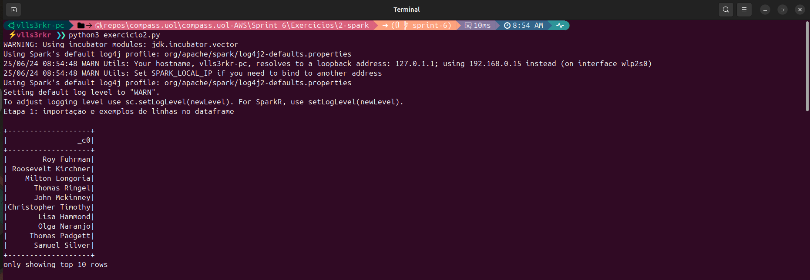

- Na 2a etapa utilizamos a função `withColumnRenamed' renomeamos a coluna para Nomes e examinamos o schema com `printSchema()`. Observamos o resultado com a função `show(10)` para mostrar as 10 primeiras linhas. Na 3a etapa, usamos a função `withColumn` para distribuir valores aleatórios em uma nova coluna chamada E**scolaridade**. As categorias na coluna foram distribuídas usando as funções `when`, que condiciona o valor a um número randômico assinalado pela função `rand`. O resultado pode ser conferido na evidência à seguir que traz a coluna renomeada para Nome, e uma nova coluna Escolaridade com os valores distribuídos aleatoriamente:  

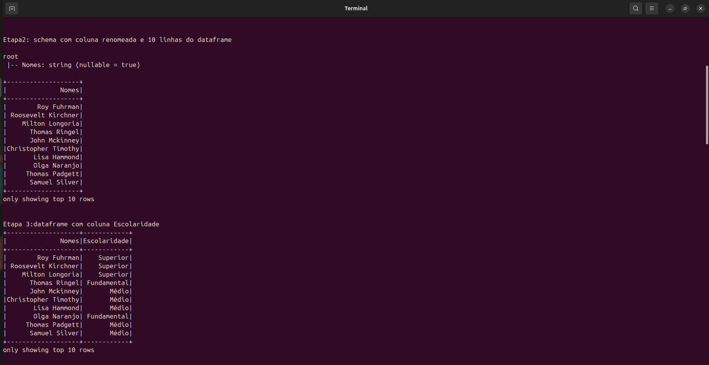

- Na 4a etapa listamos alguns dos países da América do Sul (13 no total), transformamos a lista em uma string, utilizamos a função `rand` para distribuir os países aleatoriamente entre as linhas na nova coluna **Pais** usando a função `len` para passar o tamanho dos elementos dessa lista a ser multiplicada pelo número gerado aleatoriamente. Na 5a etapa nos vamos multiplicar o número aleatório com a função `rand`, a multiplicação pela diferença entre 2010 e 1945 e a soma com 1945 garante que estamos obtendo valores dentro do intervalo proposta. A função `floor` garante que estamos arredondando os valores também dentro desse intervalo. O resultado pode ser observado na amostra à seguir: 

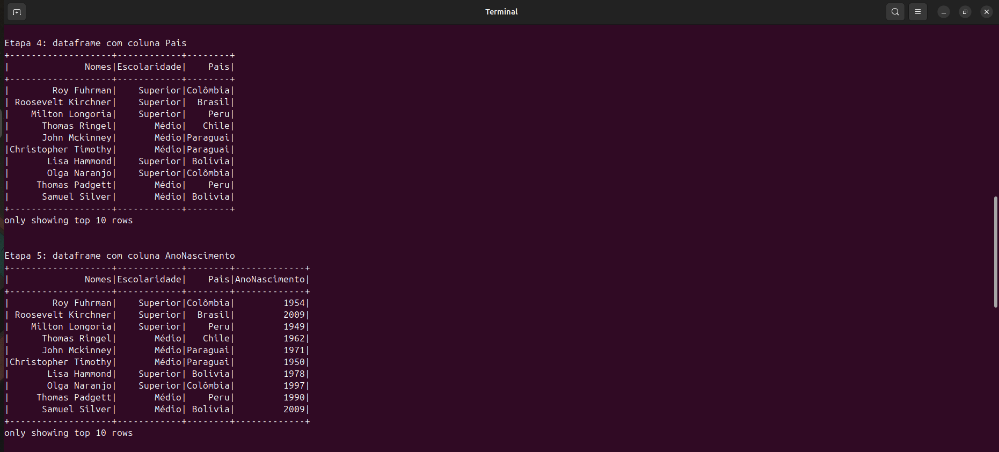

- Para as etapas 6 e 7 fizemos essencialmente a mesma coisa, mas uma com Spark e a outra com SparkSQL, onde selecionamos as pessoas nascidas neste século (à partir de 2001). A amostra abaixo mostra que os resultados são iguais:

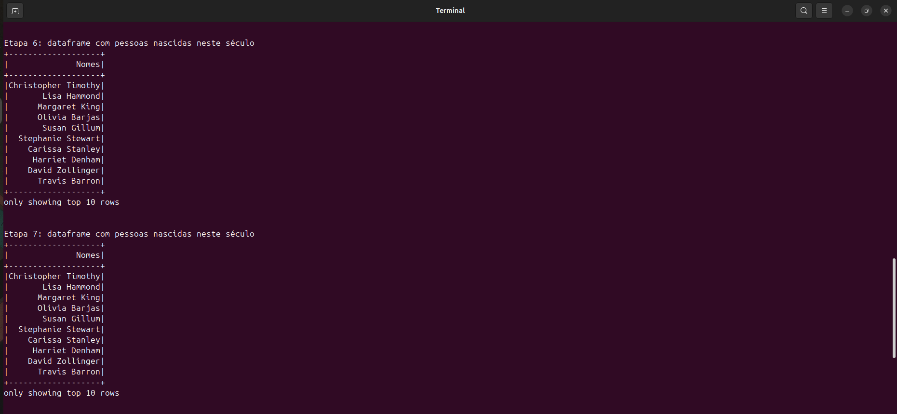

- Igualmente como nas etapas anteriores, as etapas 8 e 9 traz uma seleção feita com Spark e com SparkSQL, onde selecionamos todas as pessoas que nasceram na geração Millennial. No primeiro caso utilizamos uma função `filter` para filtrar as pessoas nascidas entre 1980 e 1994 (inclusas nesse ano), e em seguida realizamos uma contagem com a função `count`. No segundo caso, fizemos o mesmo exercício, selecionando o filtro com `where`. Por último, na 10a etapa, realizamos uma classificação das gerações em uma coluna chamada **Geracao** e, para isso, utilizamos a função `case` para classificar essas gerações conforme a data da coluna **AnoNascimento**. O resultado final pode ser encontrado na amostra abaixo:

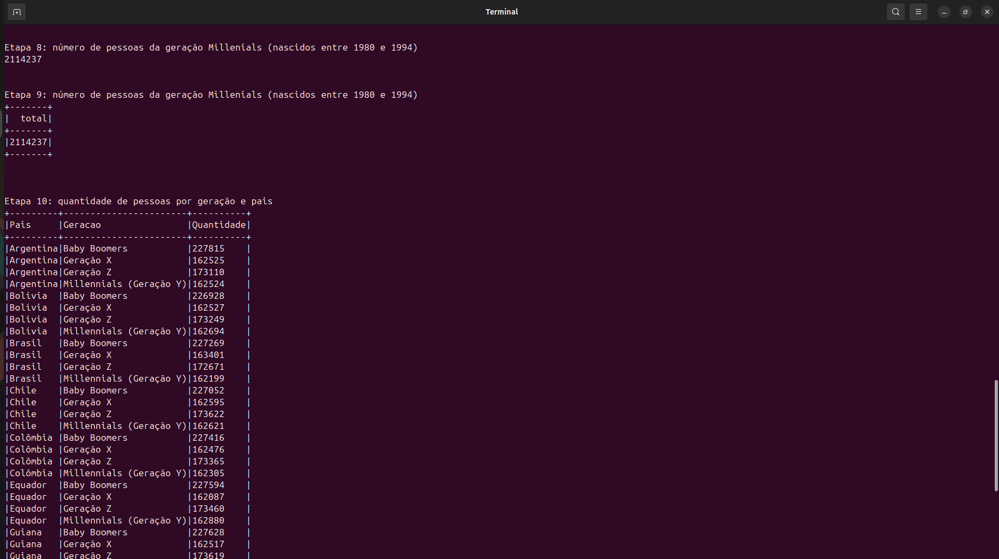

## [Exercício 3 - Lab Glue](./Exercícios/3-lab_glue/)

- Preparamos os dados de origem em um novo bucket para esse laboratório e fizemos o upload do arquivo nomes.csv para o bucket no diretório "pgdm-gluelab/lab-glue/input/nomes.csv", conforme a amostra abaixo:

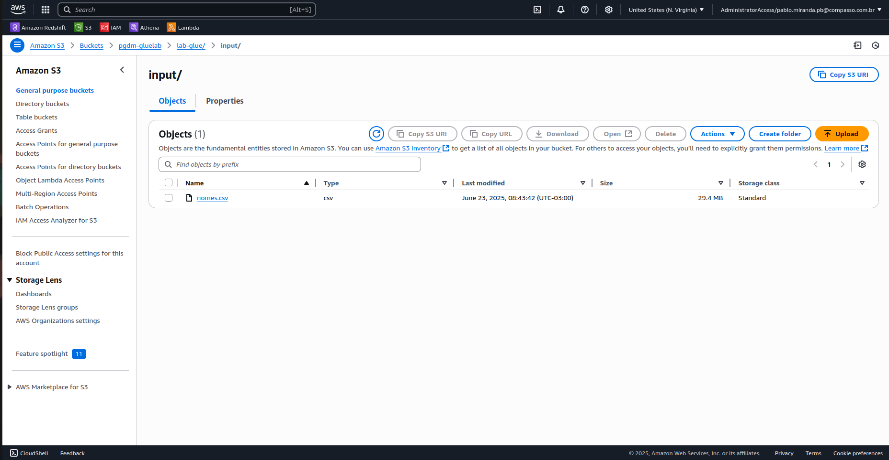

- Criamos a IAM Role para os jobs do AWS Glue entregando algumas autorizações que, apesar de bastante permissivas, serviu para os propósitos de estudo de AWS Glue nesse lab. "AmazonS3FullAccess", "AWSGlueConsoleFullAccess", "AWSLakeFormationDataAdmin" e "CloudWatchFullAccess" e essa role foi chamada de **AWSGlueServiceRole-Lab4** e que vai nos permitir acessar todos os serviços necessários. Além disso, foi necessário também dar permissão no AWS Lake Formation e criar uma tabela para receber nossos dados. A role se encontra na evidência abaixo:

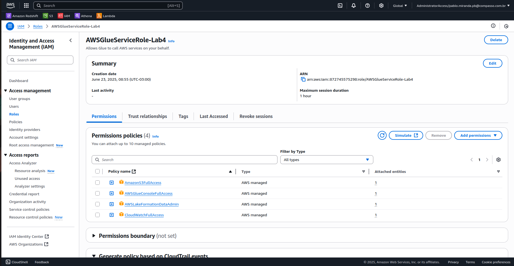

- Criamos um novo job seguindo as instruções do lab. Como o job foi criado à partir de um script, ele pode ser conferido em no diretório do exercício com o título de [exercicio3.py](./Exercícios/3-lab_glue/exercicio3.py). Abaixo, a amostra traz o sucesso do job no AWS Glue:

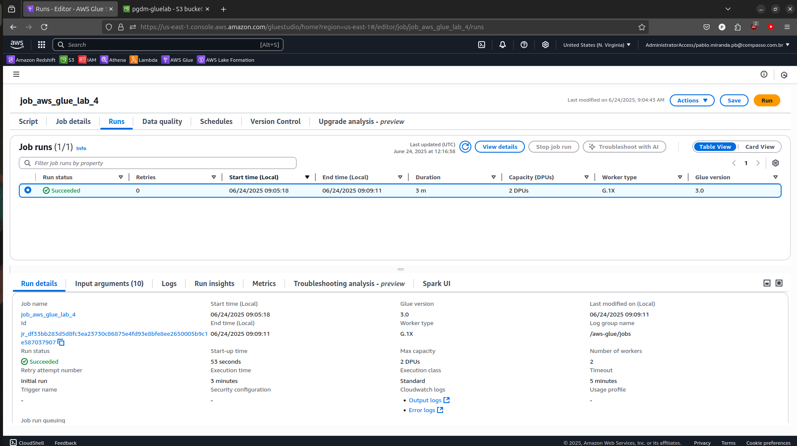

- Conferimos o log do output do nosso job, infelizmente a opção de monitoramento com "CloudWatch continuous logs" não se encontrava disponível ou a opção não estava presente, mas tivemos a oportunidade de examinar os logs ainda assim, e podem ser conferidos nas evidências abaixo:

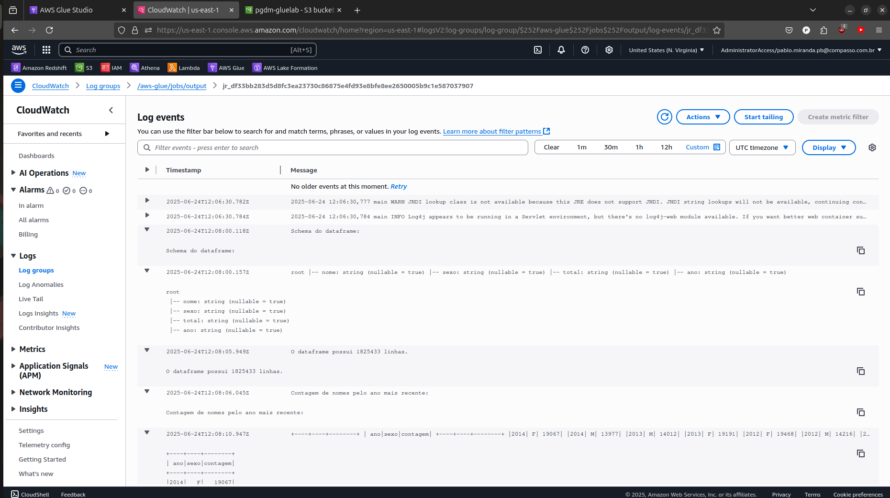

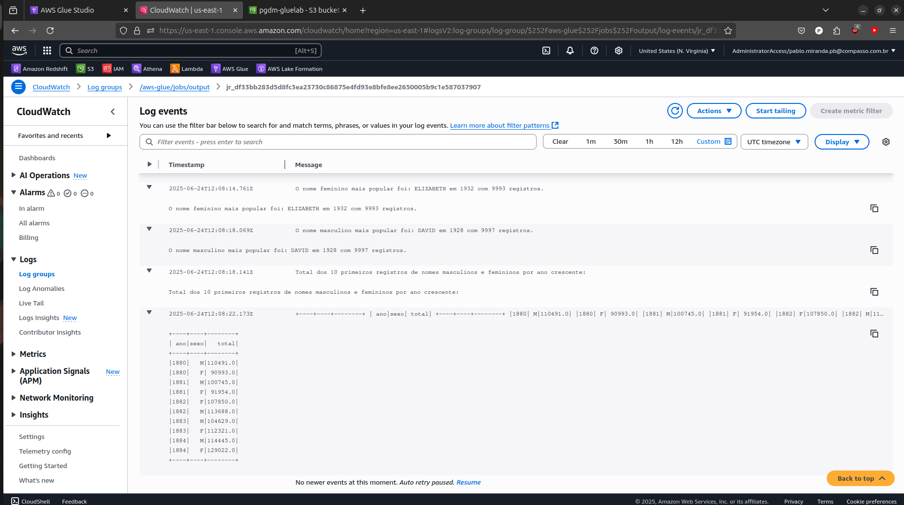

 - As evidências a seguir mostra que nossos dados foram particionados segundo as colunas **sexo** e **ano** no formato "json" e armazenados no nosso bucket no diretório "frequencia_registro_nomes_eua", detalhes que podem ser observados, inclusive, na parte superior da amostra à seguir:

- Criamos um crawler chamado "FrequenciaRegistroNomesCrawler" para explorar os dados de saída que foram armazenados no diretório "frequencia_registro_nomes_eua". Como nossos dados foram particionados, recuperar arquivo "json" por "json" teria sido bastante trabalhoso, de modo que esse crawler vai pesquisar todos os sub-diretórios e reunir esses dados na tabela **glue-lab** que criamos anteriormente. Obtivemos sucesso com o crawler, que pode ser observado na evidência seguinte:

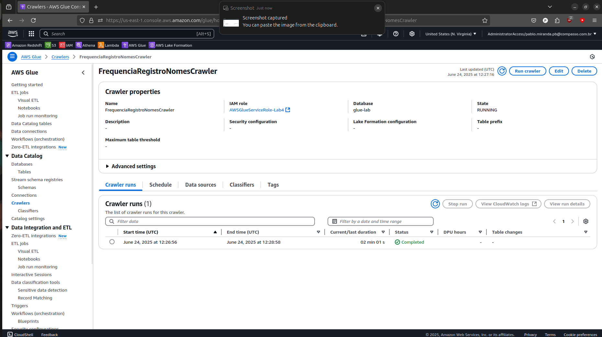

- A evidência a seguir mostra os nossos dados sendo consultados com sucesso direto da tabela **glue-lab** no AWS Athena, confirmando, também, que a operação com o crawler foi um sucesso: 

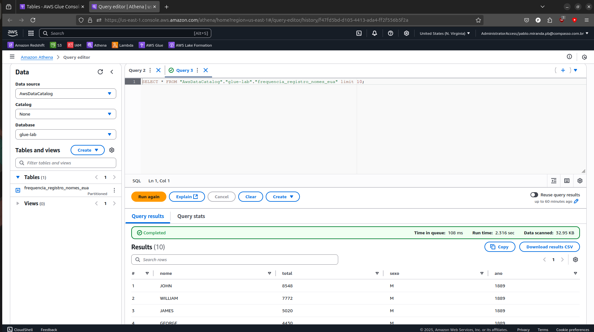

# Certificados

Abaixo se encontram dois certificados nominais a Pablo Miranda, todos relacionados aos cursos realizados na plataforma [AWS Skill Builder](https://explore.skillbuilder.aws/learn). Para essa *Sprint*, a conclusão dos cursos **Fundamentals of Analytics on AWS pt.2** e **AWS Glue Getting Started** resultaram no fornecimento dos certificados nominais que se encontram no diretório de [Certificados](./Certificados/), mas que também podem ser acessado nos links abaixo:

- [Fundamentals of Analytics on AWS pt.2](./Certificados/fundamentals_of_analytics_on_aws_2.pdf)

- [AWS Glue Getting Started](./Certificados/aws_glue_getting_started.pdf)