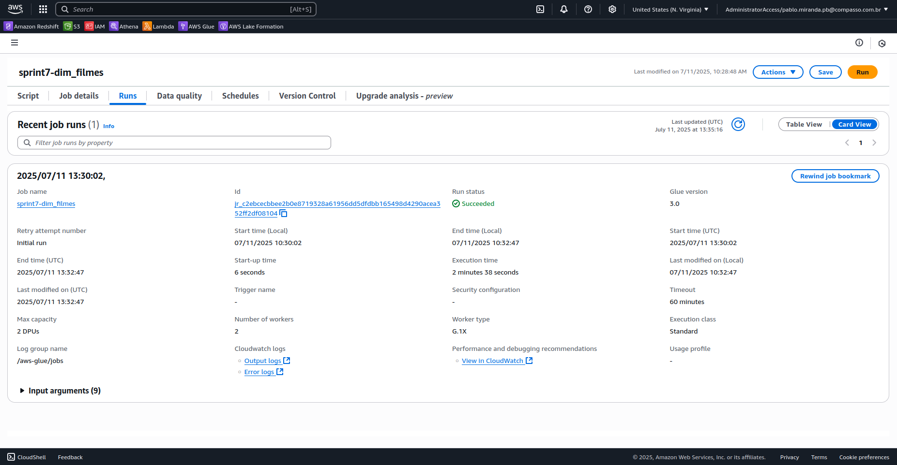

# Desafio da Sprint 7

O objetivo é praticar a combinação de conhecimentos vistos no Programa, fazer um mix de tudo que já foi feito. Para essa *Sprint*, realizamos o processamento dos dados na camada **REFINED**, uma camada do data lake em que os dados estão prontos para análise e extração de *insights*, e a sua origem corresponde aos dado da camada anterior, que chamamos de **TRUSTED**.

## Entregáveis

- [x] Todo o código, comentários, evidências e demais artefatos desenvolvidos para resolver o desafio;
    - Os códigos foram disponibilizados em formato `.py`, podendo ser acessados abaixo, e comentados neste arquivo README.md.

- [x] Arquivo **README.md** com evidências imagens/prints de realização do desafio, bem como documentação de explicação de cada parte executada;
    - As evidências foram armazenadas no diretório [Evidências](../Evidências/) e as observações para resolução do desafio dessa sprint se enconta neste arquivo README.md.

- [x] Modelo de Dados da camada **REFINED** desenhado em ferramenta de modelagem;
    - Esboço disponibilizado no arquivo [1-rascunho_modelo.png](../Evidências/1-rascunho_modelo.png).
    - Desenho com ferramenta de modelagem no arquivo [2-modelo.png](../Evidências/2-modelo.png)

- [x] Código desenvolvido com devidos comentários:
    - [x] Arquivo contendo código Python no formato `.py` representando código *AWS Glue* para criar a camada **REFINED**;
        - [dim_data.py](./etapa-2/dim_data.py)
        - [dim_filmes.py](./etapa-2/dim_filmes.py)
        - [dim_pais.py](./etapa-2/dim_pais.py)
        - [fato_filmes_p_bloco.py](./etapa-2/fato_filmes_p_bloco.py)

## Sumário

- [Etapa 1 - Modelagem de Dados Camada Refined](#etapa-1---modelagem-de-dados-camada-refined)

- [Etapa 2 - Processamento Camada Refined](#etapa-2---processamento-camada-refined)

    - [dim_data](#dim_data)

    - [dim_filmes](#dim_filmes)

    - [dim_pais](#dim_pais)

    - [fato_filmes_p_bloco](#fato_filmes_p_bloco)

## Preparação

Não foi requisitada nenhuma preparação como nas etapas anteriores. Porém, realizamos uma série de exames para a execução das etapas dessa *Sprint*: 

- Conferimos o nosso bucket que funciona como datalake, o **pgdm-datalake**, e os diretórios das camadas **RAW** e **TRUSTED** para nos certificar que constavam lá todos os arquivos necessários;

- Através do **AWS Athena**, consultamos os dados que havíamos previamente catalogados dentro da camada **TRUSTED**, até para entendermos quais dados precisam ser limpos e quais as dimensões serão trazidas para a camada **REFINED**. 

# Desafio

Realizamos a terceira etapa do nosso Desafio Final de Filmes e Séries. Os dados devem ser persistidos na camada **REFINED**, onde os dados obtidos e processados nas etapas anteriores devem ser processados em tabelas dimensões e fatos, catalogados com *AWS Glue* para que possam ser analisados posteriormente com *AWS Athena* utilizando comandos SQL. A modelagem dos dados foi realizada pensando nossas questões originais, formuladas na primeira etapa do desafio final.

Para essa etapa, não podemos usar notebooks do Glue, os jobs precisam ser desenvolvidos com o *script editor*, e a configuração dos jobs devem atentar para esses detalhes:
    
    - Worker type: G 1x;
    
    - Requested number of workers: 2;

    - Job Timeout (minutes): 60, ou menos, se possível.

Antes de começarmos as etapas nos realizamos as preparações já mencionadas anteriormente: conferimos os arquivos que já estão em nosso datalake, o bucket **pgdm-datalake**, e os diretórios **RAW** e **TRUSTED**, além de conferir como esses dados já estão catalogados com o **AWS Athena**.

## [Etapa 1 - Modelagem de Dados Camada Refined](./etapa-1/)

Antes de mais nada, é necessário relembrar das nossas questões e das etapas anteriores. Para a camada **RAW** a ingestão dos dados aconteceram à partir de duas fontes: 

Primeiro, um arquivo `.csv` que fizemos o upload localmente para o nosso bucket com as seguintes dimensões, lembrando que apenas algumas dessas colunas nos interessa, pois a nossa análise se concentrará apenas nos títulos dos filmes:

- 'id', 
- 'tituloprincipal', 
- 'titulooriginal', 
- 'anolancamento', 
- 'tempominutos', 
- 'genero', 
- 'notamedia', 
- 'numerovotos', 
- 'generoartista', 
- 'personagem', 
- 'nomeartista', 
- 'anonascimento',
- 'anofalecimento', 
- 'profissao', 
- 'titulosmaisconhecidos';

Segundo, as requisições à API do TMDB que resultou em uma série de arquivos `.json`. As requisições foram realizadas já pensando os primeiros direcionamentos do desafio. Nossa *squad* recebeu o tema Guerra e Crime, portanto decidimos trabalhar com filmes de guerra em um determinado recorte temporal. Os filmes registrados nos arquivos `.json` já são filtrados pelo nosso temaa, países, e período de interesse: as requisições de API foram realizadas após um *join* entre o campo 'id' do `.csv` e o 'id_imdb' da API, o ano de lançamento do filme registrado em 'anolancamento' e os países produtores do filme registrados em 'paises_codigo'. Essas são as dimensões dos arquivos `.json`:

- 'id',
- 'id_imdb',
- 'lancamento',
- 'lucro',
- 'media_tmdb',
- 'orcamento',
- 'paises_codigo',
- 'paises_nome',
- 'recebimento',
- 'titulo',
- 'titulo original',
- 'votos_tmdb';

Para a etapa posterior, nós apenas padronizamos o formato dos arquivos, de `.csv` e `.json`, para `.parquet` e particionamos pela data de extração da API. Por fim, agora precisamos modelar nossos dados para responder as seguintes perguntas:

```
1. Nas décadas posteriores quais foram os gastos dos EUA e da ex-URSS em filmes de guerra?
2. A cada década, quem recebeu os melhores votos médios por filme?
3. Em termos de lucro, é possível mapear quem bloco lucrou mais?
4. A Rússia consegiu manter uma produção de filmes nos mesmos parâmetros de qualidade da Ex-União Soviética?
5. Quais foram os gastos realizados pela Ucrânia e Rússia, deflagrado o conflito entre eles?
```

Ou seja, temos claramente duas situações que precisam ser respondidas, questões referentes ao período da Guerra Fria, entre SU e US (ex-URSS e os Estados Unidos) e questões referentes ao nosso período atual entre RU e UA (Rússia e Ucrânia).

Analisamos os dados disponibilizados na camada **TRUSTED** e conseguimos modelar os dados da camada **REFINED**, uma tabela **fato** e três tabelas **dimensão** formando um **esquema tipo estrela**. Originalmente pensamos que deveríamos também adicionar uma dimensão para os gêneros de filmes que haviam sido requisitados via API e presentes no nosso arquivo CSV, contudo, na *Sprint* 5 já havíamos filtrado todos os filmes segundo o gênero Guerra (*War*), de modo que essa dimensão não seriviria a nenhum propósito nessa etapa. Segue abaixo um esboço para a nossa modelagem:


Executamos esse esboço em um banco de dados SQLite como uma forma de prototipar essas relações e entender a cardinalidade da nossa modelagem: o código para a montagem dessas tabelas se encontram no arquivo [modelagem.txt](./etapa-1/modelagem.txt) e o banco de dados se encontra em [modelagem.sqlite](./etapa-1/modelagem.sqlite). **Como limite** para esse projeto, nos afastamos de qualquer arquitetua mais complexa, portanto evitamos esquemas floco de neve que poderia impactar a nossa performance no momento das consultas da próxima *Sprint*, além de evitarmos também **tabelas de ponte**, que poderia adicionar um gasto de tempo e esforço desnecessário. Abaixo a modelagem realizada com SQLite e renderizada com a *IDE* DBeaver, trazendo a cardinalidade de cada uma das tabelas:


## [Etapa 2 - Processamento Camada Refined](./etapa-2/)

### dim_data

A tabela de dimensão data é modelada à partir dos dados de data de lançamento dos filmes. Como recolhemos a data de lançamento no formato ano, mês e dia, YYYY-MM-DD, pudemos extrair várias informações que podem ser úteis para responder nossas questões ou novas questões que porventura apareçam no futuro. Utilizamos um estruturamento dos tipos dos dados com `StructType`, retiramos valores repetidos e ausentes da coluna **lancamento**, criamos uma coluna chamada **data_col** estruturado como `DateType`, e com a ajuda de algumas funções nativas do PySpark, extraímos `ano`, `mes`, `dia`, `trimestre`, `semestre`, `dia_semana`, `dia_ano`, `fim_semana`, `decada` (que foi obtida ao dividir o ano por 10 e multiplicado por 10 ao ser convertido para inteiro) e `periodo_historico` (que foi obtido com três condicionais, classificando o ano em que esses filmes foram lançados). Dropamos a coluna `data_col` e selecionamos apenas as colunas previstas na nossa modelagem e, por fim, o resultado foi exportado como `.parquet` para a camada **REFINED**. O código inteiro pode ser conferido abaixo e no arquivo [dim_data.py](./etapa-2/dim_data.py):

```python
import sys

from awsglue.context import GlueContext
from awsglue.job import Job
from awsglue.utils import getResolvedOptions
from pyspark import SparkContext
from pyspark.sql import functions as F
from pyspark.sql.types import (
    BooleanType,
    DateType,
    IntegerType,
    StringType,
    StructField,
    StructType,
)

args = getResolvedOptions(
    sys.argv, ["JOB_NAME", "S3_INPUT_DATA_PATH", "S3_TARGET_DATA_PATH"]
)

sc = SparkContext()
glueContext = GlueContext(sc)
spark = glueContext.spark_session
job = Job(glueContext)
job.init(args["JOB_NAME"], args)

input_path = args["S3_INPUT_DATA_PATH"]
output_path = args["S3_TARGET_DATA_PATH"]

schema = StructType(
    [
        StructField("data", DateType(), True),
        StructField("ano", IntegerType(), True),
        StructField("mes", IntegerType(), True),
        StructField("dia", IntegerType(), True),
        StructField("trimestre", IntegerType(), True),
        StructField("semestre", IntegerType(), True),
        StructField("dia_semana", IntegerType(), True),
        StructField("dia_ano", IntegerType(), True),
        StructField("fim_semana", BooleanType(), True),
        StructField("decada", IntegerType(), True),
        StructField("periodo_historico", StringType(), True),
    ]
)

df = spark.read.option("recursiveFileLookup", "true").parquet(input_path)

df = (
    df.select("lancamento")
    .dropna()
    .distinct()
    .withColumn("data_col", F.to_date(F.col("lancamento"), "yyyy-MM-dd"))
    .withColumn("ano", F.year(F.col("data_col")))
    .withColumn("mes", F.month(F.col("data_col")))
    .withColumn("dia", F.dayofmonth(F.col("data_col")))
    .withColumn("trimestre", F.quarter(F.col("data_col")))
    .withColumn("semestre", F.when(F.month(F.col("data_col")) <= 6, 1).otherwise(2))
    .withColumn("dia_semana", F.dayofweek(F.col("data_col")))
    .withColumn("dia_ano", F.dayofyear(F.col("data_col")))
    .withColumn("fim_semana", F.col("dia_semana").isin([1, 7]))
    .withColumn("decada", (F.year(F.col("data_col")) / 10).cast(IntegerType()) * 10)
    .withColumn(
        "periodo_historico",
        F.when(F.year(F.col("data_col")) < 1993, "guerra fria")
        .when(F.year(F.col("data_col")) > 2013, "russia x ucrania")
        .otherwise("pos guerra fria")
    )
    .withColumn("data", F.col("data_col"))
    .drop("data_col", "lancamento")
    .select(
        "data",
        "ano",
        "mes",
        "dia",
        "trimestre",
        "semestre",
        "dia_semana",
        "dia_ano",
        "fim_semana",
        "decada",
        "periodo_historico"
    )
)

df = spark.createDataFrame(df.rdd, schema)

df.write.mode("overwrite").parquet(output_path)


job.commit()

```

Abaixo as evidências do sucesso do *Job*, o diretório com a tabela dim_data na camada **REFINED**, o sucesso do *crawler* que tabelou esses dados e a execução com sucesso no **AWS Athena**:


### dim_pais

A tabela dimensão país apresentou uma dificuldade que não havíamos encontrado até agora: a disposição de valores no formato *array* nos fez refletir sobre qual seria a melhor maneira de catalogar essa dimensão. A nossa ideia inicial era atribuir um ID único como *Primary Key* para cada país e para cada combinação de país. Apesar de esse ser o caminho mais simples, vai trazer valores repetidos dentro de diferentes *arrays* e não reflete a natureza dessa tabela que é catalogar os países e identificá-los por uma chave primária que ajude na performance da nossa tabela fato. A saída foi explodir os *arrays* nas colunas `paises_codigo` e `paises_nome` com as funções `split` para separar os elementos dos *arrays* e depois a função `posexplode` para realizar a operação e depois `distinct` para deixar de fora os valores repetidos para a camada **REFINED**. Por fim exportamos tudo no formato `.parquet`. O código pode ser examinado no script [dim_pais.py](./etapa-2/dim_pais.py) ou abaixo:

``` python
import sys

from awsglue.context import GlueContext
from awsglue.job import Job
from awsglue.utils import getResolvedOptions
from pyspark import SparkContext
from pyspark.sql import functions as F
from pyspark.sql.types import (
    IntegerType,
    StringType,
    StructField,
    StructType,
)
from pyspark.sql.window import Window

args = getResolvedOptions(
    sys.argv, ["JOB_NAME", "S3_INPUT_PAIS_PATH", "S3_TARGET_PAIS_PATH"]
)

sc = SparkContext()
glueContext = GlueContext(sc)
spark = glueContext.spark_session
job = Job(glueContext)
job.init(args["JOB_NAME"], args)

input_path = args["S3_INPUT_PAIS_PATH"]
output_path = args["S3_TARGET_PAIS_PATH"]

schema = StructType(
    [
        StructField("id_pais", IntegerType(), True),
        StructField("codigo_pais", StringType(), True),
        StructField("nome_pais", StringType(), True),
    ]
)


df = spark.read.option("recursiveFileLookup", "true").parquet(input_path)

df = (
    df.withColumn("paises_codigo_array", F.split(F.col("paises_codigo"), ",\s*"))
    .withColumn("paises_nome_array", F.split(F.col("paises_nome"), ",\s*"))
    .select(
        F.posexplode(F.col("paises_codigo_array")).alias("pos", "codigo_pais"),
        F.col("paises_nome_array"),
    )
    .withColumn("nome_pais", F.col("paises_nome_array")[F.col("pos")])
    .select("codigo_pais", "nome_pais")
    .distinct()
    .withColumn("id_pais", F.row_number().over(Window.orderBy("codigo_pais")))
    .select("id_pais", "codigo_pais", "nome_pais")
)

df = spark.createDataFrame(df.rdd, schema)

df.write.mode("overwrite").parquet(output_path)

job.commit()

```

Abaixo as evidências do sucesso do *Job*, o diretório com a tabela dim_pais na camada **REFINED**, o sucesso do *crawler* que tabelou esses dados e a execução com sucesso no **AWS Athena**:


### dim_filmes

A tabela de dimensão dos filmes foi obtida realizando um *join* entre as as fontes que estão na camada **TRUSTED**, novamente passamos a estrutura dos tipos de dados utilizando a função `StructType` e selecionamos todos os campos que conseguimos extrair que foram `id_imdb`, `titulo_principal`, `titulo_original`, `ano_lancamento`, `duracao_minutos`, `nota_media_imdb`, `total_votos_imdb`, `media_tmdb`, `votos_tmdb`, `orcamento`, `receita`, `lucro`. Para os dados locais, deixamos de fora apenas os valores faltantes que estavam nos campos 'id_imdb' e 'titulo_principal', que já haviam sido deixadas de fora com o *join* realizado na aquisição de API, que foram os mesmos valores faltantes que deixamos de fora dos dados obtidos no TMDB. Em seguida exportamos esses dados no formato `.parquet` para a camada **REFINED**. O código inteiro pode ser conferido abaixo e no arquivo [dim_filmes.py](./etapa-2/dim_filmes.py):

```python
import sys
from awsglue.context import GlueContext
from awsglue.job import Job
from awsglue.utils import getResolvedOptions
from pyspark import SparkContext
from pyspark.sql import functions as F
from pyspark.sql.types import (StringType, StructType, StructField, 
                              IntegerType, DoubleType)

args = getResolvedOptions(
    sys.argv, ["JOB_NAME", "S3_INPUT_FILMES_CSV_PATH", "S3_INPUT_FILMES_JSON_PATH", "S3_TARGET_FILMES_PATH"]
)

sc = SparkContext()
glueContext = GlueContext(sc)
spark = glueContext.spark_session
job = Job(glueContext)
job.init(args["JOB_NAME"], args)

input_path_csv = args["S3_INPUT_FILMES_CSV_PATH"]
input_path_json = args["S3_INPUT_FILMES_JSON_PATH"]
output_path = args["S3_TARGET_FILMES_PATH"]

schema = StructType([
    StructField("id_imdb", StringType(), False),
    StructField("titulo_principal", StringType(), True),
    StructField("titulo_original", StringType(), True),
    StructField("ano_lancamento", IntegerType(), True),
    StructField("duracao_minutos", IntegerType(), True),
    StructField("nota_media_imdb", DoubleType(), True),
    StructField("total_votos_imdb", IntegerType(), True),
    StructField("media_tmdb", DoubleType(), True),
    StructField("votos_tmdb", IntegerType(), True),
    StructField("orcamento", DoubleType(), True),
    StructField("receita", DoubleType(), True),
    StructField("lucro", DoubleType(), True)
])

df_csv = (spark.read.option("recursiveFileLookup", "true")
          .parquet(input_path_csv)
          .select(
              F.col("id").alias("id_imdb"),
              F.col("tituloPincipal").alias("titulo_principal"),
              F.col("tituloOriginal").alias("titulo_original"),
              F.col("anoLancamento").cast(IntegerType()).alias("ano_lancamento"),
              F.col("tempoMinutos").cast(IntegerType()).alias("duracao_minutos"),
              F.col("notaMedia").cast(DoubleType()).alias("nota_media_imdb"),
              F.col("numeroVotos").cast(IntegerType()).alias("total_votos_imdb")
          )
          .dropna(subset=["id_imdb", "titulo_principal"])
          .distinct())

df_json = (spark.read.option("recursiveFileLookup", "true")
           .parquet(input_path_json)
           .select(
               F.col("id_imdb"),
               F.col("media_tmdb").cast(DoubleType()),
               F.col("votos_tmdb").cast(IntegerType()),
               F.col("orcamento").cast(DoubleType()),
               F.col("recebimento").cast(DoubleType()).alias("receita"),
               (F.col("recebimento").cast(DoubleType()) - F.col("orcamento").cast(DoubleType())).alias("lucro")
           )
           .dropna(subset=["id_imdb"])
           .distinct())

df = df_csv.join(df_json, "id_imdb", "inner")
df = spark.createDataFrame(df.rdd, schema)

df.write.mode("overwrite").parquet(output_path)

job.commit()

```

Abaixo as evidências do sucesso do *Job*, o diretório com a tabela dim_filmes na camada **REFINED**, o sucesso do *crawler* que tabelou esses dados e a execução com sucesso no **AWS Athena**:




### fato_filmes_p_bloco

A modelagem prévia de dados nos ajudou a visualizar melhor com o que queríamos na tabela fato de filmes por bloco histórico, apesar de ter sido a tabela mais trabalhosa para fazer em termos de código (retornamos para nossas anotações de como lidar com *arrays* com PySpark). Basicamente estruturamos a coluna `id_pais` que vai receber os valores como *array* enquanto `ArrayType` com a função `StructField`. Fizemos *joins* com as tabelas `dim_pais`, `dim_filmes` e `dim_data`, selecionando as colunas 'id_filme', 'id_imdb''id_pais', 'data', 'votos_tmdb', 'media_tmdb', 'total_votos_imdb', 'nota_media_imdb', 'orcamento', 'recebimento', 'lucro', 'id_bloco', 'bloco_historico', 'ano', 'mes', 'decada' e 'periodo_historico'. Usamos a função `sort_array` para organizarmos os *arrays* de países que vamos receber do *join*. Criamos a coluna 'bloco_historico' condicionando seus valores ao período dos filmes e aos países em que aparecem nos *arrays* para classificamos conforme os períodos da Guerra Fria ou do conflito Ucrânia e Rússia, para daí criarmos manualmente os identificadores desses blocos (possível apenas porque eram poucos os valores). Agrupamos os dados recebidos da camada **TRUSTED** com os das tabelas dimensão, agregamos os valores em um *array*, após explodir a coluna dos países que havíamos lido na fonte dos nossos dados. Como o objetivo da nossa análise é a de examinar a produção de filmes de blocos políticos, filtramos pela identificação desses blocos e, como segurança, também pelos anos em que os conflitos aconteceram, para daí particionarmos pela coluna 'bloco_historico' e salvos como `.parquet`. O código pode ser examinado no arquivo [fato_filmes_p_bloco.py](./etapa-2/fato_filmes_p_bloco.py) ou abaixo:

```python
import sys

from awsglue.context import GlueContext
from awsglue.job import Job
from awsglue.utils import getResolvedOptions
from pyspark import SparkContext
from pyspark.sql import functions as F
from pyspark.sql.types import (
    ArrayType,
    DateType,
    DoubleType,
    IntegerType,
    StringType,
    StructField,
    StructType,
)
from pyspark.sql.window import Window

args = getResolvedOptions(
    sys.argv,
    [
        "JOB_NAME",
        "S3_INPUT_TRUSTED_PATH",
        "S3_DIM_FILMES_PATH",
        "S3_DIM_PAISES_PATH",
        "S3_DIM_DATAS_PATH",
        "S3_TARGET_FATO_PATH",
    ],
)

sc = SparkContext()
glueContext = GlueContext(sc)
spark = glueContext.spark_session
job = Job(glueContext)
job.init(args["JOB_NAME"], args)

input_trusted_path = args["S3_INPUT_TRUSTED_PATH"]
dim_filmes_path = args["S3_DIM_FILMES_PATH"]
dim_paises_path = args["S3_DIM_PAISES_PATH"]
dim_datas_path = args["S3_DIM_DATAS_PATH"]
output_path = args["S3_TARGET_FATO_PATH"]

schema = StructType(
    [
        StructField("id_filme", IntegerType(), False),
        StructField("id_imdb", StringType(), True),
        StructField("id_pais", ArrayType(IntegerType()), True),
        StructField("data", DateType(), True),
        StructField("votos_tmdb", IntegerType(), True),
        StructField("media_tmdb", DoubleType(), True),
        StructField("total_votos_imdb", IntegerType(), True),
        StructField("nota_media_imdb", DoubleType(), True),
        StructField("orcamento", DoubleType(), True),
        StructField("recebimento", DoubleType(), True),
        StructField("lucro", DoubleType(), True),
        StructField("id_bloco", IntegerType(), True),
        StructField("bloco_historico", StringType(), True),
        StructField("ano", IntegerType(), True),
        StructField("mes", IntegerType(), True),
        StructField("decada", IntegerType(), True),
        StructField("periodo_historico", StringType(), True),
    ]
)

dim_filmes = spark.read.parquet(dim_filmes_path)
dim_paises = spark.read.parquet(dim_paises_path)
dim_datas = spark.read.parquet(dim_datas_path)

df = spark.read.option("recursiveFileLookup", "true").parquet(input_trusted_path)

fato_filmes = (
    df.withColumn(
        "paises_codigo_array", F.sort_array(F.split(F.col("paises_codigo"), ",\s*"))
    )
    .withColumn("data_col", F.to_date(F.col("lancamento"), "yyyy-MM-dd"))
    .withColumn("ano_lancamento", F.year(F.col("data_col")))
    .withColumn(
        "bloco_historico",
        F.when(
            (F.array_contains(F.col("paises_codigo_array"), "US"))
            & (F.col("ano_lancamento") < 1993),
            "ocidental",
        )
        .when(F.array_contains(F.col("paises_codigo_array"), "SU"), "sovietico")
        .when(
            (F.array_contains(F.col("paises_codigo_array"), "RU"))
            & (F.col("ano_lancamento") > 2012),
            "russia",
        )
        .when(F.array_contains(F.col("paises_codigo_array"), "UA"), "ucrania")
        .otherwise("outros"),
    )
    .withColumn(
        "id_bloco",
        F.when(F.col("bloco_historico") == "ocidental", 1)
        .when(F.col("bloco_historico") == "sovietico", 2)
        .when(F.col("bloco_historico") == "russia", 3)
        .when(F.col("bloco_historico") == "ucrania", 4)
        .otherwise(5),
    )
    .alias("base")
    .join(
        dim_filmes.select(
            "id_imdb",
            "votos_tmdb",
            "media_tmdb",
            "total_votos_imdb",
            "nota_media_imdb",
            "orcamento",
            "receita",
            "lucro",
        ).alias("df"),
        "id_imdb",
        "inner",
    )
    .join(
        dim_datas.select("data", "ano", "mes", "decada", "periodo_historico").alias(
            "dd"
        ),
        F.col("base.data_col") == F.col("dd.data"),
        "inner",
    )
    .withColumn("codigo_pais_exploded", F.explode(F.col("base.paises_codigo_array")))
    .join(
        dim_paises.select("id_pais", "codigo_pais").alias("dp"),
        F.col("codigo_pais_exploded") == F.col("dp.codigo_pais"),
        "inner",
    )
    .groupBy(
        F.col("base.id_imdb"),
        F.col("base.data_col"),
        F.col("base.bloco_historico"),
        F.col("base.id_bloco"),
        F.col("df.votos_tmdb"),
        F.col("df.media_tmdb"),
        F.col("df.total_votos_imdb"),
        F.col("df.nota_media_imdb"),
        F.col("df.orcamento"),
        F.col("df.receita"),
        F.col("df.lucro"),
        F.col("dd.ano"),
        F.col("dd.mes"),
        F.col("dd.decada"),
        F.col("dd.periodo_historico"),
    )
    .agg(F.collect_set(F.col("dp.id_pais")).alias("id_pais_array"))
    .withColumn("id_filme", F.row_number().over(Window.orderBy("id_imdb")))
    .select(
        "id_filme",
        F.col("id_imdb"),
        F.col("id_pais_array").alias("id_pais"),
        F.col("data_col").alias("data"),
        F.col("votos_tmdb").cast(IntegerType()),
        F.col("media_tmdb").cast(DoubleType()),
        F.col("total_votos_imdb").cast(IntegerType()),
        F.col("nota_media_imdb").cast(DoubleType()),
        F.col("orcamento").cast(DoubleType()),
        F.col("receita").cast(DoubleType()).alias("recebimento"),
        F.col("lucro").cast(DoubleType()),
        F.col("id_bloco"),
        F.col("bloco_historico"),
        F.col("ano"),
        F.col("mes"),
        F.col("decada"),
        F.col("periodo_historico"),
    )
    .filter((F.col("id_bloco") != 5) & ((F.col("ano") < 1993) | (F.col("ano") > 2013)))
    .distinct()
)

fato_filmes = spark.createDataFrame(fato_filmes.rdd, schema)

fato_filmes.write.mode("overwrite").partitionBy("bloco_historico").parquet(output_path)

job.commit()

```

Abaixo as evidências do sucesso do *Job*, o diretório com a tabela fato_filmes_p_bloco na camada **REFINED** (particionado por bloco_historico), o sucesso do *crawler* que tabelou esses dados e a execução com sucesso no **AWS Athena**:


