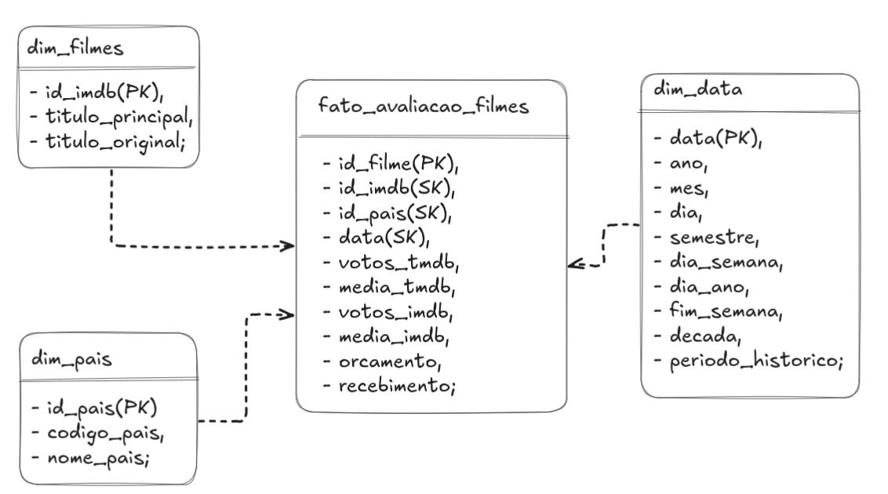
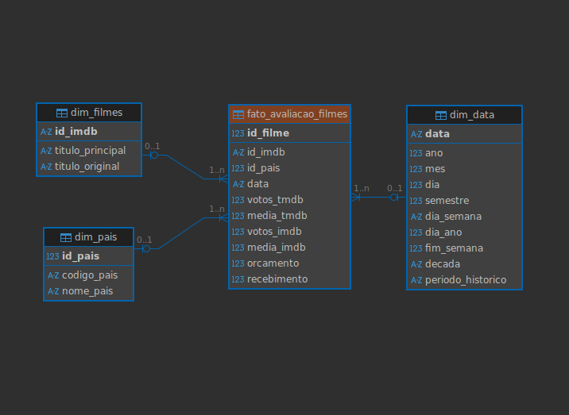

# Desafio da Sprint 8

O objetivo é praticar a combinação de conhecimentos vistos no Programa, fazer um mix de tudo que já foi feito. Para essa *Sprint* nós tivemos como desafio extrair *insights*, apresentando-os através de uma ferramenta de visualização de dados, o **AWS QuickSight**.

## Entregáveis

- [] Todo o código, comentários, evidências e demais artefatos desenvolvidos para resolver o desafio;

- [] Arquivo **README.md** com evidências imagens/prints de realização do desafio, bem como documentação de explicação de cada parte executada;

- [] Arquivo `.pdf` e imagens dos dashboards implementados.

## Sumário

## Preparação

Refizemos nossa modelagem com a ajuda do *feedback* recebido da *Sprint* anterior, bem como com a ajuda da monitoria da presente *Sprint* que nos ajudou a entender os ajustes necessários para uma melhor performance. Rascunhamos nossa modelagem com a ajuda do **Excalidraw** para o esquema mostrado abaixo:

A remodelagem ficou disponibilizado também em um arquivo [`.sqlite`](./modelagem_sprint8.sqlite) que nos ajudou a estudar a cardinalidade de nossas tabelas. A visualização dessa modelagem foi obtida utilizando o *software* **DBeaver**, e pode ser examinada abaixo:

# Desafio

Com a finalidade de extrair *insights*, criamos um *dashboard* na **AWS QuickSight** utilizando as tabelas que foram criadas para a camada **REFINED** no *Data Lake*, utilizando também o **AWS Athena**. Para o desenvolvimento do *Dashboard* exploramos os recursos quando convenientes para a construção de uma boa narrativa com os dados disponíveis. 