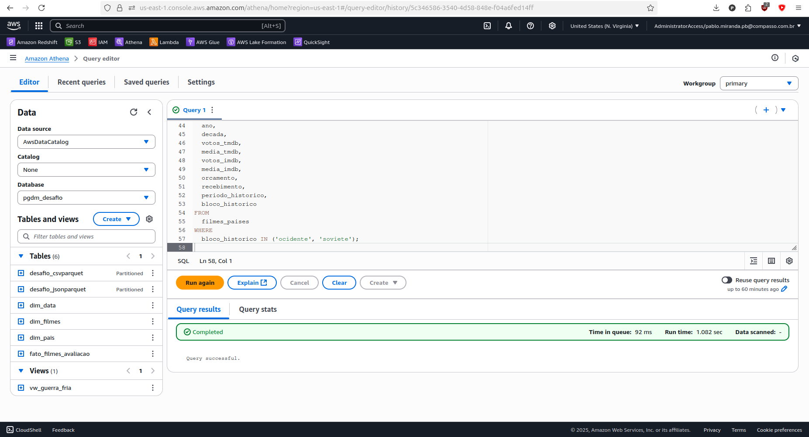
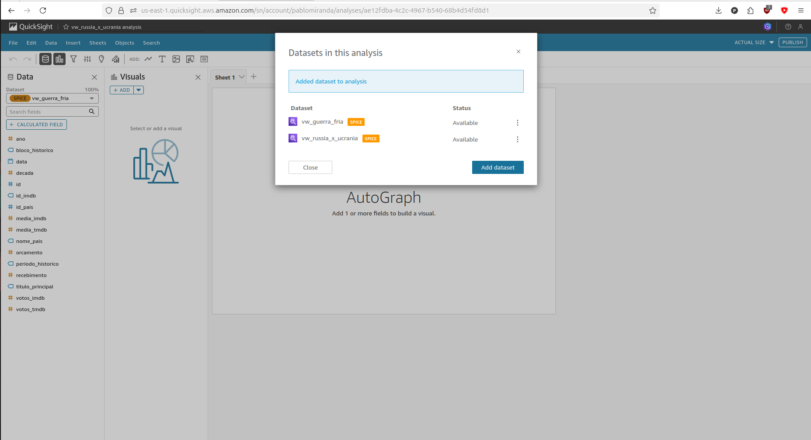
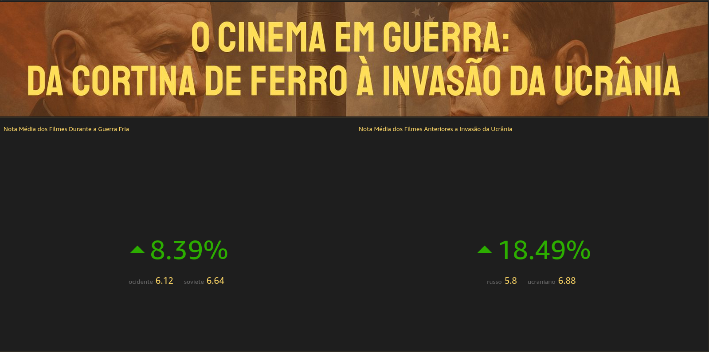
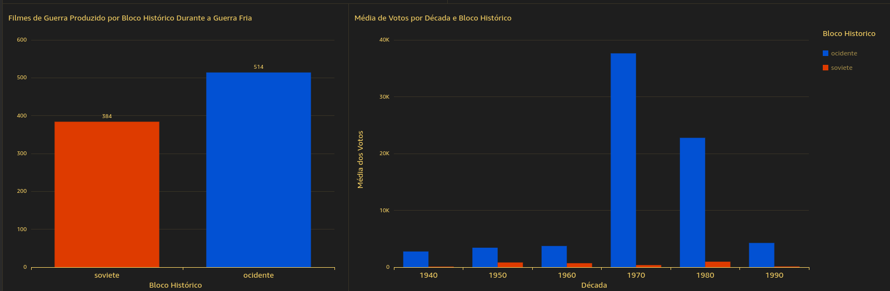
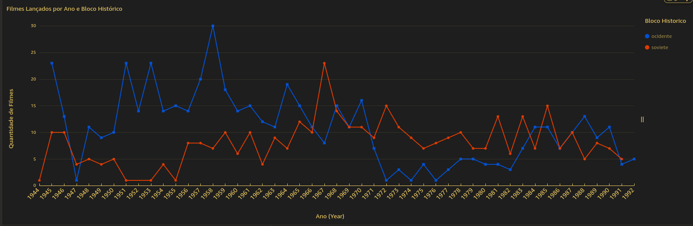
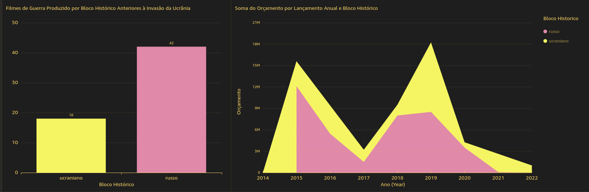

# Desafio da Sprint 8

O objetivo é praticar a combinação de conhecimentos vistos no Programa, fazer um mix de tudo que já foi feito. Para essa *Sprint* nós tivemos como desafio extrair *insights*, apresentando-os através de uma ferramenta de visualização de dados, o **AWS QuickSight**.

## Entregáveis

- [X] Todo o código, comentários, evidências e demais artefatos desenvolvidos para resolver o desafio;
  - Os códigos, comentários e evidências foram apontados no presente README.md

- [X] Arquivo **README.md** com evidências imagens/prints de realização do desafio, bem como documentação de explicação de cada parte executada;
  - O presente README.md contém todas as evidências das atividades realizadas no desafio dessa sprint.

- [X] Arquivo `.pdf` e imagens do dashboard implementado.
  - Arquivo `.pdf`: [o_cinema_em_guerra.pdf](./o_cinema_em_guerra.pdf)
  - As imagens estão no diretório [Evidências](../Evidências/) e foram comentadas na seção [Apresentação Final](#apresentação-final).

## Sumário

- [Preparação](#preparação)

- [Desafio](#desafio)

  - [Criação das *Views*](#criação-das-views)

  - [Elaboração do *Dashboard*](#elaboração-do-dashboard)

    - [*Storytelling*](#storytelling)

    - [Esquema de Cores](#esquema-de-cores)

  - [Apresentação Final](#apresentação-final)

## Preparação

Refizemos nossa modelagem com a ajuda do *feedback* recebido da *Sprint* anterior, bem como com a ajuda da monitoria que nos ajudou a entender a razão desses ajustes para uma melhor performance. Rascunhamos nossa modelagem com a ajuda do **Excalidraw** para o esquema mostrado abaixo:


A remodelagem ficou disponibilizado também em um arquivo [`.sqlite`](./scripts/modelagem_sprint8.sqlite) que nos ajudou a estudar a cardinalidade de nossas tabelas. A visualização dessa modelagem foi obtida utilizando o *software* **DBeaver**, e pode ser examinada abaixo:


Os ajustes foram realizados nos *jobs* da **AWS Glue** à partir dos scripts das tabelas dimensão [dim_data.py](./scripts/dim_data.py), [dim_filmes.py](./scripts/dim_filmes.py), [dim_pais.py](./scripts/dim_pais.py) e [fato_filmes_avaliacao.py](./scripts/fato_filmes_avaliacao.py).

Com nosso *datalake* finalmente ajustado, podemos iniciar a última etapa do nosso desafio.

# Desafio

Com a finalidade de extrair *insights*, nos foi requisitado a criar um painel na **AWS QuickSight** utilizando as tabelas que foram disponibilizadas na camada **REFINED** no nosso *datalake*, utilizando, também, o **AWS Athena** quando necessário. Adicionalmente, para o desenvolvimento do nosso painel, concatenamos o que aprendemos também em *design* visual e *storytelling* para criar uma boa narrativa com os dados disponíveis.

## Criação das *Views*

As questões elaboradas nas etapas anteriores gravitam em torno de dois grandes momentos da História Contemporânea, a Guerra Fria, iniciada poucos anos após o fim da 2a Guerra, envolvendo dois grandes blocos Históricos que aqui sintetizamos como blocos "Soviete" e "Ocidente", e a Guerra Rússia x Ucrânica, cujas tensões foram iniciadas em 2017 com a independência de diferentes cidades na região do Donbass com o apoio da Rússia, aqui sintetizamos dois blocos, o "Russo" e "Ucraniano". O nosso objetivo permaneceu o mesmo desde a elaboração das questões, analisar a produção de filmes de guerra como um suporte ideológico desses blocos em conflito. Criamos duas *views* uma para cada um desses conflitos. A modelagem final, com as *views* foi rascunhada da seguinte maneira:


O código da primeira *view* pode ser examinada no arquivo [`vw_guerra_fria.sql`](./scripts/vw_guerra_fria.sql) ou abaixo:

```sql
CREATE OR REPLACE VIEW pgdm_desafio.vw_guerra_fria AS
WITH filmes_paises AS (
  SELECT 
    f.id,
    f.id_imdb,
    df.titulo_principal,
    p.id_pais,
    p.nome_pais,
    f.data,
    d.ano,
    d.decada,
    f.votos_tmdb,
    f.media_tmdb,
    f.votos_imdb,
    f.media_imdb,
    f.orcamento,
    f.recebimento,
    d.periodo_historico,
    CASE
      WHEN p.id_pais = 58 THEN 'ocidente'
      WHEN p.id_pais = 53 THEN 'soviete'
      ELSE 'outro'
    END AS bloco_historico
  FROM 
    pgdm_desafio.fato_filmes_avaliacao f
  JOIN
    pgdm_desafio.dim_filmes df ON f.id_imdb = df.id_imdb
  CROSS JOIN 
    UNNEST(f.id_pais) AS t(id_pais_unnested)
  JOIN 
    pgdm_desafio.dim_pais p ON t.id_pais_unnested = p.id_pais
  JOIN 
    pgdm_desafio.dim_data d ON f.data = d.data
  WHERE 
    d.periodo_historico = 'guerra fria'
)
SELECT 
  id,
  id_imdb,
  titulo_principal,
  id_pais,
  nome_pais,
  data,
  ano,
  decada,
  votos_tmdb,
  media_tmdb,
  votos_imdb,
  media_imdb,
  orcamento,
  recebimento,
  periodo_historico,
  bloco_historico
FROM 
  filmes_paises
WHERE 
  bloco_historico IN ('ocidente', 'soviete');

```

Criamos uma **CTE** que consulta a tabela fato e realiza uma série de joins com as tabelas dimensão. A tabela dimensão `dim_pais` traz uma série de arrays que precisaram ser desacoplados para a seleção: realizamos um `Cross Join` com a função `unnest` para filtrar os filmes através dos códigos dos países que lideravam esses blocos, os Estados Unidos (que na tabela dim_pais tem o código 58) e União Soviética (que na tabela dim_pais tem o código 53), de modo que qualquer filme produzido por esses países ou em parceria com esses países podem ser encaixados nesses blocos. Filtramos pela coluna de período histórico que compreende os filmes do período da Guerra Fria. O `Case` estruturou os dados em torno de duas categorias que são os blocos em que realizamos as filtragens. Abaixo disponibilizamos a evidência do sucesso da criação dessa *view* no **AWS Athena**:



O código da segunda *view* pode ser examinada no arquivo [`vw_guerra_russia_x_ucrania.sql`](./scripts/vw_guerra_russia_x_ucrania.sql) ou abaixo:

```sql
CREATE OR REPLACE VIEW pgdm_desafio.vw_russia_x_ucrania AS
WITH filmes_paises AS (
  SELECT 
    f.id,
    f.id_imdb,
    df.titulo_principal,
    p.id_pais,
    p.nome_pais,
    f.data,
    d.ano,
    d.decada,
    f.votos_tmdb,
    f.media_tmdb,
    f.votos_imdb,
    f.media_imdb,
    f.orcamento,
    f.recebimento,
    d.periodo_historico,
    CASE
      WHEN p.id_pais = 50 THEN 'russo'
      WHEN p.id_pais = 57 THEN 'ucraniano'
      ELSE 'outro'
    END AS bloco_historico
  FROM 
    pgdm_desafio.fato_filmes_avaliacao f
  JOIN
    pgdm_desafio.dim_filmes df ON f.id_imdb = df.id_imdb
  CROSS JOIN 
    UNNEST(f.id_pais) AS t(id_pais_unnested)
  JOIN 
    pgdm_desafio.dim_pais p ON t.id_pais_unnested = p.id_pais
  JOIN 
    pgdm_desafio.dim_data d ON f.data = d.data
  WHERE 
    d.periodo_historico = 'russia x ucrania'
)
SELECT 
  id,
  id_imdb,
  titulo_principal,
  id_pais,
  nome_pais,
  data,
  ano,
  decada,
  votos_tmdb,
  media_tmdb,
  votos_imdb,
  media_imdb,
  orcamento,
  recebimento,
  periodo_historico,
  bloco_historico
FROM 
  filmes_paises
WHERE 
  bloco_historico IN ('russo', 'ucraniano');

```

A lógica foi a mesma, onde também criamos uma **CTE** que consulta a tabela fato e realiza uma série de joins com as tabelas dimensão. Filtramos os filmes através dos códigos dos países que lideravam os blocos históricos da guerra Rússia e Ucrânia, onde a Rússia (que na tabela dim_pais tem o código 50) e a Ucrânia (que na tabela dim_pais tem o código 57), de modo que qualquer filme produzido por esses países ou em parceria com esses países podem ser encaixados nesses blocos. Filtramos, ainda, pela coluna de período histórico que compreende os filmes do período do conflito entre a Rússia e a Ucrânia. O `Case` estruturou os dados em torno de duas categorias que são os blocos em que realizamos as filtragens. Abaixo disponibilizamos a evidência do sucesso da criação dessa *view* no **AWS Athena**:


A evidência abaixo mostra o sucesso da importação das views na **AWS QuickSight**:



## Elaboração do *Dashboard*:

Para a apresentação dos dados, organizamos os *cards* conforme as questões que foram elaboradas no início do desenvolvimento do projeto e re-elaboradas durante a execução das *Sprints*. Como já mencionado anteriormente, prestamos atenção aos elementos que fazem parte dessa formulação e que servem ao propósito de contar uma história com os dados.

### *Storytelling*

O objetivo principal com o *dashboard* é passar as informações de uma maneira clara segundo nossas perguntas que haviam sido formuladas e contar uma história com os nossos dados. 

Coletamos dados de filmes de guerra que foram produzidos por, ou com o suporte, de dois grandes atores históricos da segunda metade do século passado, entre 1945 e 1991, a Ex-URSS e os Estados Unidos. Nossas questões formuladas foram sobre o volume de produção desses blocos, as notas recebidos por filmes produzidos por décadas de tensões durante a Guerra Fria, o fluxo de produções de filmes por esses blocos por ano (acompanhando assim momentos chave desse conflito, como a Guerra da Coréia entre 1950 e 1953, a Crise dos Mísseis Cubanos em 1962, a Chegada do Homem á Lua em 1969, a Queda do Muro de Berlim em 1989). Como a produção dos filmes de guerra servem como suporte ideológico para as ações de conflitos, formulamos também perguntas sobre o orçamento dos filmes produzidos pela Rússia e pela Ucrânia nos anos anteriores ao início do conflito entre esses países em 2022, bem como a possibilidade da Rússia ter, de alguma maneira, preservado a qualidade das produções realizadas na ex-URSS.

Para isso obedecemos um esquema de leitura em "Z", onde o usuário lê as informações da esquerda para a direita e passa para próxima linha, assim, nós priorizamos essa ordem para a disponibilização dessas informações: começamos com cards simples, que pudessem explicar de forma concisa os dados da esquerda para a direita, para, na próxima linha, disponibilizar novas informações da esquerda para a direita. Cards com informações mais complexas ou que precisaram ser alongados (como no caso de cards com datas no eixo X) foram colocados após a disposição das informações mais diretas. Utilizamos esuqemas de cores diferentes para os blocos históricos, já que eles representam entidades diferentes e em cronologias diferentes (contando assim histórias que são relacionadas, mas que também são reconhecidas como em momentos históricos diferentes).

Entramos em detalhes sobre esses cards na seção final desse desafio.

### Esquema de Cores

Nos preocupamos em trabalhar com um esquema de cores que não confundisse o nosso público, ao mesmo tempo que pudesse manter uma identidade visual característica pertinente ao tema selecionado. Como a nossa capa, no topo do *dashboard* tem um fundo vermelho com um filtro em sépia, e um título em amarelo, selecionamos cores que combinassem com esse elemento, que é a primeira coisa que vai chamar a atenção do público na visualização desse *dashboard*.

Utilizamos o campo de *Themes* da **AWS QuickSight** para criar um tema próprio que combine com essa capa, lembre um esquema de cores que possa trazer o público a diferenciar os *players* envolvidos nessa produção de filmes (que aqui chamamos de "Blocos Históricos") e fugir de esquemas monotônicos, ao mesmo tempo em que evitamos ruídos visuais, excessos de informações, mas que apoiasse a nossa narrativa. A escolha de cores foi apoiada por esquemas de cores disponibilizadas no site [ColorHexa](https://www.colorhexa.com/).

- Primary Background: #1E1E1E
Utilizamos um Background escuro para combinar com a gravidade do tema e o tom escurecido da nossa capa.

- Primary Foreground: #F5D063
A cor escolhida foi semelhante a utilizada no título da nossa capa, de maneira que pensamos em manter uma coesão visual repetindo uma cor similar nos títulos e legendas do *dashboard*.

- Secondary Background: #2A2A2A
Uma grande dificuldade ao trabalhar com temas escuros é a armadilha dos tons monocromáticos, já que usamos uma cor parecida no nosso **Primary Background**, essa dificuldade foi contornada usando alternativas em esquemas de cor. Não queríamos uma cor muito destoante com o perigo de tornar o *dashboard* visualmente desagradável, de modo que selecionamos a cor #2A2A2A, uma alternativa à cor #2B2B2B apontada no HexaColor como sendo monocrática ao #1E1E1E.

- Secondary Foreground: #D9D9D9
Utilizamos uma cor no tom branco para realizar uma quebra com os tons escuros, algo que há havíamos feito no **Primary Foreground**.

- Accent: #C62828
A cor escolhida complementou a identidade visual e o tom escurecido das escolhas para os *backgrounds*.

- Accent Foreground: #FFFFFF
Fizemos uma pequena concessão de escolha monocromática no **Accent Foreground**, uma alternativa teria sido a cor #D6D6D6, mas esse tom de branco combinou com a nossa escolha para o **Accent**, oferecendo um bom contraste.

## Apresentação Final

Elencamos 5 questões finais para o nosso dashboard, reorganizadas à partir das questões formuladas no início do desafio final. São elas:

1. Qual a nota média dos filmes de guerra soviéticos? & 2. A Rússia conseguiu manter essa média histórica?
No topo do nosso *dashboard* encontramos dois KPI's que mostram a diferença nas notas médias entre os dois blocos históricos. As notas médias são percepções públicas sobre a qualidade desses filmes, e as KPI's trazem, no centro, as diferenças percentuais entre as notas médias dos blocos históricos em diferentes momentos. Os blocos históricos do período da Guerra Fria trazem uma diferença percentual de 8,14% com médias muito parecidas, contudo os blocos históricos do período anterior a guerra Rússia x Ucrânia trazem uma diferença percentual de 18,49%, com médias muito favoráveis à Ucrânia (vamos ver que o gasto desse país com filmes de Guerra também foram maiores apesar de menos produções). 
> Portanto, concluímos que a ex-URSS mantém uma média de notas acima do bloco histórico competidor no momento da Guerra-fria, apesar das médias serém próximas, enquanto a nota média dos filmes produzidos pela Rússia é consideravelmente abaixo da sua competidora, a Ucrânia. 

Abaixo é possível observar a capa do dashboard e as KPI's mencionadas:



3. Qual a média de votos recebidos por Bloco Histórico por década durante a Guerra Fria?
Logo após os cards com KPI's, há dois gráficos em barras que diz respeito a blocos históricos durante a Guerra Fria, um mostra a quantidade de filmes produzidos pelo bloco soviete e pelo bloco ocidente, e o outro a média de votos recebidos por bloco em uma determinada década. Apesar do bloco ocidente ter produzido mais filmes, e, por consequência, mais votos, as maiores médias de votos são de filmes realizados nas décadas de 70 e 80. A baixa quantidade de média de votos no bloco soviete pode indicar que essas são produções que atendem a um nicho específico de audiência. 
> O bloco ocidente, capitaneado pelos Estados Unidos foi campeão indisputável nas 6 décadas analisadas, incluindo um crescimento acentuado nas décadas de 1970 e 1980. Além dos filmes soviéticos serem parte, hoje, de um nicho cultural, é possível que a popularidade desses filmes se deva ao fato de que a distribuição dos filmes ocidentais, incluindo a popularização de formatos como o VHS tenha ajudado na divulgação desses filmes que podem ser, ainda hoje, populares.

Os gráficos em barras podem ser examinados na evidência abaixo:



4. Qual foi o comportamento das produções de filmes na Guerra Fria na segunda metade do século? 
Em seguida temos um gráfico em linhas que mostram a quantidade de filmes produzidos por bloco histórico durante a Guerra Fria. A razão pelo alongamento do card se dá pela necessidade de trazer mais espaço entre os elementos, já que um card menor pode fazer com que o gráfico seja confuso, mesmo com uma granularidade menor como a selecionada (são filmes por ano).  
> Existe uma queda nas produções de ambos os blocos no momento posterior ao fim da Segunda Guerra Mundial, e uma acentuada recuperação nas produções do bloco ocidente, situação que se inverte durante a Crise dos Misseis Cubanos, momento em que o bloco soviete atinge o ápice nas produções de filme de guerra. Curiosamente, as décadas de 70 e 80, momentos em que vimos no gráfico em barras passado ser os mais populares em termos de quantidade de votos, representa uma baixa na produção do bloco ocidente, com um aumento gradual no número de produção, o que pode ser interpretado como um aumento na qualidade desses lançamentos, apesar da baixa produção.

O gráfico em linha pode ser examinado na evidência à seguir:



5. Por fim, nos anos anteriores ao início da Guerra Rússia e Ucrânia, o gasto orçamentário Ucraniano supera o Russo?
Confrontamos as produções desses blocos históricos com os gráficos das produções dos blocos históricos russo e ucraniano, no contexto dos anos anteriores à Invasão da Ucrânia e Guerra entre Rússia e Ucrânia. Anteriormente o KPI havia nos informado que a Ucrânia detém uma nota média de filmes de guerra consideravelmente maior que o da Rússia, e com os novos gráficos ficamos sabendo também que a Rússia produziu mais que o dobro de filmes da Ucrânia e o gasto orçamentário também traz uma diferença significativa. 
> Para examinarmos o gráfico em área devemos prestar atenção ao espaço ocupado por cada um dos blocos, onde os gastos orçamentários da Rússia com filmes de guerra são quase sempre maiores que o da Ucrânia, **exceto** em 2017 e 2019, provavelmente seguindo o aumento das tensões e da guerra civil em torno da região do Donbass, e da ocupação das tropas russas das fronteiras poucos anos depois. 

Ambos os gráficos podem ser examinados na evidência abaixo:



O arquivo em `.pdf` pode ser encontrado no diretório do Desafio como [o_cinema_em_guerra.pdf](./o_cinema_em_guerra.pdf)