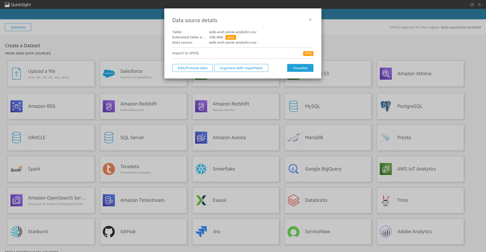
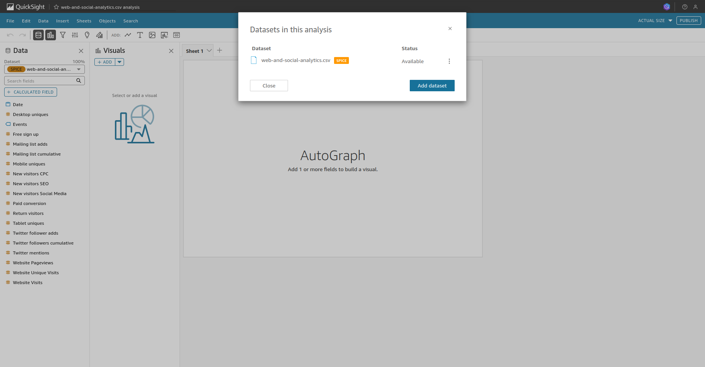
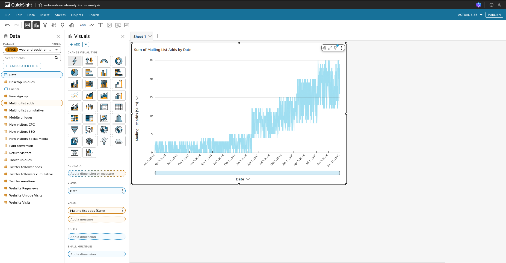
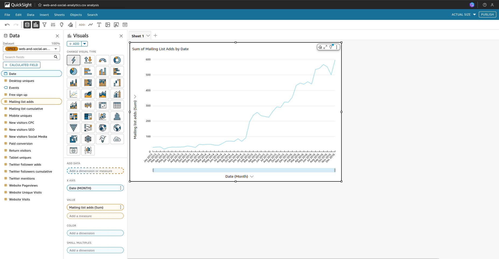
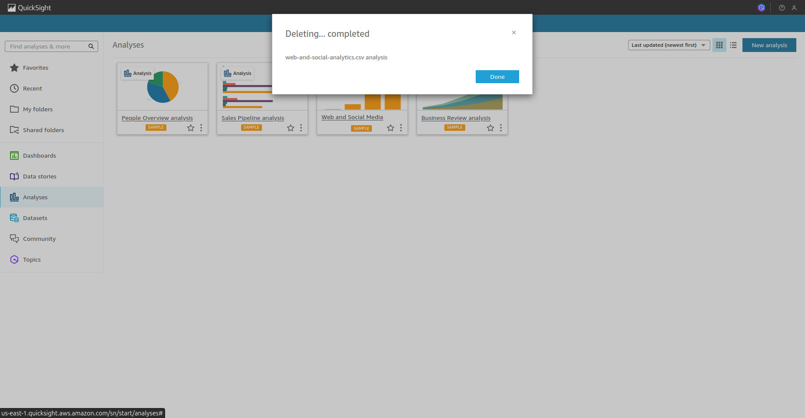
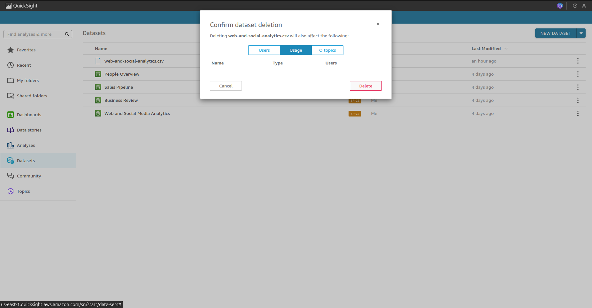
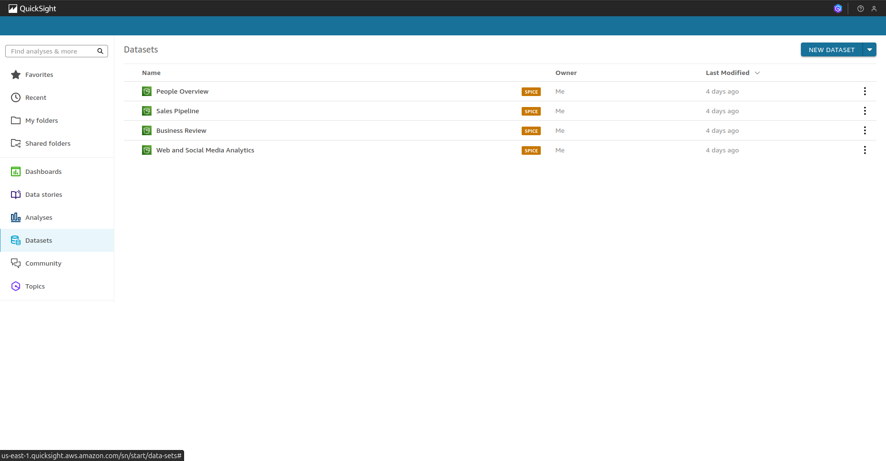

# Resumo da Sprint 8

A *Sprint* 8 foi dividida em duas semanas, como habitual, onde, na primeira semana, realizamos um curso introdutório sobre **AWS QuickSight**, um curso sobre o mesmo serviço na plataforma *Skill Builder*, e, na segunda semana, realizamos um *lab* sobre **AWS QuickSight** e entregamos o desafio da semana, concluindo o nosso projeto final. Esses foram os cursos, com uma breve discussão de seu conteúdo:

- **Complete Introduction to Amazon QuickSight**: esse foi um curso completo sobre o uso dos recursos no serviço **AWS QuickSight**, com exemplos práticos de como criar *datasets*, gráficos, elementos visuais, etc.

- **AWS Skill Builder - Amazon QuickSight - Getting Started**: o curso em questão reforçou os pontos já abordados anteriormente, trazendo considerações sobre um recurso específico que é o armazenamento em *SPICE*, integração com outros serviços da AWS, além de dicas sobre *Storytelling*, visando uma melhor entrega dos dados para os clinetes.

> Já tinhamos conhecimento em ferramentas de BI, mas nunca havíamos utilizado a **AWS QuickSight**, ainda mais integrado em uma pipeline com os outros serviços da AWS das *Sprints* anteriores como **AWS Glue**, especificamente no serviço Data Catalog, e **AWS Athena**. Foi uma *Sprint* desafiadora pois os elementos visuais da apresentação dos dados leva em consideração habilidades de conhecimento de negócio, *design* visual e *Storytelling*, e agregar tudo isso na produção do nosso painel foi, com certeza, um desafio que nos fez repensar varias vezes a su construção. 

# Sumário

- [Desafio](#desafio)

- [Exercícios](#exercícios)

    1. [Lab - **AWS QuickSight**](#aws-quicksight)

    2. [Lab - **AWS Limpeza de Recursos**](#aws-quicksight--limpeza-de-recursos)

- [Evidências](#evidências)

- [Certificados](#certificados)

# Desafio

O Desafio dessa *Sprint* foi realizado em uma única entrega, que consistiu em servir os dados no formato de um painel utilizando a **AWS QuickSight** para formar um painel utilizando os dados da camada **REFINED** e apresentá-lo em um arquivo `.pdf`. Verificamos a nossa modelagem, criamos visões utilizando o **AWS Athena** e construímos o painel prestando atenção à legibilidade dos dados, utilizando padrões de cores que fossem pertinentes a história que contamos através desses dados e organizando os elementos através do *storytelling* planejado. 

O README.md, bem como os arquivos pertinentes ao Desafio se encontram no diretório [Desafio](./Desafio/).

Todas as evidências do desafio se encontra na própria pasta de [Evidências](./Evidências/).

# Exercícios

## **AWS QuickSight**

Foram efetuados uma série de ações para a construção de um painel utilizando o serviço da **AWS QuickSight**: criação de um novo dataset à partir de dados locais, criação de gráficos utilizado as dimensões do dataset criado, mudamos a granularidade de um gráfico que utilizava dados de data no eixo x para uma melhor visualização. As amostras das evidências do exercício podem ser encontradas na próxima seção.

## **AWS QuickSight** - Limpeza de Recursos

Realizamos a remoção do painel realizado no exercício anterior e a deleção do dataset que havia sido criado para a execução do exercício. As evidências se encontram na seção abaixo.

# Evidências

## **AWS QuickSight**

1. Na página inicial do **AWS QuickSight**, escolhemos Nova Análise e realizamos o upload dos dados. Os dados de amostra foram obtidos à partir do arquivo disponibilizado pelo lab, e que pode ser encontrado no diretório de Exercício como [web-and-social-analytics.csv](./Exercícios/lab_aws_quicksight/web-and-social-analytics.csv). Imediatamente ao realizar o upload, selecionamos o botão visualize, como mostra a evidência abaixo:

2. Nos certificamos que o dataset escolhido foi aquele que havia sido feito o upload, o `web-and-social-analytics.csv`, observado no canto superior, bem como nas colunas disponibilizadas na parte esquerda da tela, como observado na amostra à seguir:

3. Selecionamos os campos `Date`e `Mailing List Adds` e o **AWS QuickSight** selecionou um gráfico de linha mostrando a quantidade de e-mails recebidos por dia, como pode ser observado na evidência seguinte:

4. Mudamos a granularidade de dia para mẽs selecionando a dimensão `Date` no eixo X o que resultou em um gráfico com uma melhor disposição visual, como pode ser examinado na amostra abaixo:

## **AWS QuickSight** - Limpeza de Recursos

1. Com a finalidade de remover todos os recursos utilizados, deletamos primeiro a limpeza do painel que utilizamos no exercício anterior. A amostra à seguir traz a confirmação da deleção mencionada: 

2. Por fim, deletamos também o dataset que havia sido importado para o lab anterior. As evidências seguintes trazem o processo de deleção e o ambiente com apenas os datasets de amostra, padrão do ****AWS QuickSight****:

# Certificados

Abaixo se encontra um certificado nominais a Pablo Miranda, relacionados ao curso realizado na plataforma [AWS Skill Builder](https://explore.skillbuilder.aws/learn). Para essa *Sprint*, a conclusão do curso **Amazon QuickSight - Getting Started** resultou no fornecimento do certificado nominal que se encontra no diretório de [Certificados](./Certificados/), podendo, também, ser acessado no link abaixo:

- [Amazon QuickSight - Getting Started](./Certificados/amazon_quickSight.pdf)